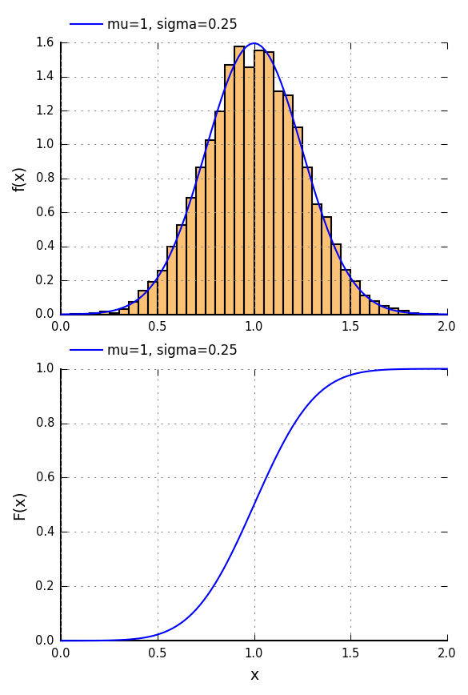

# Gosl &ndash; Go scientific library

Gosl is a computing library written in go language (golang) to help with the development of software
for scientific research. The library tries to be as general as possible. The use of concurrency for
multi-threaded applications and message passing for parallel computations are considered. Functions
and structures for geometry calculations, random numbers generation and probability distributions,
optimisation algorithms, and plotting and visualisation are implemented as well. This library helped
with the development of the results presented in [1-5].


## Content

1.  [chk](https://github.com/cpmech/gosl/tree/master/chk)       &ndash; Check code and unit test tools
2.  [io](https://github.com/cpmech/gosl/tree/master/io)         &ndash; Input/output, read/write files, and print commands
3.  [utl](https://github.com/cpmech/gosl/tree/master/utl)       &ndash; Utilities. Lists. Dictionaries. Simple Numerics
4.  [plt](https://github.com/cpmech/gosl/tree/master/plt)       &ndash; Plotting and drawing (png and eps)
5.  [mpi](https://github.com/cpmech/gosl/tree/master/mpi)       &ndash; Message Passing Interface for parallel computing
6.  [la](https://github.com/cpmech/gosl/tree/master/la)         &ndash; Linear Algebra and efficient sparse solvers
7.  [fdm](https://github.com/cpmech/gosl/tree/master/fdm)       &ndash; Simple finite differences method
8.  [num](https://github.com/cpmech/gosl/tree/master/num)       &ndash; Fundamental numerical methods
9.  [fun](https://github.com/cpmech/gosl/tree/master/fun)       &ndash; Scalar functions of one scalar and one vector
10. [gm](https://github.com/cpmech/gosl/tree/master/gm)         &ndash; Geometry algorithms and structures
11. [gm/msh](https://github.com/cpmech/gosl/tree/master/gm/msh) &ndash; Mesh generation and Delaunay triangulation
12. [gm/tri](https://github.com/cpmech/gosl/tree/master/gm/tri) &ndash; Mesh generation: triangles
13. [gm/rw](https://github.com/cpmech/gosl/tree/master/gm/rw)   &ndash; Mesh generation: read/write
14. [graph](https://github.com/cpmech/gosl/tree/master/graph)   &ndash; Graph theory structures and algorithms
15. [ode](https://github.com/cpmech/gosl/tree/master/ode)       &ndash; Ordinary differential equations
16. [opt](https://github.com/cpmech/gosl/tree/master/opt)       &ndash; Optimisation problem solvers
17. [rnd](https://github.com/cpmech/gosl/tree/master/rnd)       &ndash; Random numbers and probability distributions
18. [tsr](https://github.com/cpmech/gosl/tree/master/tsr)       &ndash; Tensor algebra and definitions for continuum mechanics
19. [vtk](https://github.com/cpmech/gosl/tree/master/vtk)       &ndash; 3D Visualisation with the VTK tool kit


## Examples

See examples here: https://github.com/cpmech/gosl/blob/master/examples/README.md


<div id="container">
<p></p>
Normally distributed pseudo-random numbers. Using sub-package `rnd`
</div>


## Installation and documentation

1. To install on Windows, [see instructions for Windows here](https://github.com/cpmech/gosl/blob/master/doc/InstallationOnWindows.md)
2. To install on macOS, [see instructions for macOS](https://github.com/cpmech/gosl/blob/master/doc/InstallationOnMacOS.md)
3. To install on Debian/Ubuntu/Linux, type the following commands:

```
sudo apt-get install libopenmpi-dev libhwloc-dev libsuitesparse-dev libmumps-dev 
sudo apt-get install gfortran libvtk6-dev python-scipy python-matplotlib dvipng
mkdir -p $GOPATH/src/github.com/cpmech
cd $GOPATH/src/github.com/cpmech
git clone https://github.com/cpmech/gosl.git
cd gosl
./all.bash
```

Make sure that the following environment variable is defined:

```
export PYTHONPATH=$PYTHONPATH:$GOPATH/src/github.com/cpmech/gosl/scripts
```

The documentation for developers is available here: http://rawgit.com/cpmech/gosl/master/doc/index.html


## License

Unless otherwise noted, the Gosl source files are distributed under the BSD-style license found in the LICENSE file.
