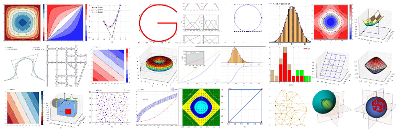

# Gosl &ndash; Go scientific library

Gosl is a library written in [Go](https://golang.org) to develop high-performance scientific
computations. The library tries to be as general and _easy_ as possible. Gosl considers the use of
both Go concurrency routines and parallel computing using the message passing interface. Gosl has
several modules (sub-packages) for a variety of tasks in scientific computing, image analysis, and
data post-processing. For example, it includes high-performant linear algebra functions (wrapping
MKL, OpenBLAS, LAPACK, SuiteSparse, UMFPACK...), fast Fourier transform algorithms (wrapping FFTW),
numerical integration (wrapping QUADPACK), functions and structures for geometry calculations (e.g.
3D transfinite interpolation, grid search, octree...), random numbers generation (SFMT and DSFMT)
and probability distributions, optimisation and graph algorithms, plotting and visualisation using
the VTK, and much more. Gosl has also solvers to (stiff or not) ordinary differential equations and
several tools for 2D/3D mesh generation to assist on the development of solvers for partial
differential equations.

[See the documentation](https://godoc.org/github.com/cpmech/gosl) for more details (e.g. how to call
functions and use structures).

[Welcome to contributing](https://github.com/cpmech/gosl/blob/master/CONTRIBUTING.md) + TODO list.

## Contents

Gosl includes the following _packages_:
1.  [chk](https://github.com/cpmech/gosl/tree/master/chk)             &ndash; Check code and unit test tools
2.  [io](https://github.com/cpmech/gosl/tree/master/io)               &ndash; Input/output, read/write files, and print commands
3.  [utl](https://github.com/cpmech/gosl/tree/master/utl)             &ndash; Utilities. Lists. Dictionaries. Simple Numerics
4.  [plt](https://github.com/cpmech/gosl/tree/master/plt)             &ndash; Plotting and drawing (png and eps)
5.  [mpi](https://github.com/cpmech/gosl/tree/master/mpi)             &ndash; Message Passing Interface for parallel computing
6.  [la](https://github.com/cpmech/gosl/tree/master/la)               &ndash; Linear Algebra: vector, matrix, efficient sparse solvers, eigenvalues, decompositions, etc.
7.  [la/mkl](https://github.com/cpmech/gosl/tree/master/la/mkl)       &ndash; Lower level linear algebra using Intel MKL
8.  [la/oblas](https://github.com/cpmech/gosl/tree/master/la/oblas)   &ndash; Lower level linear algebra using OpenBLAS
9.  [num/qpck](https://github.com/cpmech/gosl/tree/master/num/qpck)   &ndash; Go wrapper to QUADPACK for numerical integration
10. [num](https://github.com/cpmech/gosl/tree/master/num)             &ndash; Fundamental numerical methods such as root solvers, non-linear solvers, numerical derivatives and quadrature
11. [fun](https://github.com/cpmech/gosl/tree/master/fun)             &ndash; Special functions, DFT, FFT, Bessel, elliptical integrals, orthogonal polynomials, interpolators
12. [fun/dbf](https://github.com/cpmech/gosl/tree/master/fun/dbf)     &ndash; Database of functions of a scalar and a vector like f(t,{x}) (e.g. time-space)
13. [fun/fftw](https://github.com/cpmech/gosl/tree/master/fun/fftw)   &ndash; Go wrapper to FFTW for fast Fourier Transforms
14. [gm](https://github.com/cpmech/gosl/tree/master/gm)               &ndash; Geometry algorithms and structures
15. [gm/msh](https://github.com/cpmech/gosl/tree/master/gm/msh)       &ndash; Mesh structures and interpolation functions for FEA, including quadrature over polyhedra
16. [gm/tri](https://github.com/cpmech/gosl/tree/master/gm/tri)       &ndash; Mesh generation: triangles and Delaunay triangulation (wrapping Triangle)
17. [gm/rw](https://github.com/cpmech/gosl/tree/master/gm/rw)         &ndash; Mesh generation: read/write routines
18. [graph](https://github.com/cpmech/gosl/tree/master/graph)         &ndash; Graph theory structures and algorithms
19. [opt](https://github.com/cpmech/gosl/tree/master/opt)             &ndash; Solvers for optimisation problems (e.g. interior point method)
20. [rnd](https://github.com/cpmech/gosl/tree/master/rnd)             &ndash; Random numbers and probability distributions
21. [rnd/dsfmt](https://github.com/cpmech/gosl/tree/master/rnd/dsfmt) &ndash; Go wrapper to dSIMD-oriented Fast Mersenne Twister
22. [rnd/sfmt](https://github.com/cpmech/gosl/tree/master/rnd/sfmt)   &ndash; Go wrapper to SIMD-oriented Fast Mersenne Twister
23. [vtk](https://github.com/cpmech/gosl/tree/master/vtk)             &ndash; 3D Visualisation with the VTK tool kit
24. [ode](https://github.com/cpmech/gosl/tree/master/ode)             &ndash; Solvers for ordinary differential equations

## Examples

[See all examples here](examples/README.md)

[See benchmarks here](examples/benchmark/README.md)

Selected:

* [Compute (fast) discrete Fourier transform](examples/fun_fft01.go)
* [Generate and draw a NURBS toroidal surface](examples/gm_nurbs03.go)
* [Generating normally distributed pseudo-random numbers](examples/rnd_normalDistribution.go)
* [Solution of sparse linear system](examples/la_HLsparseReal01.go)
* [Solution of sparse linear system with complex numbers](examples/la_HLsparseComplex01.go)
* [Numerical differentiation](examples/num_deriv01.go)
* [Drawing iso-surfaces with VTK](examples/vtk_isosurf01.go)
* [Plotting a contour](examples/plt_contour01.go)
* [Root finding problems](examples/num_brent01.go)
* [B-splines: curve, control, and basis](examples/gm_bspline02.go)
* [Orthogonal polynomials](examples/fun_orthopoly01.go)
* [Chebyshev interpolation](examples/fun_laginterp01.go)
* [Fourier interpolation](examples/fun_fourierinterp01.go)
* [Solving ordinary differential equations](examples/ode_hweq11.go)

## Installation

Since Gosl needs some other C and Fortran codes, **not** all sub-packages can be directly installed
using `go get ...`. Nonetheless, **Gosl is pretty easy to install!** See links below:

1. [Ubuntu](https://github.com/cpmech/gosl/blob/master/doc/InstallationOnUbuntu.md)
2. [Windows](https://github.com/cpmech/gosl/blob/master/doc/InstallationOnWindows.md)
3. [macOS](https://github.com/cpmech/gosl/blob/master/doc/InstallationOnMacOS.md)

The following subpackages are available on Linux only at the moment: _mpi_, _la/mkl_, and _vtk_. The
following subpackages are not available for Windows at the moment: _gm/tri_, _rnd/sfmt_, and
_rnd/dsfmt_. Help to compile these packages in all platforms is much welcome and appreciated.

## About the filenames

1. `t_something_test.go` is a **unit test**. We have several of them! Some usage
   information can be learned from these files.
2. `t_something_main.go` is a test with a main function to be run with `go run ...` or `mpirun -np ? go
   run ...` (replace ? with the number of cpus). There very few of these files.
3. `t_b_something_test.go` is a benchmark test. There a few of them. Run benchmarks with `go test -run=XXX -bench=.`

## Design strategies

Here, we call _structure_ any _user-defined type_. These are simply Go `types` defined as `struct`.
One may think of these _structures_ as _classes_. Gosl has several global functions as well and
tries to avoid complicated constructions.

An allocated structure (instance) is called an **object** and functions attached to this object are
called **methods**. In Gosl, the variable holding the pointer to an object is always named **o**
(lower case "o"). This variable is similar to the `self` or `this` keywords in other languages
(Python, C++, respectively).

Functions that allocate a pointer to a structure are prefixed with `New`; for instance:
`NewIsoSurf`. Some structures require an explicit call to another function to release allocated
memory. Be aware of this requirement! In this case, the function is named `Free` and appears in a
few sub-packages that use CGO. Also, some objects may need to be initialised before use. In this
case, functions named `Init` have to be called.

The directories corresponding to each package has a README.md file that should help with
understanding the library. Also, there are links to `godoc.org` where all functions, structures, and
variables are well explained.

## Bibliography

The following works take advantage of Gosl:

1. Pedroso DM, Bonyadi MR, Gallagher M (2017) Parallel evolutionary algorithm for single and multi-objective optimisation: differential evolution and constraints handling, Applied Soft Computing http://dx.doi.org/10.1016/j.asoc.2017.09.006
2. Pedroso DM (2017) FORM reliability analysis using a parallel evolutionary algorithm, Structural Safety 65:84-99 http://dx.doi.org/10.1016/j.strusafe.2017.01.001
3. Pedroso DM, Zhang YP, Ehlers W (2017) Solution of liquid-gas-solid coupled equations for porous media considering dynamics and hysteretic retention behaviour, Journal of Engineering Mechanics 04017021 http://dx.doi.org/10.1061/(ASCE)EM.1943-7889.0001208 
4. Pedroso DM (2015) A solution to transient seepage in unsaturated porous media. Computer Methods in Applied Mechanics and Engineering, 285:791-816 http://dx.doi.org/10.1016/j.cma.2014.12.009
5. Pedroso DM (2015) A consistent u-p formulation for porous media with hysteresis. Int. Journal for Numerical Methods in Engineering, 101(8):606-634 http://dx.doi.org/10.1002/nme.4808

## Authors and license

See the AUTHORS file.

Unless otherwise noted, the Gosl source files are distributed under the BSD-style license found in the LICENSE file.
