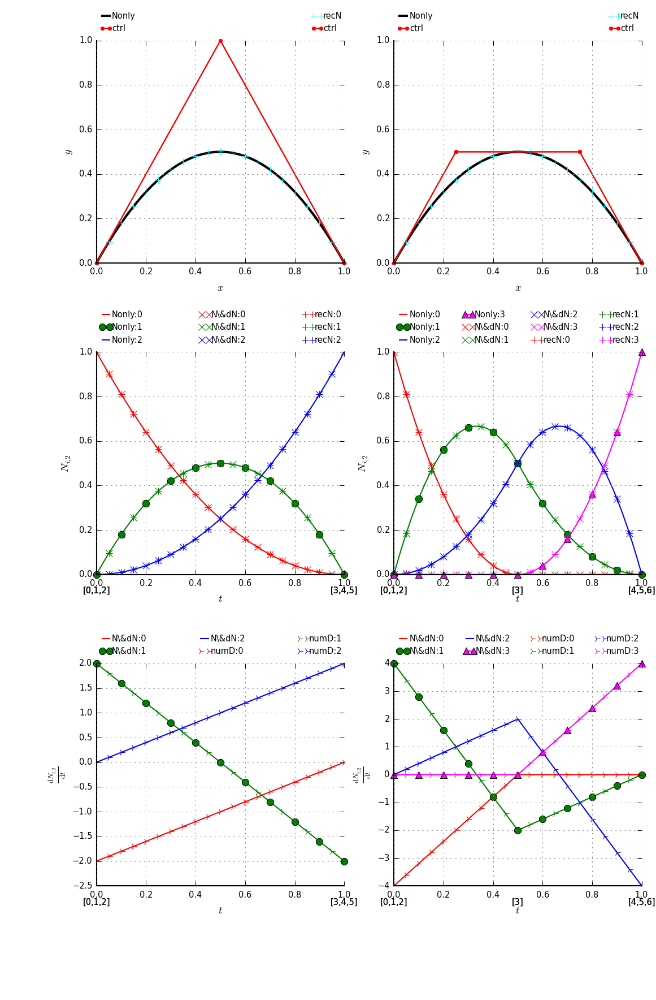
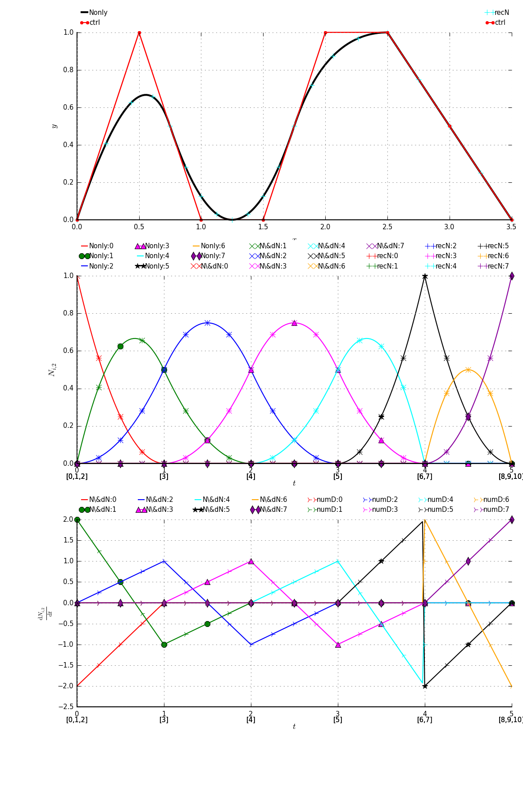

# Gosl &ndash; Go scientific library

Gosl contains a mix of routines for research on numerical methods. These include linear algebra,
linear solvers, nonlinear solvers, ordinary differential equation solvers, plotting routines,
geometry functions, utilities for making better use of Go (golang), and more.

## License

Unless otherwise noted, the Gosl source files are distributed
under the BSD-style license found in the LICENSE file.

## Installation and documentation

```
mkdir -p $GOPATH/src/github.com/cpmech
cd $GOPATH/src/github.com/cpmech
git clone https://github.com/cpmech/gosl.git
cd gosl
./all.bash
```

See http://cpmech.github.io/gosl for more information.

## Examples

See examples here: https://github.com/cpmech/gosl/blob/master/examples/README.md

<div id="container">
<p></p>
B-spline of 2nd order. Knot insertion. Basis functions and derivatives.
</div>

<div id="container">
<p></p>
B-spline of 2nd order. Basis functions and derivatives.
</div>

## Acknowledgements
Funding from the Australian Research Council is gratefully acknowledged.
