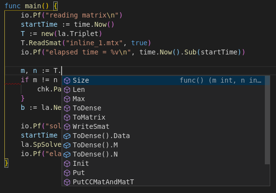

# Gosl - Go scientific library

Gosl is a set of tools for developing scientific simulations using the Go language. We mainly consider the development of numerical methods and solvers for differential equations but also present some functions for fast Fourier transforms, the generation of random numbers, probability distributions, and computational geometry.

This library contains essential functions for linear algebra computations (operations between all combinations of vectors and matrices, eigenvalues and eigenvectors, linear solvers) and the development of numerical methods (e.g. numerical quadrature).

We link Gosl with existent libraries written in C and Fortran, such as OpenBLAS, LAPACK, UMFPACK, MUMPS, QUADPACK and FFTW3. These existing libraries have been fundamental for the development of high-performant simulations over many years. We believe that it is nearly impossible to rewrite these libraries in native Go and at the same time achieve the same speed delivered by them. Just for reference, a naive implementation of matrix-matrix multiplication in Go is more than 100 times slower than OpenBLAS.

## Installation

Because of other (awesome) libraries, the easiest way to work with Gosl is via Docker. Having Docker and VS Code installed, you can start developing powerful numerical simulations using Gosl in a matter of minutes. Furthermore, the best part of it is that it works on Windows, Linux, and macOS out of the box.

### Containerized (recommended)

1. Install Docker
2. Install Visual Studio Code
3. Install the Remote Development extension for VS Code
4. Clone https://github.com/cpmech/hello-gosl
5. Create your application within a container (see gif below)

Done. And your system will "remain clean."


Our [Docker Image](https://hub.docker.com/repository/docker/gosl/gosl) also contains Go and the Go Tools for working with VS Code (or not). Below is a video showing the convenience of VS Code + the Go tools + Gosl. Note how fast VS Code is in finding the function ReadLines and the package gosl/io even under a clash with Go's io package. Upon file save, the Go tools automatically add the required imports. Note also the very convenient auto-completion of the callback function given to ReadLines. Also, Code + the Go tools nicely fill the function arguments with default values.


Another great thing about VS Code is it's _IntelliSense_. Here, as soon as we start typing "m comma n two-dot equal T dot", VS Code immediately offers `Size()` as the first option because it matches the preceding code. Fantastic!



### Debian/Ubuntu GNU Linux

First we have to first install some extra libraries **before** calling _go get_.

**Install dependencies**

```
sudo apt-get install -y --no-install-recommends \
  gcc \
  gfortran \
  libopenmpi-dev \
  libhwloc-dev \
  liblapacke-dev \
  libopenblas-dev \
  libmetis-dev \
  libparmetis-dev \
  libscotch-dev \
  libptscotch-dev \
  libsuitesparse-dev \
  libmumps-ptscotch-dev \
  libfftw3-dev \
  libfftw3-mpi-dev          
```

**Download Gosl**

```
go get github.com/cpmech/gosl
```

Done. Installation completed.

## Documentation

Gosl includes the following _essential_ packages:

- [chk](https://github.com/cpmech/gosl/tree/master/chk). To check numerical results and for unit testing
- [io](https://github.com/cpmech/gosl/tree/master/io). Input/output including printing to the terminal and handling files
- [utl](https://github.com/cpmech/gosl/tree/master/utl). To generate series (e.g. linspace) and other functions as in pylab/matlab/octave
- [mpi](https://github.com/cpmech/gosl/tree/master/mpi). Message Passing Interface for parallel computing
- [la](https://github.com/cpmech/gosl/tree/master/la). Linear Algebra: vector, matrix, efficient sparse solvers, eigenvalues, decompositions

Gosl includes the following _main_ packages:

- [fun](https://github.com/cpmech/gosl/tree/master/fun). Special functions, DFT, FFT, Bessel, elliptical integrals, orthogonal polynomials, interpolators
- [gm](https://github.com/cpmech/gosl/tree/master/gm). Geometry algorithms and structures
- [hb](https://github.com/cpmech/gosl/tree/master/hb). Pseudo hierarchical binary (hb) data file format
- [num](https://github.com/cpmech/gosl/tree/master/num). Fundamental numerical methods such as root solvers, non-linear solvers, numerical derivatives and quadrature
- [ode](https://github.com/cpmech/gosl/tree/master/ode). Solvers for ordinary differential equations
- [opt](https://github.com/cpmech/gosl/tree/master/opt). Numerical optimization: Interior Point, Conjugate Gradients, Powell, Grad Descent
- [pde](https://github.com/cpmech/gosl/tree/master/pde). Solvers for partial differential equations (FDM, Spectral, FEM)
- [rnd](https://github.com/cpmech/gosl/tree/master/rnd). Random numbers and probability distributions

(see each subdirectory for more information)

## Examples

Please check out https://github.com/cpmech/gosl-examples

## Benchmarks

Please check out https://github.com/cpmech/gosl-benchmarks

## Previous version

The previous version, including more packages, is [available here ](https://github.com/cpmech/gosl/tree/stable-1.1.3) and can be used with the Docker image 1.1.3 as in this [hello gosl example](https://github.com/cpmech/hello-gosl-old-1.1.3).

These other packages, such as machine learning, plotting, etc., have been removed because they do not depend on CGO and may be developed independently. We can now maintain the core of Gosl more efficiently, which has a focus on the foundation for other scientific code.
