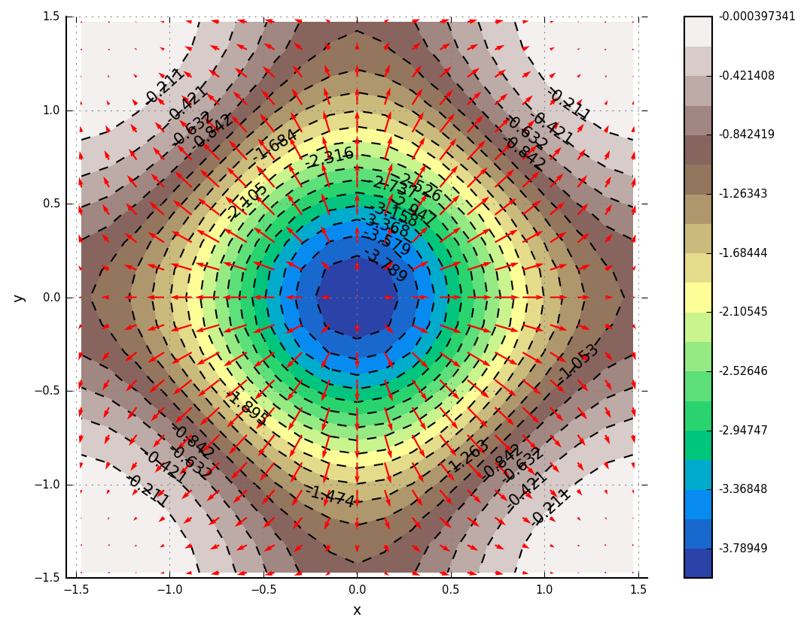
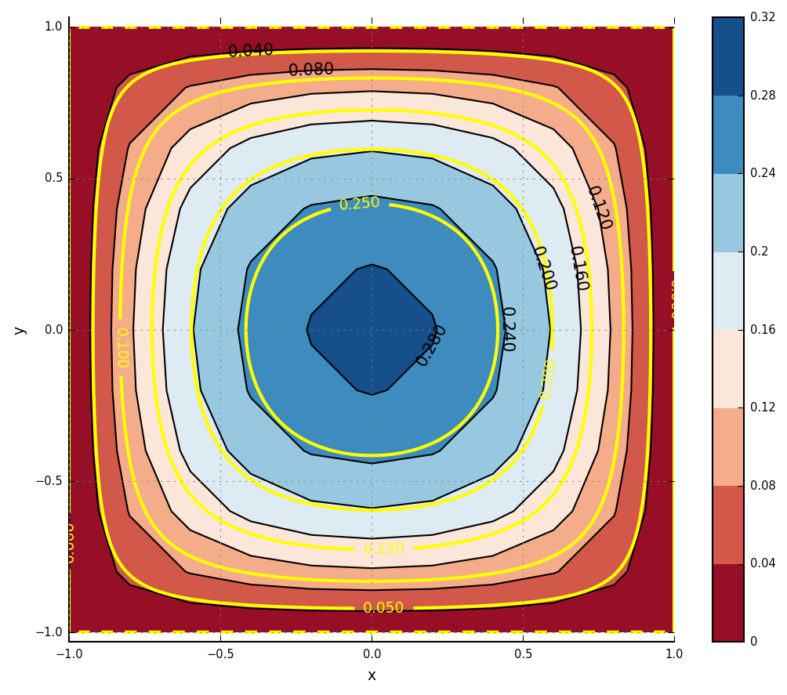
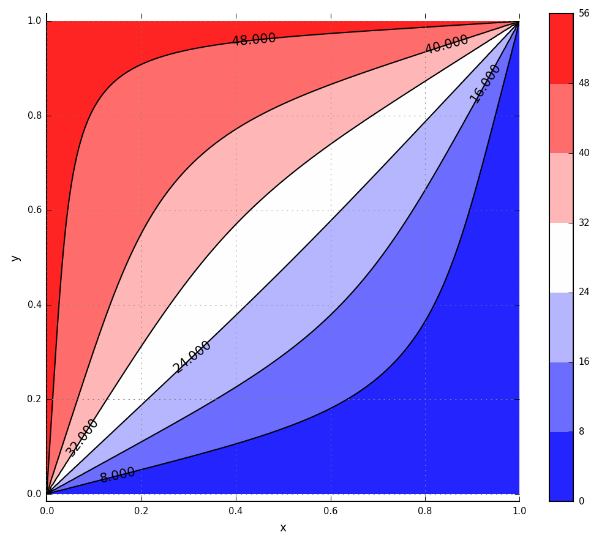

# Gosl Examples

## Summary
1. Generating normally distributed pseudo-random numbers
2. Solution of sparse linear system
3. Solution of sparse linear system with complex numbers
4. Numerical differentiation
5. Drawing iso-surfaces with VTK
6. Plotting a contour
7. Solution of Poisson's equation using finite differences

# 1 Generating normally distributed pseudo-random numbers

The `rnd` package is a wrapper to Go `rand` package but has some more _high level_ functions to
assist on works involving random numbers and probability distributions.

By using the package `rnd`, it's very easy to generate pseudo-random numbers sampled from a normal
distribution.

Source code: <a href="rnd_normalDistribution.go">rnd_normalDistribution.go</a>

<div id="container">
<p></p>
Normally distributed pseudo-random numbers
</div>

# 2 Solution of sparse linear system

Solution of real and sparse linear system using Umfpack and high-level routines.

A small linear system is solved with [Umfpack](http://faculty.cse.tamu.edu/davis/suitesparse.html).
The sparse matrix representation is initialised with a triplet.

Given the following matrix:

```
      _                      _
     |  2   3    0    0    0  |
     |  3   0    4    0    6  |
 A = |  0  -1   -3    2    0  |
     |  0   0    1    0    0  |
     |_ 0   4    2    0    1 _|
```

and the following vector:

```
      _      _
     |    8   |
     |   45   |
 b = |   -3   |
     |    3   |
     |_  19  _|
```

solve:

```
         A.x = b
```

Truncated code:
```go
// input matrix in Triplet format
// including repeated positions. e.g. (0,0)
var A la.Triplet
A.Init(5, 5, 13)
A.Put(0, 0, 1.0) // << repeated
A.Put(0, 0, 1.0) // << repeated
A.Put(1, 0, 3.0)
A.Put(0, 1, 3.0)
A.Put(2, 1, -1.0)
A.Put(4, 1, 4.0)
A.Put(1, 2, 4.0)
A.Put(2, 2, -3.0)
A.Put(3, 2, 1.0)
A.Put(4, 2, 2.0)
A.Put(2, 3, 2.0)
A.Put(1, 4, 6.0)
A.Put(4, 4, 1.0)

// right-hand-side
b := []float64{8.0, 45.0, -3.0, 3.0, 19.0}

// solve
x, err := la.SolveRealLinSys(&A, b)
if err != nil {
    io.Pfred("solver failed:\n%v", err)
    return
}
```

Output:
```
a =
    2    3    0    0    0
    3    0    4    0    6
    0   -1   -3    2    0
    0    0    1    0    0
    0    4    2    0    1
b = 8 45 -3 3 19 
x = 0.9999999999999998 2 3 4 4.999999999999998 
```

Source code: <a href="la_HLsparseReal01.go">la_HLsparseReal01.go</a>

## Alternatively, the _low-level_ routines can be used.

In this case, three steps must be taken:

1. Initialise solver
2. Perform factorisation
3. Solve problem

See: <a href="la_sparseReal01.go">la_sparseReal01.go</a>


# 3 Solution of sparse linear system with complex numbers

Solution of complex and sparse linear system using Umfpack and high-level routines.

Given the following matrix of complex numbers:

```
      _                                                  _
     |  19.73    12.11-i      5i        0          0      |
     |  -0.51i   32.3+7i    23.07       i          0      |
 A = |    0      -0.51i    70+7.3i     3.95    19+31.83i  |
     |    0        0        1+1.1i    50.17      45.51    |
     |_   0        0          0      -9.351i       55    _|
```

and the following vector:

```
      _                  _
     |    77.38+8.82i     |
     |   157.48+19.8i     |
 b = |  1175.62+20.69i    |
     |   912.12-801.75i   |
     |_     550-1060.4i  _|
```

solve:

```
         A.x = b
```

 the solution is:

```
      _            _
     |     3.3-i    |
     |    1+0.17i   |
 x = |      5.5     |
     |       9      |
     |_  10-17.75i _|
```

Source code: <a href="la_HLsparseComplex01.go">la_HLsparseComplex01.go</a>

## Alternatively, the _low-level_ routines can be used.

See: <a href="la_sparseComplex01.go">la_sparseComplex01.go</a>


# 4 Numerical differentiation

There are numerous uses for numerical differentiation.

In this example, numerical differentiation is employed to check that the implementation of the
derivatives of the sin function is corrected.

Source code: <a href="num_deriv01.go">num_deriv01.go</a>

<div id="container">
<p></p>
Sin function
</div>

Output:
```
                 x              analytical               numerical                   error
dy/dx   @ 0.000000                       1      0.9999999999999998   2.220446049250313e-16
d²y/dx² @ 0.000000                      -0                       0                       0
dy/dx   @ 0.628319      0.8090169943749473      0.8090169943746159  3.3140157285060923e-13
d²y/dx² @ 0.628319     -0.5877852522924731     -0.5877852522897387  2.7344793096517606e-12
dy/dx   @ 1.256637     0.30901699437494745     0.30901699437699115   2.043698543729988e-12
d²y/dx² @ 1.256637     -0.9510565162951535     -0.9510565163025483   7.394751477818318e-12
dy/dx   @ 1.884956    -0.30901699437494734     -0.3090169943750832   1.358357870628879e-13
d²y/dx² @ 1.884956     -0.9510565162951536     -0.9510565162929511   2.202571458553848e-12
dy/dx   @ 2.513274     -0.8090169943749475     -0.8090169943687026   6.244893491214043e-12
d²y/dx² @ 2.513274     -0.5877852522924732     -0.5877852522882455   4.227729277772596e-12
dy/dx   @ 3.141593                      -1     -0.9999999999784639  2.1536106231678787e-11
d²y/dx² @ 3.141593 -1.2246467991473515e-16                       0  1.2246467991473515e-16
dy/dx   @ 3.769911     -0.8090169943749475     -0.8090169943913278  1.6380341527622022e-11
d²y/dx² @ 3.769911       0.587785252292473      0.5877852522905287  1.9443335830260366e-12
dy/dx   @ 4.398230    -0.30901699437494756    -0.30901699437612157  1.1740053373898718e-12
d²y/dx² @ 4.398230      0.9510565162951535      0.9510565162973443  2.1908030944928214e-12
dy/dx   @ 5.026548     0.30901699437494723     0.30901699436647384   8.473388657392888e-12
d²y/dx² @ 5.026548      0.9510565162951536      0.9510565162933304   1.823208251039432e-12
dy/dx   @ 5.654867      0.8090169943749473       0.809016994400035  2.5087709687454662e-11
d²y/dx² @ 5.654867      0.5877852522924732      0.5877852523075159   1.504263380525117e-11
dy/dx   @ 6.283185                       1      0.9999999999840412   1.595878984517185e-11
d²y/dx² @ 6.283185   2.449293598294703e-16                       0   2.449293598294703e-16
```


# 5 Drawing iso-surfaces with VTK

An isosurface is a geometric construction representing a 2D region containing equal values. This
surface is drawn in the 3D space (although the concept can be extended to hyperisosurfaces too) for
a given scalar field (i.e. a _level_).

In this example, the functions to generate families of surfaces resembling a cone and an ellipse are
developed. These functions are computed over a 3D grid that is used by VTK to locate the regions of
equal values. Two auxiliary scalars fields, p and q, are firstly defined.

Source code: <a href="vtk_isosurf01.go">vtk_isosurf01.go</a>

The output looks like:

<div id="container">
<p></p>
Iso-surface
</div>


# 6 Plotting a contour

The `plt` subpackage is a convenient wrapper to python.matplotlib/pyplot that can generate nice
graphs. For example:

```go
// scalar field
fcn := func(x, y float64) float64 {
    return -math.Pow(math.Pow(math.Cos(x), 2.0)+math.Pow(math.Cos(y), 2.0), 2.0)
}

// gradient. u=dfdx, v=dfdy
grad := func(x, y float64) (u, v float64) {
    m := math.Pow(math.Cos(x), 2.0) + math.Pow(math.Cos(y), 2.0)
    u = 4.0 * math.Cos(x) * math.Sin(x) * m
    v = 4.0 * math.Cos(y) * math.Sin(y) * m
    return
}

// grid size
xmin, xmax, N := -math.Pi/2.0+0.1, math.Pi/2.0-0.1, 21

// mesh grid
X, Y := utl.MeshGrid2D(xmin, xmax, xmin, xmax, N, N)

// compute f(x,y) and components of gradient
F := utl.DblsAlloc(N, N)
U := utl.DblsAlloc(N, N)
V := utl.DblsAlloc(N, N)
for i := 0; i < N; i++ {
    for j := 0; j < N; j++ {
        F[i][j] = fcn(X[i][j], Y[i][j])
        U[i][j], V[i][j] = grad(X[i][j], Y[i][j])
    }
}

// plot
plt.SetForPng(0.75, 600, 150)
plt.Contour(X, Y, F, "levels=20, cmapidx=4")
plt.Quiver(X, Y, U, V, "color='red'")
plt.Gll("x", "y", "")
plt.Equal()
plt.SaveD("/tmp/gosl", "plt_contour01.png")
```

Source code: <a href="plt_contour01.go">plt_contour01.go</a>

Output:
<div id="container">
<p></p>
Contour
</div>


# 7 Solution of Poisson's equation using finite differences

Package `fdm` can help with the solution (approximation) of partial differential equations using the
finite differences method (FDM).

## First example

Solving:

```
                ∂²u        ∂²u
           - kx ———  -  ky ———  =  1
                ∂x²        ∂y²
```

with zero Dirichlet boundary conditions around [-1, 1] x [-1, 1] and with kx=1 and ky=1.

Solution with `fdm` and plotting with `plt`:

```go
// material data
kx, ky := 1.0, 1.0
source := func(x, y float64, args ...interface{}) float64 {
    return 1.0
}

// closed-form solution (for reference)
π, π3, N := math.Pi, math.Pow(math.Pi, 3.0), 50
solution := func(x, y float64) (res float64) {
    res = (1.0 - x*x) / 2.0
    for i := 1; i < N; i += 2 {
        k := float64(i)
        a := k * π * (1.0 + x) / 2.0
        b := k * π * (1.0 + y) / 2.0
        c := k * π * (1.0 - y) / 2.0
        d := k * k * k * math.Sinh(k*π)
        res -= (16.0 / π3) * (math.Sin(a) / d) * (math.Sinh(b) + math.Sinh(c))
    }
    return
}

// allocate grid
var g fdm.Grid2d
g.Init(-1.0, 1.0, -1.0, 1.0, 11, 11)

// ids of equations with prescribed (known, given) U values
// all around the square domain
peq := utl.IntUnique(g.B, g.R, g.T, g.L)

// structure to hold equations ids.
// each grid node corresponds to one equation
// i.e. number of equations == g.N
var e fdm.Equations
e.Init(g.N, peq)

// set K11 and K12 => corresponding to unknown eqs
var K11, K12 la.Triplet
fdm.InitK11andK12(&K11, &K12, &e)

// assemble system
F1 := make([]float64, e.N1)
fdm.AssemblePoisson2d(&K11, &K12, F1, kx, ky, source, &g, &e)

// set prescribed values (default == 0.0)
U2 := make([]float64, e.N2)

// solve linear problem:
//   K11 * U1 = F1
U1, err := la.SolveRealLinSys(&K11, F1)
if err != nil {
    chk.Panic("solve failed: %v", err)
}

// merge solution with known values
U := make([]float64, g.N)
fdm.JoinVecs(U, U1, U2, &e)

// plotting
X, Y, F := g.Generate(nil, U)
var gsol fdm.Grid2d
gsol.Init(-1.0, 1.0, -1.0, 1.0, 101, 101)
Xsol, Ysol, Fsol := gsol.Generate(solution, nil)
plt.SetForPng(0.8, 600, 150)
plt.Contour(X, Y, F, "cmapidx=1")
plt.ContourSimple(Xsol, Ysol, Fsol, true, 0.7, "colors='yellow', linewidths=2")
plt.Equal()
plt.Gll("x", "y", "")
plt.SaveD("/tmp/gosl", "fdm_problem01.png")
```

Source code: <a href="fdm_problem01.go">fdm_problem01.go</a>

Output:
<div id="container">
<p></p>
Solution of Poisson's equation 01
</div>


## Second example

Solving:

```
                ∂²u        ∂²u
           - kx ———  -  ky ———  =  0
                ∂x²        ∂y²
```

in the domain [0, 1] x [0, 1] with u = 50 @ the top and left boundaries. The other Dirichlet
boundary conditions are zero. The material data are: kx = 1 and ky = 1.

Solution with `fdm` and plotting with `plt`:

```go
// material data
kx, ky := 1.0, 1.0

// allocate grid
var g fdm.Grid2d
g.Init(0.0, 1.0, 0.0, 1.0, 101, 101)

// ids of equations with prescribed (known, given) U values
// all around the square domain
peq := utl.IntUnique(g.L, g.T, g.B, g.R)

// structure to hold equations ids.
// each grid node corresponds to one equation
// i.e. number of equations == g.N
var e fdm.Equations
e.Init(g.N, peq)

// set K11 and K12 => corresponding to unknown eqs
var K11, K12 la.Triplet
fdm.InitK11andK12(&K11, &K12, &e)

// assemble system
F1 := make([]float64, e.N1)
fdm.AssemblePoisson2d(&K11, &K12, F1, kx, ky, nil, &g, &e)

// set prescribed values (default is 0.0)
U2 := make([]float64, e.N2)
for _, eq := range g.L {
    U2[e.FR2[eq]] = 50.0
}
for _, eq := range g.T {
    U2[e.FR2[eq]] = 50.0
}

// prepare right-hand-side
//   F1 = F1 - K12 * U2
la.SpMatVecMulAdd(F1, -1, K12.ToMatrix(nil), U2)

// solve linear problem:
//   K11 * U1 = F1
U1, err := la.SolveRealLinSys(&K11, F1)
if err != nil {
    chk.Panic("solve failed: %v", err)
}

// merge solution with known values
U := make([]float64, g.N)
fdm.JoinVecs(U, U1, U2, &e)

// plotting
X, Y, F := g.Generate(nil, U)
plt.SetForPng(0.8, 600, 150)
plt.Contour(X, Y, F, "cmapidx=0")
plt.Equal()
plt.Gll("x", "y", "")
plt.SaveD("/tmp/gosl", "fdm_problem02.png")
```

Source code: <a href="fdm_problem02.go">fdm_problem02.go</a>

Output:
<div id="container">
<p></p>
Solution of Poisson's equation 02
</div>
