# Gosl Examples

[See benchmark examples here](benchmark/README.md)

## Summary

* Compute (fast) discrete Fourier transform
* Generate and draw a NURBS toroidal surface
* Generating normally distributed pseudo-random numbers
* Solution of sparse linear system
* Solution of sparse linear system with complex numbers
* Numerical differentiation
* Drawing iso-surfaces with VTK
* Plotting a contour
* Root finding problems
* B-splines: curve, control, and basis
* Orthogonal polynomials
* Lagrange interpolation using Chebyshev points
* Fourier interpolation


# Compute (fast) discrete Fourier transform

Source code: <a href="fun_fft01.go">fun_fft01.go</a>

<div id="container">
<p></p>
</div>


# Generate and draw a NURBS toroidal surface

Source code: <a href="gm_nurbs03.go">gm_nurbs03.go</a>

<div id="container">
<p>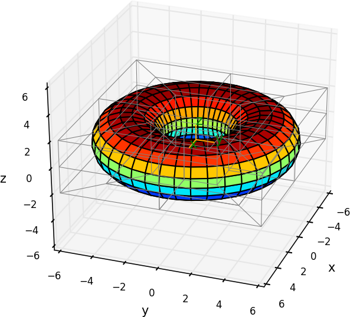</p>
</div>


# Generating normally distributed pseudo-random numbers

The `rnd` package is a wrapper to Go `rand` package but has some more _high level_ functions to
assist on works involving random numbers and probability distributions.

By using the package `rnd`, it's very easy to generate pseudo-random numbers sampled from a normal
distribution.

Source code: <a href="rnd_normalDistribution.go">rnd_normalDistribution.go</a>

<div id="container">
<p></p>
Normally distributed pseudo-random numbers
</div>


# Solution of sparse linear system

Solution of real and sparse linear system using Umfpack and high-level routines.

A small linear system is solved with [Umfpack](http://faculty.cse.tamu.edu/davis/suitesparse.html).
The sparse matrix representation is initialised with a triplet.

Given the following matrix:

```
      _                      _
     |  2   3    0    0    0  |
     |  3   0    4    0    6  |
 A = |  0  -1   -3    2    0  |
     |  0   0    1    0    0  |
     |_ 0   4    2    0    1 _|
```

and the following vector:

```
      _      _
     |    8   |
     |   45   |
 b = |   -3   |
     |    3   |
     |_  19  _|
```

solve:

```
         A.x = b
```

Output:
```
a =
    2    3    0    0    0
    3    0    4    0    6
    0   -1   -3    2    0
    0    0    1    0    0
    0    4    2    0    1
b = 8 45 -3 3 19 
x = 0.9999999999999998 2 3 4 4.999999999999998 
```

Source code: <a href="la_HLsparseReal01.go">la_HLsparseReal01.go</a>

## Alternatively, the _low-level_ routines can be used.

In this case, three steps must be taken:

1. Initialise solver
2. Perform factorisation
3. Solve problem

See: <a href="la_sparseReal01.go">la_sparseReal01.go</a>


# Solution of sparse linear system with complex numbers

Solution of complex and sparse linear system using Umfpack and high-level routines.

Given the following matrix of complex numbers:

```
      _                                                  _
     |  19.73    12.11-i      5i        0          0      |
     |  -0.51i   32.3+7i    23.07       i          0      |
 A = |    0      -0.51i    70+7.3i     3.95    19+31.83i  |
     |    0        0        1+1.1i    50.17      45.51    |
     |_   0        0          0      -9.351i       55    _|
```

and the following vector:

```
      _                  _
     |    77.38+8.82i     |
     |   157.48+19.8i     |
 b = |  1175.62+20.69i    |
     |   912.12-801.75i   |
     |_     550-1060.4i  _|
```

solve:

```
         A.x = b
```

 the solution is:

```
      _            _
     |     3.3-i    |
     |    1+0.17i   |
 x = |      5.5     |
     |       9      |
     |_  10-17.75i _|
```

Source code: <a href="la_HLsparseComplex01.go">la_HLsparseComplex01.go</a>

## Alternatively, the _low-level_ routines can be used.

See: <a href="la_sparseComplex01.go">la_sparseComplex01.go</a>


# Numerical differentiation

There are numerous uses for numerical differentiation.

In this example, numerical differentiation is employed to check that the implementation of the
derivatives of the sin function is corrected.

Source code: <a href="num_deriv01.go">num_deriv01.go</a>

<div id="container">
<p></p>
Sin function
</div>

Output:
```
                 x              analytical               numerical                   error
dy/dx   @ 0.000000                       1      0.9999999999999998   2.220446049250313e-16
d²y/dx² @ 0.000000                      -0                       0                       0
dy/dx   @ 0.628319      0.8090169943749473      0.8090169943746159  3.3140157285060923e-13
d²y/dx² @ 0.628319     -0.5877852522924731     -0.5877852522897387  2.7344793096517606e-12
dy/dx   @ 1.256637     0.30901699437494745     0.30901699437699115   2.043698543729988e-12
d²y/dx² @ 1.256637     -0.9510565162951535     -0.9510565163025483   7.394751477818318e-12
dy/dx   @ 1.884956    -0.30901699437494734     -0.3090169943750832   1.358357870628879e-13
d²y/dx² @ 1.884956     -0.9510565162951536     -0.9510565162929511   2.202571458553848e-12
dy/dx   @ 2.513274     -0.8090169943749475     -0.8090169943687026   6.244893491214043e-12
d²y/dx² @ 2.513274     -0.5877852522924732     -0.5877852522882455   4.227729277772596e-12
dy/dx   @ 3.141593                      -1     -0.9999999999784639  2.1536106231678787e-11
d²y/dx² @ 3.141593 -1.2246467991473515e-16                       0  1.2246467991473515e-16
dy/dx   @ 3.769911     -0.8090169943749475     -0.8090169943913278  1.6380341527622022e-11
d²y/dx² @ 3.769911       0.587785252292473      0.5877852522905287  1.9443335830260366e-12
dy/dx   @ 4.398230    -0.30901699437494756    -0.30901699437612157  1.1740053373898718e-12
d²y/dx² @ 4.398230      0.9510565162951535      0.9510565162973443  2.1908030944928214e-12
dy/dx   @ 5.026548     0.30901699437494723     0.30901699436647384   8.473388657392888e-12
d²y/dx² @ 5.026548      0.9510565162951536      0.9510565162933304   1.823208251039432e-12
dy/dx   @ 5.654867      0.8090169943749473       0.809016994400035  2.5087709687454662e-11
d²y/dx² @ 5.654867      0.5877852522924732      0.5877852523075159   1.504263380525117e-11
dy/dx   @ 6.283185                       1      0.9999999999840412   1.595878984517185e-11
d²y/dx² @ 6.283185   2.449293598294703e-16                       0   2.449293598294703e-16
```


# Drawing iso-surfaces with VTK

An isosurface is a geometric construction representing a 2D region containing equal values. This
surface is drawn in the 3D space (although the concept can be extended to hyperisosurfaces too) for
a given scalar field (i.e. a _level_).

In this example, the functions to generate families of surfaces resembling a cone and an ellipse are
developed. These functions are computed over a 3D grid that is used by VTK to locate the regions of
equal values. Two auxiliary scalars fields, p and q, are firstly defined.

Source code: <a href="vtk_isosurf01.go">vtk_isosurf01.go</a>

<div id="container">
<p></p>
Iso-surface
</div>


# Plotting a contour

The `plt` subpackage is a convenient wrapper to python.matplotlib/pyplot that can generate nice
graphs. For example:

Source code: <a href="plt_contour01.go">plt_contour01.go</a>

<div id="container">
<p></p>
Contour
</div>


# Root finding problems

Example: find the root of
```
    y(x) = x³ - 0.165 x² + 3.993e-4
```
within [0, 0.11]. We have to make sure that the root is bounded otherwise Brent's method doesn't
work.

Using Brent's method: <a href="num_brent01.go">num_brent01.go</a>

Output:
```
  it                      x                   f(x)                    err
                                                                  1.0e-14
   0  1.100000000000000e-01 -2.662000000000001e-04  5.500000000000000e-02
   1  6.600000000000000e-02 -3.194400000000011e-05  3.300000000000000e-02
   2  6.044444444444443e-02  1.730305075445823e-05  2.777777777777785e-03
   3  6.239640011030302e-02 -1.676981032316081e-07  9.759778329292944e-04
   4  6.237766369176578e-02 -7.323468182796403e-10  9.666096236606754e-04
   5  6.237758151338346e-02  3.262039076357137e-15  4.108919116063703e-08
   6  6.237758151374950e-02  0.000000000000000e+00  4.108900814037142e-08

x      = 0.0623775815137495
f(x)   = 0
nfeval = 8
niter. = 6
```

<div id="container">
<p></p>
Simple root finding problem solved by Brent's method.
</div>


Using Newton's method: <a href="num_newton01.go">num_newton01.go</a>

Output:
```
  it                    Ldx                 fx_max
                  (1.0e-04)              (1.0e-09)
   0  0.000000000000000e+00  2.778000000000000e-04
   1  3.745954692556634e+06  5.421253067129628e-05
   2  6.176571448942142e+05  1.391803634400563e-06
   2  1.515117884960284e+04  5.314115983194589e-10
. . . converged with fx_max. nit=2, nFeval=4, nJeval=3

x      = 0.062377521883073835
f(x)   = 5.314115983194589e-10
nfeval = 4
niter. = 2
```

<div id="container">
<p>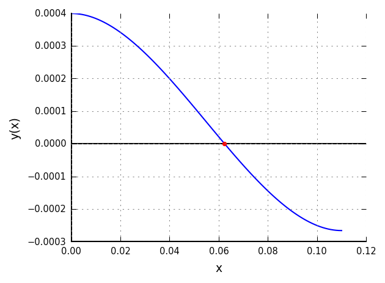</p>
Simple root finding problem solved by Newton's method.
</div>


# B-splines: curve, control, and basis

Source code: <a href="gm_bspline02.go">gm_bspline02.go</a>

<div id="container">
<p>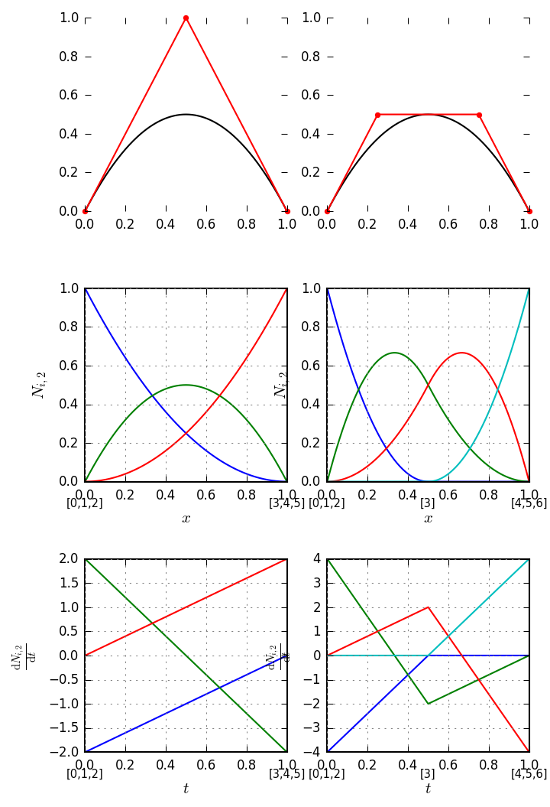</p>
</div>


# Orthogonal polynomials

This example generates the following orthogonal polynomials and plot according to figures in [1]

* Jacobi
* Chebyshev First Kind
* Chebyshev Second Kind
* Legendre
* Hermite

Source code: <a href="fun_orthopoly01.go">fun_orthopoly01.go</a>

## Jacobi: Figure 22.1

<div id="container">
<p>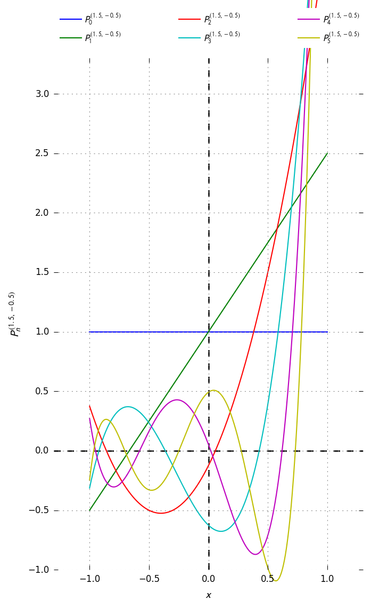</p>
Jacobi orthogonal polynomials. Figure 22.1 of [1]
</div>

## Chebyshev1: Figure 22.6

<div id="container">
<p>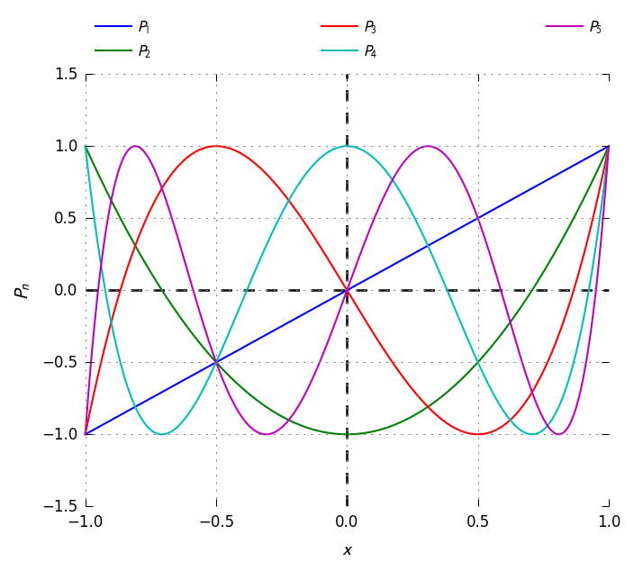</p>
Chebyshev 1st kind orthogonal polynomials. Figure 22.6 of [1]
</div>

## Chebyshev2: Figure 22.7

<div id="container">
<p>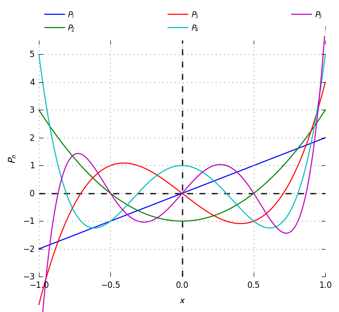</p>
Chebyshev 2nd kind orthogonal polynomials. Figure 22.7 of [1]
</div>

## Legendre: Figure 22.8

<div id="container">
<p>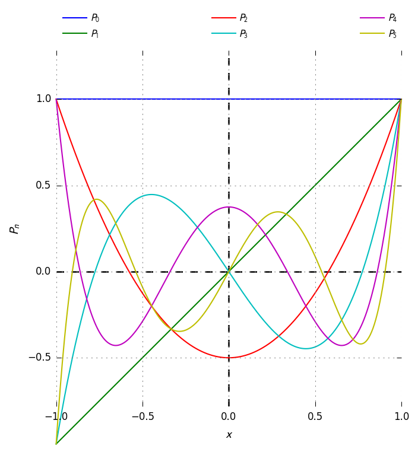</p>
Legendre orthogonal polynomials. Figure 22.8 of [1]
</div>

## Hermite: Figure 22.10

<div id="container">
<p>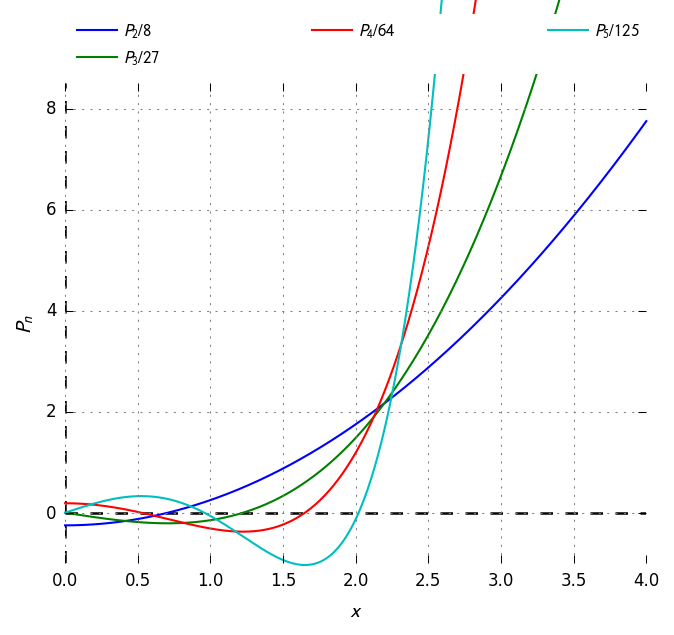</p>
Hermite orthogonal polynomials. Figure 22.10 of [1]
</div>

## Reference:
[1] Abramowitz M, Stegun IA (1972) Handbook of Mathematical Functions with Formulas,
    Graphs, and Mathematical Tables. U.S. Department of Commerce, NIST


# Lagrange interpolation using Chebyshev points

This example interpolates the Runge curve using the following formula:

```
                  N
      X          ————             X
     I {f}(x) =  \     f(x[i]) ⋅ ℓ (x)
      N          /                i
                 ————
                 i = 0
```

where ℓ is the Lagrange (cardinal) function.

Source code: <a href="fun_laginterp01.go">fun_laginterp01.go</a>

## Generating (nodal) polynomial

With N = 8

```
               N
       X      ━━━━
      ω (x) = ┃  ┃ (x - X[i])
      N+1     ┃  ┃
             i = 0
```

<div id="container">
<p>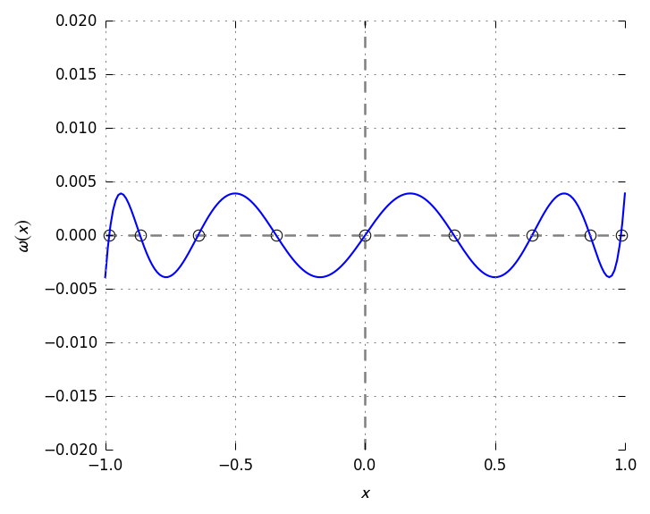</p>
</div>

## Runge curve for many polynomial degrees

<div id="container">
<p>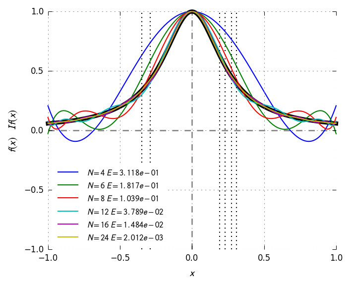</p>
</div>


## Error estimate

<div id="container">
<p>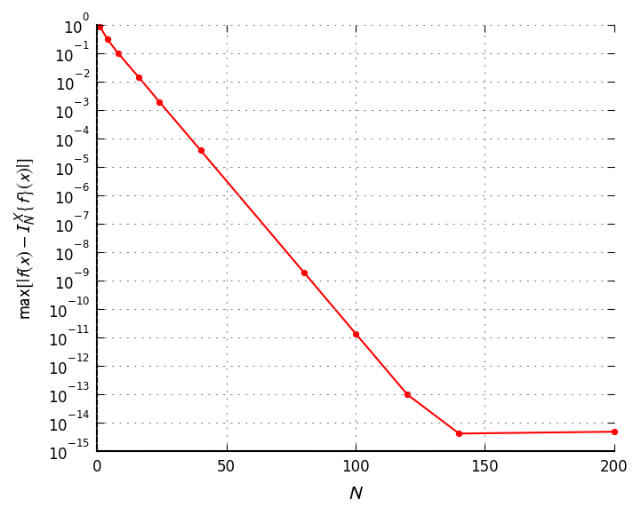</p>
</div>


# Fourier interpolation

Interpolte the boxcar function using truncate Fourier series

Source code: <a href="fun_fourierinterp01.go">fun_fourierinterp01.go</a>

<div id="container">
<p>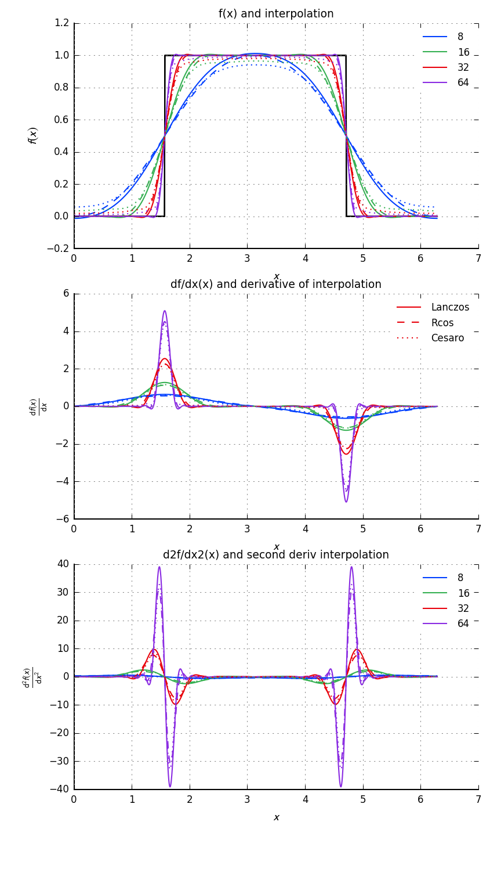</p>
</div>
