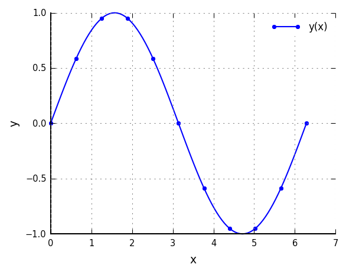
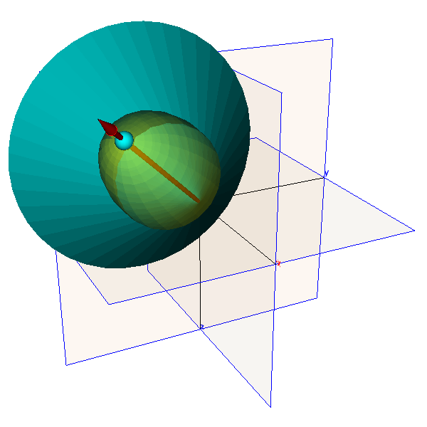

# Gosl &ndash; examples

## Summary
1.  **la_umfpack01** -- Solution of linear system with Umfpack and sparse matrices.
2.  **num_deriv01** -- Numerical differentiation.
3.  **vtk_isosurf01** -- Visualisatioin of iso-surface using VTK.


# 1 la_umfpack01 -- Linear Algebra -- Umfpack01

A small linear system is solved with [Umfpack](http://faculty.cse.tamu.edu/davis/suitesparse.html). The sparse matrix representation is initialised with a triplet.

Source code: <a href="la_umfpackex01.go">la_umfpackex01.go</a>

Output:
```
a =
    2    3    0    0    0
    3    0    4    0    6
    0   -1   -3    2    0
    0    0    1    0    0
    0    4    2    0    1
b = 8 45 -3 3 19 
x = 0.9999999999999998 2 3 4 4.999999999999998 
```


# 2 num_deriv01 -- Numerical -- differentiation

Numerical differentiation is employed to check that the implementation of derivatives of the sin function is corrected.

Source code: <a href="num_deriv01.go">num_deriv01.go</a>

<div id="container">
<p></p>
Sin function
</div>

Output:
```
                 x              analytical               numerical                   error
dy/dx   @ 0.000000                       1      0.9999999999999998   2.220446049250313e-16
d²y/dx² @ 0.000000                      -0                       0                       0
dy/dx   @ 0.628319      0.8090169943749473      0.8090169943746159  3.3140157285060923e-13
d²y/dx² @ 0.628319     -0.5877852522924731     -0.5877852522897387  2.7344793096517606e-12
dy/dx   @ 1.256637     0.30901699437494745     0.30901699437699115   2.043698543729988e-12
d²y/dx² @ 1.256637     -0.9510565162951535     -0.9510565163025483   7.394751477818318e-12
dy/dx   @ 1.884956    -0.30901699437494734     -0.3090169943750832   1.358357870628879e-13
d²y/dx² @ 1.884956     -0.9510565162951536     -0.9510565162929511   2.202571458553848e-12
dy/dx   @ 2.513274     -0.8090169943749475     -0.8090169943687026   6.244893491214043e-12
d²y/dx² @ 2.513274     -0.5877852522924732     -0.5877852522882455   4.227729277772596e-12
dy/dx   @ 3.141593                      -1     -0.9999999999784639  2.1536106231678787e-11
d²y/dx² @ 3.141593 -1.2246467991473515e-16                       0  1.2246467991473515e-16
dy/dx   @ 3.769911     -0.8090169943749475     -0.8090169943913278  1.6380341527622022e-11
d²y/dx² @ 3.769911       0.587785252292473      0.5877852522905287  1.9443335830260366e-12
dy/dx   @ 4.398230    -0.30901699437494756    -0.30901699437612157  1.1740053373898718e-12
d²y/dx² @ 4.398230      0.9510565162951535      0.9510565162973443  2.1908030944928214e-12
dy/dx   @ 5.026548     0.30901699437494723     0.30901699436647384   8.473388657392888e-12
d²y/dx² @ 5.026548      0.9510565162951536      0.9510565162933304   1.823208251039432e-12
dy/dx   @ 5.654867      0.8090169943749473       0.809016994400035  2.5087709687454662e-11
d²y/dx² @ 5.654867      0.5877852522924732      0.5877852523075159   1.504263380525117e-11
dy/dx   @ 6.283185                       1      0.9999999999840412   1.595878984517185e-11
d²y/dx² @ 6.283185   2.449293598294703e-16                       0   2.449293598294703e-16
```


# 3 vtk_isosurf01 -- VTK -- visualising iso-surfaces

Two iso-surfaces are added to the 3D scene using VTK. One is a cone and the other an ellipsoid.

Source code: <a href="vtk_isosurf01.go">vtk_isosurf01.go</a>

<div id="container">
<p></p>
Iso-surface
</div>
