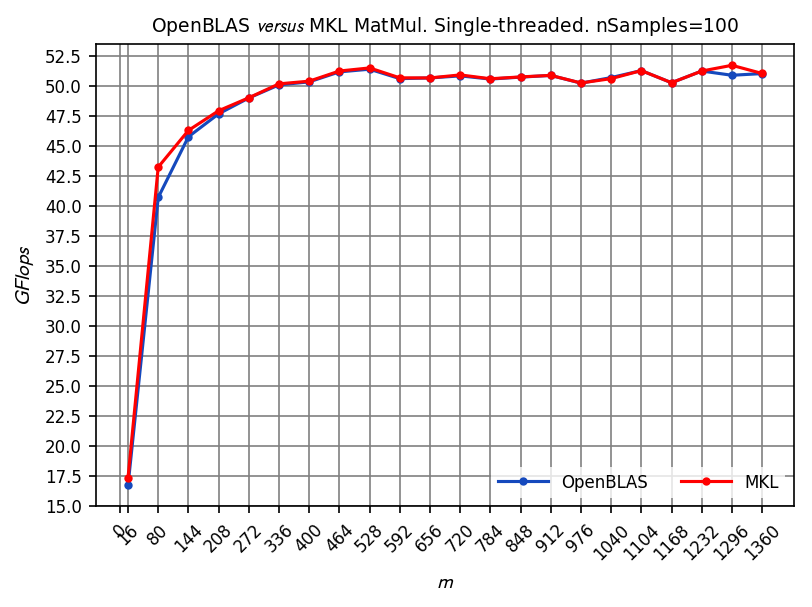
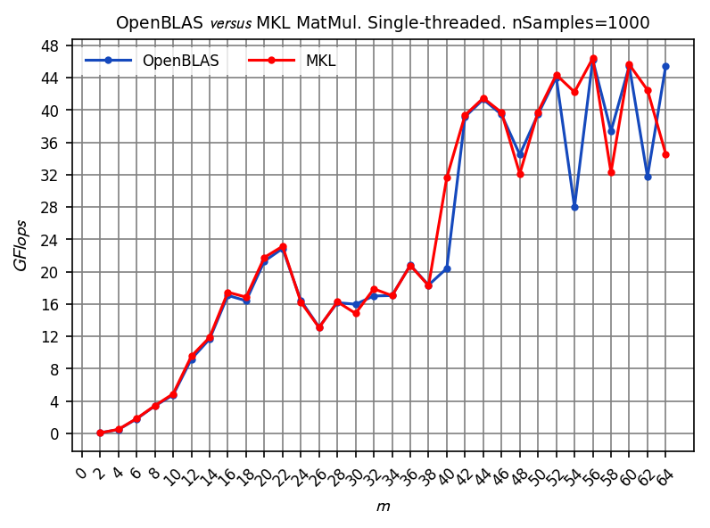

# Gosl Benchmark

## Summary

* Matrix-Matrix multiplication: oblas.Dgemm versus Naïve approach
* Matrix-Matrix multiplication: OpenBLAS versus MKL

These tests were run on:
* Ubuntu 16.04.2 LTS (from lsb_release -a)
* Intel(R) Core(TM) i7-4770 CPU @ 3.40GHz (from cat /proc/cpuinfo) and "standard flags"
with default OpenBLAS compilation.


# Matrix-Matrix multiplication: oblas.Dgemm versus Naïve approach

Test ran at: 2017 Jun 23

Source code: <a href="oblas_dgemm01.go">oblas_dgemm01.go</a>

## Larger matrices

<div id="container">
<p></p>
</div>

Output (larger matrices):
```
   size   ┃     OpenBLAS dgemm     (Dt) ┃          naïve           (naiveDt) ┃ naiveDt/Dt
━━━━━━━━━━╋━━━━━━━━━━━━━━━━━━━━━━━━━━━━━╋━━━━━━━━━━━━━━━━━━━━━━━━━━━━━━━━━━━━╋━━━━━━━━━━━━━━
  16×  16 ┃  8.71 GFlops (       940ns) ┃ naive:  0.89 GFlops (     9.159µs) ┃ 9.744 
  80×  80 ┃ 27.10 GFlops (    37.787µs) ┃ naive:  0.85 GFlops (  1.211082ms) ┃ 32.050 
 144× 144 ┃ 35.45 GFlops (   168.442µs) ┃ naive:  0.79 GFlops (  7.536701ms) ┃ 44.744 
 208× 208 ┃ 38.53 GFlops (   467.142µs) ┃ naive:  0.73 GFlops ( 24.490851ms) ┃ 52.427 
 272× 272 ┃ 41.79 GFlops (   963.097µs) ┃ naive:  0.78 GFlops ( 51.918322ms) ┃ 53.908 
 336× 336 ┃ 43.48 GFlops (  1.744716ms) ┃ naive:  0.72 GFlops (105.320761ms) ┃ 60.366 
 400× 400 ┃ 44.65 GFlops (  2.866527ms) ┃ naive:  0.72 GFlops (178.326095ms) ┃ 62.210 
 464× 464 ┃ 45.44 GFlops (  4.396533ms) ┃ naive:  0.65 GFlops (309.134597ms) ┃ 70.313 
 528× 528 ┃ 44.20 GFlops (    6.6598ms) ┃ naive:  0.71 GFlops (412.563052ms) ┃ 61.948 
 592× 592 ┃ 44.25 GFlops (  9.378083ms) ┃ naive:  0.71 GFlops (585.060299ms) ┃ 62.386 
 656× 656 ┃ 44.99 GFlops ( 12.549349ms) ┃ naive:  0.32 GFlops (1.739039722s) ┃ 138.576 
 720× 720 ┃ 45.78 GFlops ( 16.306108ms) ┃ naive:  0.67 GFlops (1.109812566s) ┃ 68.061 
 784× 784 ┃ 45.55 GFlops ( 21.159115ms) ┃ naive: N/A                         ┃ N/A
 848× 848 ┃ 45.88 GFlops ( 26.582728ms) ┃ naive: N/A                         ┃ N/A
 912× 912 ┃ 46.49 GFlops ( 32.634519ms) ┃ naive: N/A                         ┃ N/A
 976× 976 ┃ 46.63 GFlops (  39.87703ms) ┃ naive: N/A                         ┃ N/A
1040×1040 ┃ 45.89 GFlops ( 49.024206ms) ┃ naive: N/A                         ┃ N/A
1104×1104 ┃ 46.25 GFlops ( 58.192775ms) ┃ naive: N/A                         ┃ N/A
1168×1168 ┃ 46.56 GFlops ( 68.441843ms) ┃ naive: N/A                         ┃ N/A
1232×1232 ┃ 46.73 GFlops ( 80.037818ms) ┃ naive: N/A                         ┃ N/A
1296×1296 ┃ 46.74 GFlops (  93.15229ms) ┃ naive: N/A                         ┃ N/A
1360×1360 ┃ 46.27 GFlops (108.736216ms) ┃ naive: N/A                         ┃ N/A
```

## Small matrices

<div id="container">
<p></p>
</div>

Output (small matrices):
```
   size   ┃     OpenBLAS dgemm     (Dt) ┃          naïve           (naiveDt) ┃ naiveDt/Dt
━━━━━━━━━━╋━━━━━━━━━━━━━━━━━━━━━━━━━━━━━╋━━━━━━━━━━━━━━━━━━━━━━━━━━━━━━━━━━━━╋━━━━━━━━━━━━━━
   2×   2 ┃  0.04 GFlops (       389ns) ┃ naive:  0.35 GFlops (        46ns) ┃ 0.118 
   4×   4 ┃  0.29 GFlops (       442ns) ┃ naive:  0.43 GFlops (       300ns) ┃ 0.679 
   6×   6 ┃  0.78 GFlops (       552ns) ┃ naive:  0.52 GFlops (       835ns) ┃ 1.513 
   8×   8 ┃  1.67 GFlops (       615ns) ┃ naive:  0.55 GFlops (     1.871µs) ┃ 3.042 
  10×  10 ┃  2.31 GFlops (       866ns) ┃ naive:  0.55 GFlops (     3.607µs) ┃ 4.165 
  12×  12 ┃  3.47 GFlops (       995ns) ┃ naive:  0.57 GFlops (     6.067µs) ┃ 6.097 
  14×  14 ┃  3.96 GFlops (     1.385µs) ┃ naive:  0.42 GFlops (    13.198µs) ┃ 9.529 
  16×  16 ┃  5.74 GFlops (     1.428µs) ┃ naive:  0.59 GFlops (    13.912µs) ┃ 9.742 
  18×  18 ┃  5.95 GFlops (      1.96µs) ┃ naive:  0.42 GFlops (    27.639µs) ┃ 14.102 
  20×  20 ┃  8.98 GFlops (     1.781µs) ┃ naive:  0.96 GFlops (    16.593µs) ┃ 9.317 
  22×  22 ┃ 12.65 GFlops (     1.684µs) ┃ naive:  0.84 GFlops (    25.442µs) ┃ 15.108 
  24×  24 ┃ 15.19 GFlops (      1.82µs) ┃ naive:  0.87 GFlops (    31.848µs) ┃ 17.499 
  26×  26 ┃ 14.28 GFlops (     2.461µs) ┃ naive:  0.87 GFlops (    40.324µs) ┃ 16.385 
  28×  28 ┃ 16.06 GFlops (     2.734µs) ┃ naive:  0.89 GFlops (    49.472µs) ┃ 18.095 
  30×  30 ┃ 15.59 GFlops (     3.464µs) ┃ naive:  0.87 GFlops (    61.833µs) ┃ 17.850 
  32×  32 ┃ 17.44 GFlops (     3.757µs) ┃ naive:  0.86 GFlops (     76.38µs) ┃ 20.330 
  34×  34 ┃ 16.88 GFlops (     4.656µs) ┃ naive:  0.87 GFlops (    90.112µs) ┃ 19.354 
  36×  36 ┃ 18.46 GFlops (     5.055µs) ┃ naive:  0.83 GFlops (   112.196µs) ┃ 22.195 
  38×  38 ┃ 17.83 GFlops (     6.154µs) ┃ naive:  0.84 GFlops (   131.115µs) ┃ 21.306 
  40×  40 ┃ 18.30 GFlops (     6.995µs) ┃ naive:  0.84 GFlops (   152.936µs) ┃ 21.864 
  42×  42 ┃ 19.41 GFlops (     7.635µs) ┃ naive:  0.84 GFlops (   176.249µs) ┃ 23.084 
  44×  44 ┃ 21.06 GFlops (     8.088µs) ┃ naive:  0.84 GFlops (   201.707µs) ┃ 24.939 
  46×  46 ┃ 20.07 GFlops (     9.702µs) ┃ naive:  0.85 GFlops (   229.871µs) ┃ 23.693 
  48×  48 ┃ 23.89 GFlops (      9.26µs) ┃ naive:  0.85 GFlops (   261.616µs) ┃ 28.252 
  50×  50 ┃ 21.37 GFlops (      11.7µs) ┃ naive:  0.85 GFlops (    295.49µs) ┃ 25.256 
  52×  52 ┃ 22.86 GFlops (    12.304µs) ┃ naive:  0.85 GFlops (   331.815µs) ┃ 26.968 
  54×  54 ┃ 21.47 GFlops (     14.67µs) ┃ naive:  0.85 GFlops (   372.515µs) ┃ 25.393 
  56×  56 ┃ 25.66 GFlops (    13.686µs) ┃ naive:  0.85 GFlops (   415.259µs) ┃ 30.342 
  58×  58 ┃ 24.15 GFlops (    16.161µs) ┃ naive:  0.85 GFlops (   460.571µs) ┃ 28.499 
  60×  60 ┃ 25.59 GFlops (    16.879µs) ┃ naive:  0.85 GFlops (   509.182µs) ┃ 30.167 
  62×  62 ┃ 24.02 GFlops (    19.842µs) ┃ naive:  0.84 GFlops (   566.528µs) ┃ 28.552 
  64×  64 ┃ 26.61 GFlops (    19.703µs) ┃ naive:  0.84 GFlops (   623.595µs) ┃ 31.650 
```


# Matrix-Matrix multiplication: OpenBLAS versus MKL

Test ran at: 2017 Jun 30

Source code: <a href="mkl_oblas_dgemm01.go">mkl_oblas_dgemm01.go</a>

## Larger matrices

<div id="container">
<p></p>
</div>

Output (larger matrices):
```
   size   ┃     OpenBLAS dgemm     (Dt) ┃            MKL           (mklDt) ┃ Dt/mklDt
━━━━━━━━━━╋━━━━━━━━━━━━━━━━━━━━━━━━━━━━━╋━━━━━━━━━━━━━━━━━━━━━━━━━━━━━━━━━━╋━━━━━━━━━
  16×  16 ┃ 16.72 GFlops (       490ns) ┃ mkl: 17.36 GFlops (       472ns) ┃ 1.038 
  80×  80 ┃ 40.70 GFlops (     25.16µs) ┃ mkl: 43.23 GFlops (    23.687µs) ┃ 1.062 
 144× 144 ┃ 45.76 GFlops (   130.516µs) ┃ mkl: 46.29 GFlops (    129.02µs) ┃ 1.012 
 208× 208 ┃ 47.67 GFlops (    377.56µs) ┃ mkl: 47.93 GFlops (   375.534µs) ┃ 1.005 
 272× 272 ┃ 48.99 GFlops (   821.539µs) ┃ mkl: 49.01 GFlops (   821.264µs) ┃ 1.000 
 336× 336 ┃ 50.08 GFlops (  1.514853ms) ┃ mkl: 50.17 GFlops (   1.51229ms) ┃ 1.002 
 400× 400 ┃ 50.33 GFlops (  2.543093ms) ┃ mkl: 50.39 GFlops (  2.540164ms) ┃ 1.001 
 464× 464 ┃ 51.16 GFlops (  3.904962ms) ┃ mkl: 51.24 GFlops (  3.899508ms) ┃ 1.001 
 528× 528 ┃ 51.39 GFlops (  5.728946ms) ┃ mkl: 51.49 GFlops (  5.717217ms) ┃ 1.002 
 592× 592 ┃ 50.60 GFlops (  8.200573ms) ┃ mkl: 50.67 GFlops (  8.189586ms) ┃ 1.001 
 656× 656 ┃ 50.66 GFlops ( 11.145439ms) ┃ mkl: 50.66 GFlops ( 11.145032ms) ┃ 1.000 
 720× 720 ┃ 50.83 GFlops (  14.68571ms) ┃ mkl: 50.91 GFlops (  14.66257ms) ┃ 1.002 
 784× 784 ┃ 50.57 GFlops ( 19.059985ms) ┃ mkl: 50.59 GFlops ( 19.050532ms) ┃ 1.000 
 848× 848 ┃ 50.73 GFlops ( 24.042132ms) ┃ mkl: 50.74 GFlops ( 24.033942ms) ┃ 1.000 
 912× 912 ┃ 50.87 GFlops ( 29.823032ms) ┃ mkl: 50.87 GFlops ( 29.821971ms) ┃ 1.000 
 976× 976 ┃ 50.23 GFlops ( 37.021225ms) ┃ mkl: 50.24 GFlops (  37.01074ms) ┃ 1.000 
1040×1040 ┃ 50.69 GFlops ( 44.383743ms) ┃ mkl: 50.60 GFlops ( 44.459843ms) ┃ 0.998 
1104×1104 ┃ 51.27 GFlops ( 52.487365ms) ┃ mkl: 51.27 GFlops ( 52.488097ms) ┃ 1.000 
1168×1168 ┃ 50.26 GFlops ( 63.407657ms) ┃ mkl: 50.26 GFlops ( 63.404989ms) ┃ 1.000 
1232×1232 ┃ 51.24 GFlops ( 72.994964ms) ┃ mkl: 51.23 GFlops ( 72.997221ms) ┃ 1.000 
1296×1296 ┃ 50.88 GFlops ( 85.561895ms) ┃ mkl: 51.71 GFlops ( 84.188557ms) ┃ 1.016 
1360×1360 ┃ 51.02 GFlops ( 98.602955ms) ┃ mkl: 51.03 GFlops ( 98.585464ms) ┃ 1.000 
```

## Small matrices

<div id="container">
<p></p>
</div>

Output (small matrices):
```
   size   ┃     OpenBLAS dgemm     (Dt) ┃            MKL           (mklDt) ┃ Dt/mklDt
━━━━━━━━━━╋━━━━━━━━━━━━━━━━━━━━━━━━━━━━━╋━━━━━━━━━━━━━━━━━━━━━━━━━━━━━━━━━━╋━━━━━━━━━
   2×   2 ┃  0.06 GFlops (       282ns) ┃ mkl:  0.06 GFlops (       260ns) ┃ 1.085 
   4×   4 ┃  0.47 GFlops (       274ns) ┃ mkl:  0.48 GFlops (       266ns) ┃ 1.030 
   6×   6 ┃  1.79 GFlops (       242ns) ┃ mkl:  1.84 GFlops (       235ns) ┃ 1.030 
   8×   8 ┃  3.39 GFlops (       302ns) ┃ mkl:  3.42 GFlops (       299ns) ┃ 1.010 
  10×  10 ┃  4.74 GFlops (       422ns) ┃ mkl:  4.89 GFlops (       409ns) ┃ 1.032 
  12×  12 ┃  9.19 GFlops (       376ns) ┃ mkl:  9.55 GFlops (       362ns) ┃ 1.039 
  14×  14 ┃ 11.68 GFlops (       470ns) ┃ mkl: 11.88 GFlops (       462ns) ┃ 1.017 
  16×  16 ┃ 17.07 GFlops (       480ns) ┃ mkl: 17.47 GFlops (       469ns) ┃ 1.023 
  18×  18 ┃ 16.41 GFlops (       711ns) ┃ mkl: 16.86 GFlops (       692ns) ┃ 1.027 
  20×  20 ┃ 21.30 GFlops (       751ns) ┃ mkl: 21.77 GFlops (       735ns) ┃ 1.022 
  22×  22 ┃ 22.87 GFlops (       931ns) ┃ mkl: 23.15 GFlops (       920ns) ┃ 1.012 
  24×  24 ┃ 16.44 GFlops (     1.682µs) ┃ mkl: 16.25 GFlops (     1.701µs) ┃ 0.989 
  26×  26 ┃ 13.14 GFlops (     2.675µs) ┃ mkl: 13.08 GFlops (     2.687µs) ┃ 0.996 
  28×  28 ┃ 16.17 GFlops (     2.715µs) ┃ mkl: 16.28 GFlops (     2.697µs) ┃ 1.007 
  30×  30 ┃ 15.98 GFlops (      3.38µs) ┃ mkl: 14.84 GFlops (     3.639µs) ┃ 0.929 
  32×  32 ┃ 17.00 GFlops (     3.855µs) ┃ mkl: 17.88 GFlops (     3.665µs) ┃ 1.052 
  34×  34 ┃ 17.05 GFlops (      4.61µs) ┃ mkl: 17.04 GFlops (     4.613µs) ┃ 0.999 
  36×  36 ┃ 20.82 GFlops (     4.481µs) ┃ mkl: 20.79 GFlops (     4.489µs) ┃ 0.998 
  38×  38 ┃ 18.35 GFlops (      5.98µs) ┃ mkl: 18.27 GFlops (     6.006µs) ┃ 0.996 
  40×  40 ┃ 20.42 GFlops (     6.269µs) ┃ mkl: 31.66 GFlops (     4.043µs) ┃ 1.551 
  42×  42 ┃ 39.18 GFlops (     3.782µs) ┃ mkl: 39.38 GFlops (     3.763µs) ┃ 1.005 
  44×  44 ┃ 41.33 GFlops (     4.122µs) ┃ mkl: 41.49 GFlops (     4.106µs) ┃ 1.004 
  46×  46 ┃ 39.46 GFlops (     4.934µs) ┃ mkl: 39.71 GFlops (     4.902µs) ┃ 1.007 
  48×  48 ┃ 34.49 GFlops (     6.413µs) ┃ mkl: 32.13 GFlops (     6.884µs) ┃ 0.932 
  50×  50 ┃ 39.49 GFlops (     6.331µs) ┃ mkl: 39.77 GFlops (     6.286µs) ┃ 1.007 
  52×  52 ┃ 44.05 GFlops (     6.384µs) ┃ mkl: 44.37 GFlops (     6.338µs) ┃ 1.007 
  54×  54 ┃ 28.00 GFlops (    11.246µs) ┃ mkl: 42.24 GFlops (     7.456µs) ┃ 1.508 
  56×  56 ┃ 46.23 GFlops (     7.598µs) ┃ mkl: 46.42 GFlops (     7.567µs) ┃ 1.004 
  58×  58 ┃ 37.40 GFlops (    10.435µs) ┃ mkl: 32.31 GFlops (    12.079µs) ┃ 0.864 
  60×  60 ┃ 45.46 GFlops (     9.502µs) ┃ mkl: 45.65 GFlops (     9.464µs) ┃ 1.004 
  62×  62 ┃ 31.75 GFlops (    15.012µs) ┃ mkl: 42.48 GFlops (     11.22µs) ┃ 1.338 
  64×  64 ┃ 45.46 GFlops (    11.532µs) ┃ mkl: 34.58 GFlops (     15.16µs) ┃ 0.761 
```
