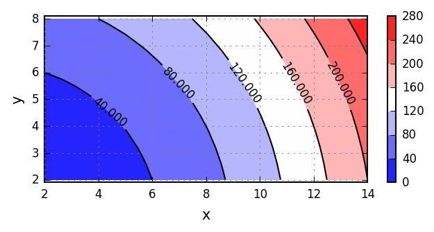

# Gosl. fdm. Simple finite differences method

More information is available in **[the documentation of this package](http://rawgit.com/cpmech/gosl/master/doc/xxfdm.html).**

This package implements few routines to help with the implementation of the finite differences
method (FDM).

Basically, it has a `Grid2D` structure and functions to _assemble_ the linear system, considering
the existence of _known_ equations due to boundary conditions.

Another key structure of this package is the `Equations` data type that organises the numbers (ids)
assigned to each equation originating from the FDM discretisation.

A typical FDM problem will require the solution of the following linear system:

**K** * **U** = **F**

where **K** is a matrix (sometimes called the _stiffness matrix_), **U** is the solution vector
(e.g. displacements), and **F** is the _right-hand-side_ vector (e.g. forces).

Now, some components of the **U** vector are known (given or prescribed) due to the boundary
conditions. To automatize the solution, the **K** matrix is _split_ as shown below:

```
K11 K12 => unknowns
K21 K22 => prescribed
 |   +---> prescribed
 +-------> unknowns
```

where the numbers **1** indicate unknown quantities and the numbers **2** indicated known
(prescribed) quantities.

The _ids_ (numbers, indices) of each row in **U**, i.e. the **equation numbers**, can be organised
in the `Equations` structure defined below:

```go
type Equations struct {
    N1, N2, N int   // unknowns, prescribed, total numbers
    RF1, FR1  []int // reduced=>full and full=>reduced maps for unknowns
    RF2, FR2  []int // reduced=>full and full=>reduced maps for prescribed
}
```

where

```
"RF" means "reduced to full"
"FR" means "full to reduced"
reduced 1: is a reduced system of equations where only unknown equations are present
reduced 2: is a reduced system of equations where only prescribed equations are present
full     : corresponds to all equations, unknown and prescribed
```

For instance:

```
N   = 9         => total number of equations
peq = [0  3  6] => prescribed equations

  0  1  2  3  4  5  6  7  8                       0   1  2   3   4  5   6   7  8
0 +--------+--------+------ 0 -- prescribed -- 0 [22] 21 21 [22] 21 21 [22] 21 21 0
1 |        |        |       1                  1  12  .. ..  12  .. ..  12  .. .. 1
2 |        |        |       2                  2  12  .. ..  12  .. ..  12  .. .. 2
3 +--------+--------+------ 3 -- prescribed -- 3 [22] 21 21 [22] 21 21 [22] 21 21 3
4 |        |        |       4                  4  12  .. ..  12  .. ..  12  .. .. 4
5 |        |        |       5                  5  12  .. ..  12  .. ..  12  .. .. 5
6 +--------+--------+------ 6 -- prescribed -- 6 [22] 21 21 [22] 21 21 [22] 21 21 6
7 |        |        |       7                  7  12  .. ..  12  .. ..  12  .. .. 7
8 |        |        |       8                  8  12  .. ..  12  .. ..  12  .. .. 8
  0  1  2  3  4  5  6  7  8                       0   1  2   3   4  5   6   7  8
  |        |        |
 pre      pre      pre                                 .. => 11 equations

N1 = 6 => number of equations of type 1 (unknowns)
N2 = 3 => number of equations of type 2 (prescribed)
N1 + N2 == N
```

Therefore:
```
       0  1  2  3  4  5
RF1 = [1  2  4  5  7  8]           => ex:  RF1[3] = full system equation # 5

       0  1  2  3  4  5  6  7  8
FR1 = [   0  1     2  3     4  5]  => ex:  FR1[5] = reduced system equation # 3
      -1       -1       -1         => indicates 'value not set'

       0  1  2
RF2 = [0  3  6]                    => ex:  RF2[1] = full system equation # 3

       0  1  2  3  4  5  6  7  8
FR2 = [0        1        2      ]  => ex:  FR2[3] = reduced system equation # 1
         -1 -1    -1 -1    -1 -1   => indicates 'value not set'
```

## Examples

### Using Grid2d

Grid2d can be used to plot a contour. Example:

```go
// create grid
var g fdm.Grid2d
g.Init(2.0, 14.0, 2.0, 8.0, 21, 11)

// callback function
fxy := func(x, y float64) float64 { return x*x + y*y }

// generate data
X, Y, F := g.Generate(fxy, nil)

// clear figure, apply default configuration values,
// and set height/width proportion to 0.5
plt.Reset(true, &plt.A{Prop: 0.5})

// draw contour
plt.ContourF(X, Y, F, nil)

// setup axes and save figure as PNG file
plt.Equal()
plt.Gll("x", "y", nil)
plt.Save("/tmp/gosl", "fdm_grid2d")
```
Source code: <a href="../examples/fdm_grid2d.go">../examples/fdm_grid2d.go</a>

Output:
<div id="container">
<p></p>
Contour with Grid2d
</div>


### Solution of Poisson's equation

Solving:

```
                ∂²u        ∂²u
           - kx ———  -  ky ———  =  1
                ∂x²        ∂y²
```

with zero Dirichlet boundary conditions around [-1, 1] x [-1, 1] and with kx=1 and ky=1.

Solution with `fdm` and plotting with `plt`:

```go
// material data
kx, ky := 1.0, 1.0
source := func(x, y float64, args ...interface{}) float64 {
    return 1.0
}

// closed-form solution (for reference)
π, π3, N := math.Pi, math.Pow(math.Pi, 3.0), 50
solution := func(x, y float64) (res float64) {
    res = (1.0 - x*x) / 2.0
    for i := 1; i < N; i += 2 {
        k := float64(i)
        a := k * π * (1.0 + x) / 2.0
        b := k * π * (1.0 + y) / 2.0
        c := k * π * (1.0 - y) / 2.0
        d := k * k * k * math.Sinh(k*π)
        res -= (16.0 / π3) * (math.Sin(a) / d) * (math.Sinh(b) + math.Sinh(c))
    }
    return
}

// allocate grid
var g fdm.Grid2d
g.Init(-1.0, 1.0, -1.0, 1.0, 11, 11)

// ids of equations with prescribed (known, given) U values
// all around the square domain
peq := utl.IntUnique(g.B, g.R, g.T, g.L)

// structure to hold equations ids.
// each grid node corresponds to one equation
// i.e. number of equations == g.N
var e fdm.Equations
e.Init(g.N, peq)

// set K11 and K12 => corresponding to unknown eqs
var K11, K12 la.Triplet
fdm.InitK11andK12(&K11, &K12, &e)

// assemble system
F1 := make([]float64, e.N1)
fdm.AssemblePoisson2d(&K11, &K12, F1, kx, ky, source, &g, &e)

// set prescribed values (default == 0.0)
U2 := make([]float64, e.N2)

// solve linear problem:
//   K11 * U1 = F1
U1, err := la.SolveRealLinSys(&K11, F1)
if err != nil {
    chk.Panic("solve failed: %v", err)
}

// merge solution with known values
U := make([]float64, g.N)
fdm.JoinVecs(U, U1, U2, &e)

// plotting
X, Y, F := g.Generate(nil, U)
var gsol fdm.Grid2d
gsol.Init(-1.0, 1.0, -1.0, 1.0, 101, 101)
Xsol, Ysol, Fsol := gsol.Generate(solution, nil)
plt.Reset(false, nil)
plt.ContourF(X, Y, F, &plt.A{CmapIdx: 1})
plt.ContourL(Xsol, Ysol, Fsol, &plt.A{Colors: []string{"yellow"}, Lw: 20})
plt.Equal()
plt.Gll("x", "y", nil)
plt.Save("/tmp/gosl", "fdm_problem01")
```

Source code: <a href="../examples/fdm_problem01.go">../examples/fdm_problem01.go</a>

Output:
<div id="container">
<p></p>
Solution of Poisson's equation
</div>
