# Gosl. fun. Scalar functions of one scalar and one vector

More information is available in [the documentation of this package](http://rawgit.com/cpmech/gosl/master/doc/xxfun.html).

This package defines and implements simple scalar functions. The derivatives and gradients of these
functions are also implemented.

The main interface in this package is `Func` which defines the F, G, H (mathematical) functions.
The `Func` interface is:

```go
type Func interface {
	Init(prms Prms) error                     // initialise function parameters
	F(t float64, x []float64) float64         // y = F(t, x)
	G(t float64, x []float64) float64         // ∂y/∂t_cteX = G(t, x)
	H(t float64, x []float64) float64         // ∂²y/∂t²_cteX = H(t, x)
	Grad(v []float64, t float64, x []float64) // ∇F = ∂y/∂x = Grad(t, x)
}
```

The other important structure is `Prm` which holds control parameters (e.g. function constants).
This structure is defined as follows:

```go
type Prm struct {

	// input
	N      string  `json:"n"`      // name of parameter
	V      float64 `json:"v"`      // value of parameter
	Min    float64 `json:"min"`    // min value
	Max    float64 `json:"max"`    // max value
	S      float64 `json:"s"`      // standard deviation
	D      string  `json:"d"`      // probability distribution type
	U      string  `json:"u"`      // unit (not verified)
	Adj    int     `json:"adj"`    // adjustable: unique ID (greater than zero)
	Dep    int     `json:"dep"`    // depends on "adj"
	Extra  string  `json:"extra"`  // extra data
	Inact  bool    `json:"inact"`  // parameter is inactive in optimisation
	SetDef bool    `json:"setdef"` // tells model to use a default value

	// auxiliary
	Fcn   Func // a function y=f(t,x)
	Other *Prm // dependency: connected parameter

	// derived
	conn []*float64 // connected variables to V
}
```

The **connected variables to V** data holds pointers to other scalars that need to be updated when
the paramter is changed. For instance, when running simulations with variable parameters.


## Implemented functions
1.  add         -- addition
2.  cdist       -- circle distance
3.  cos         -- cosine
4.  cte         -- constant
5.  exc1        -- excitation 1
6.  exc2        -- excitation 2
7.  halo        -- halo
8.  lin         -- linear
9.  mul         -- multiplication
10. pts         -- points
11. pulse       -- pulse 1
12. ref-dec-gen -- reference decreasing generic
13. ref-dec-sp1 -- reference decreasing special 1
14. ref-inc-rl1 -- reference increasing: right-to-left
15. rmp         -- ramp
16. srmps       -- smooth-ramp-smooth

### 1 add &ndash; Addition
<a href="f_add.go">
<div id="container"><p></p>Addition</div>
</a>

### 2 cdist &ndash; Circle distance
<a href="f_cdist.go">
<div id="container"><p></p>Circle distance</div>
</a>

### 3 cos &ndash; Cosine
<a href="f_cos.go">
<div id="container"><p>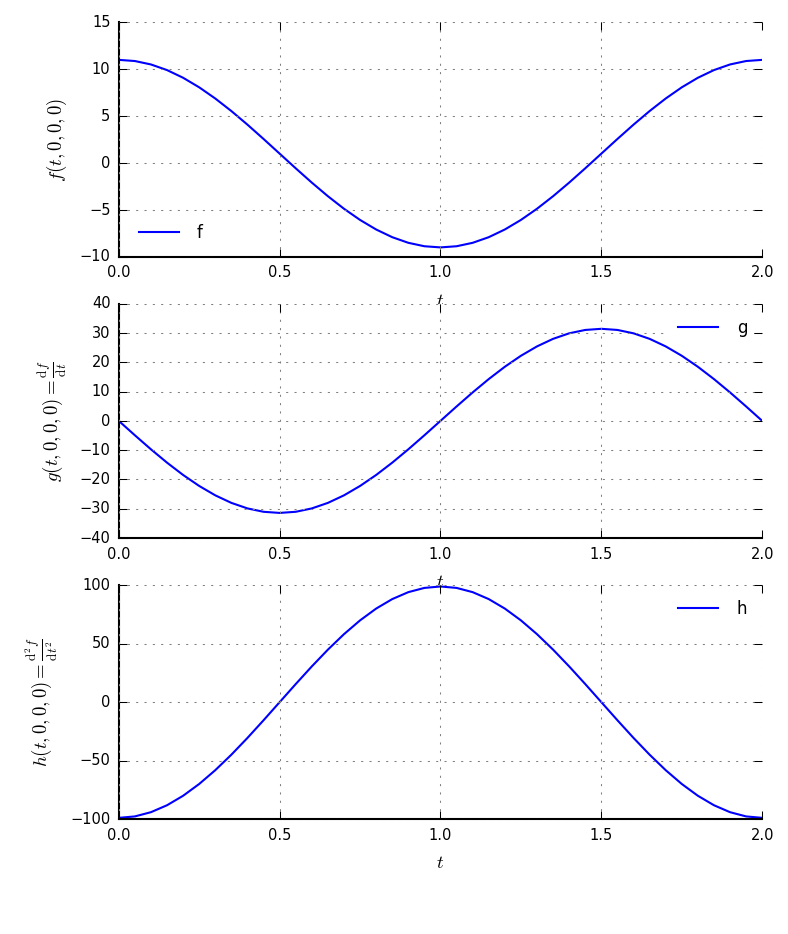</p>Cosine</div>
</a>

### 4 cte &ndash; Constant
<a href="f_cte.go">
<div id="container"><p>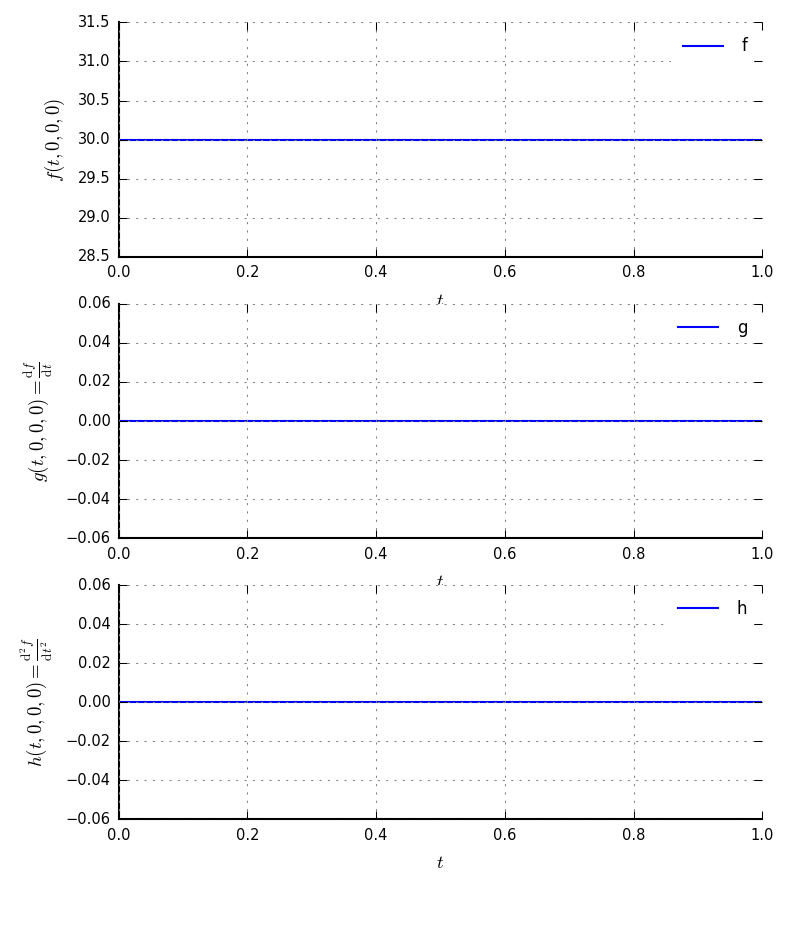</p>Constant</div>
</a>

### 5 exc1 &ndash; Excitation 1
<a href="f_exc1.go">
<div id="container"><p>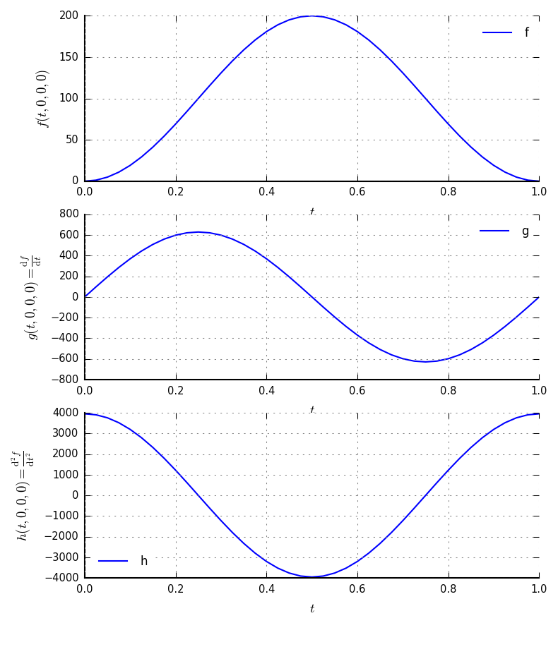</p>Excitation 1</div>
</a>

### 6 exc2 &ndash; Excitation 2
<a href="f_exc2.go">
<div id="container"><p>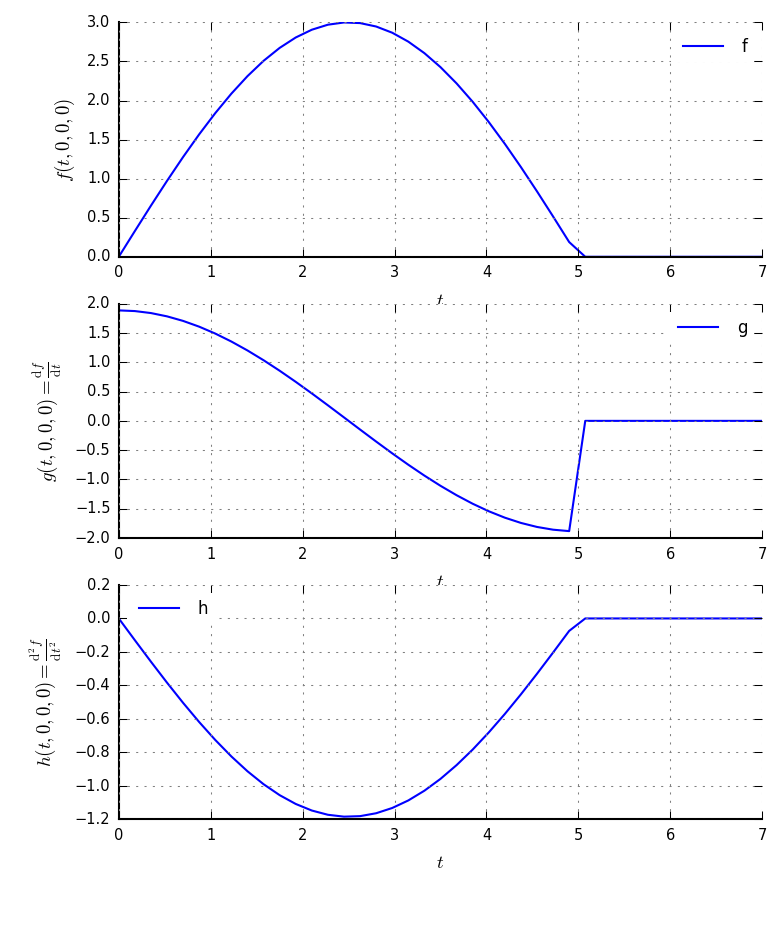</p>Excitation 2</div>
</a>

### 7 halo &ndash; Halo
<a href="f_halo.go">
<div id="container"><p>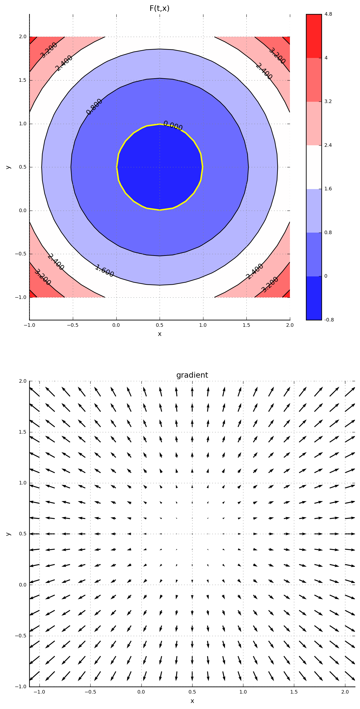</p>Halo</div>
</a>

### 8 lin &ndash; Linear
<a href="f_lin.go">
<div id="container"><p>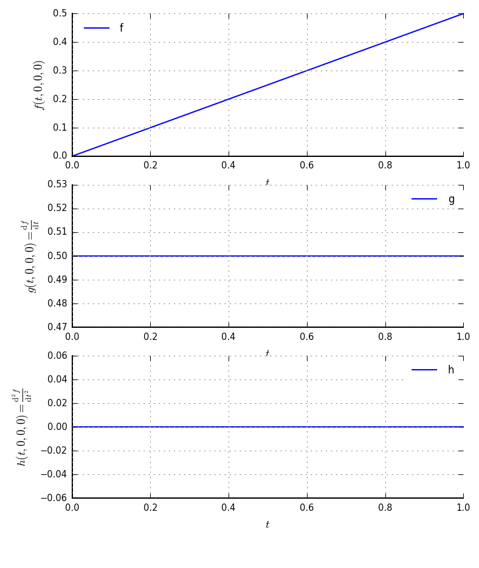</p>Linear</div>
</a>

### 9 mul &ndash; Multiplication
<a href="f_mul.go">
<div id="container"><p>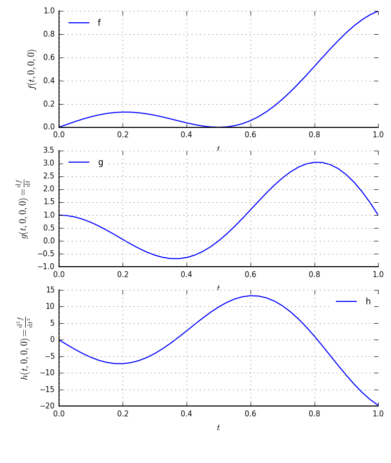</p>Multiplication</div>
</a>

### 10 pts &ndash; Points
<a href="f_pts.go">
<div id="container"><p>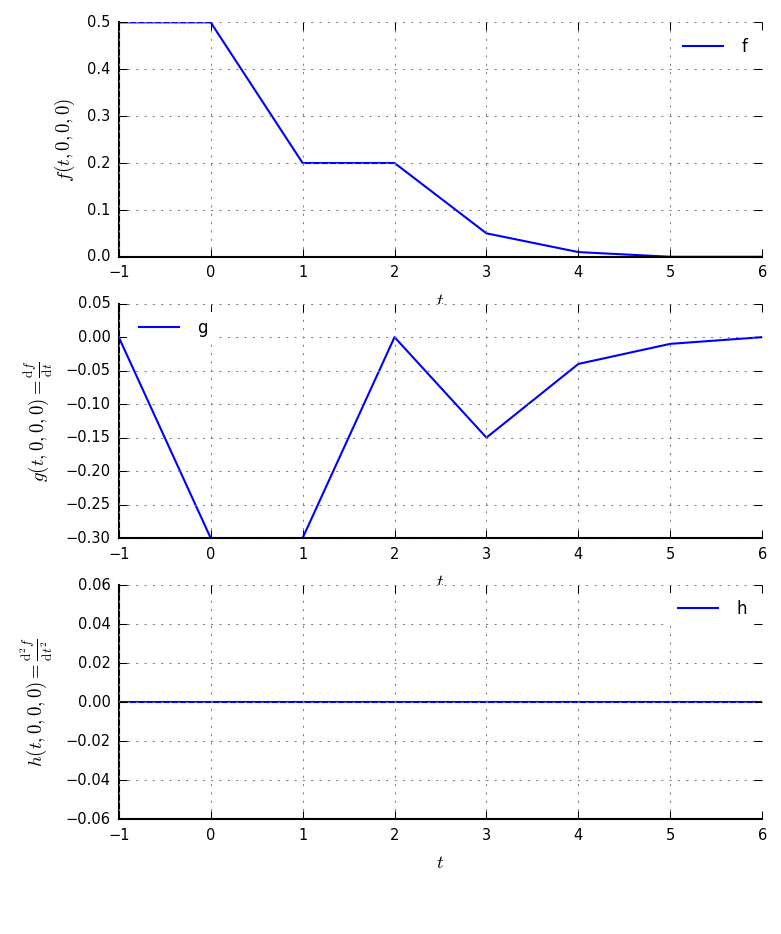</p>Points</div>
</a>

### 11 pulse &ndash; Pulse 1
<a href="f_pulse.go">
<div id="container"><p>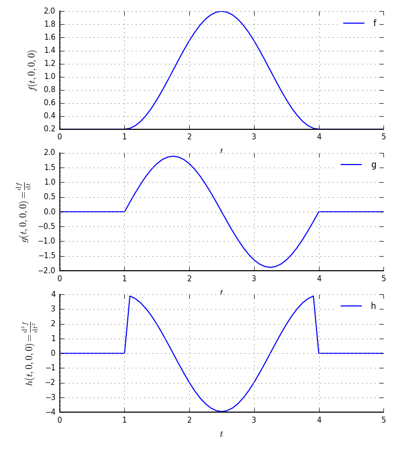</p>Pulse 1</div>
</a>

### 12 ref-dec-gen &ndash; Reference decreasing generic
<a href="f_ref-dec-gen.go">
<div id="container"><p>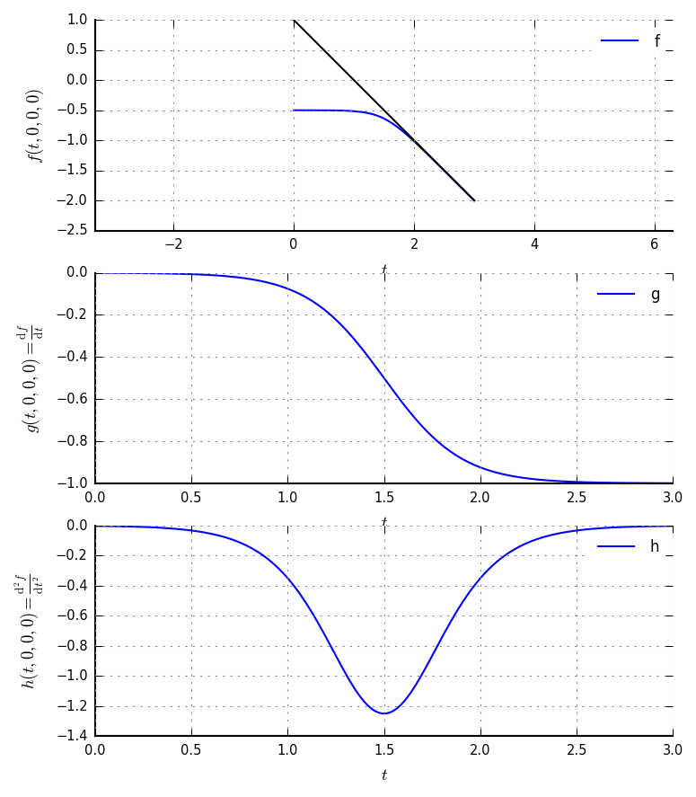</p>Reference decreasing generic</div>
</a>

### 13 ref-dec-sp1 &ndash; Reference decreasing special 1
<a href="f_ref-dec-sp1.go">
<div id="container"><p>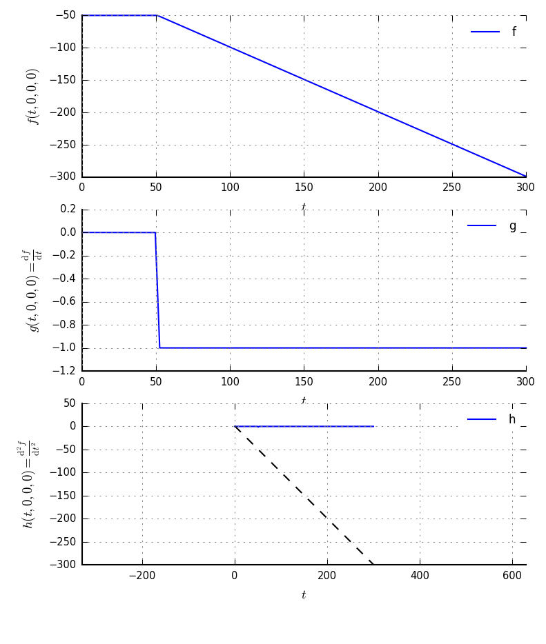</p>Reference decreasing special 1</div>
</a>

### 14 ref-inc-rl1 &ndash; Reference increasing: right-to-left
<a href="f_ref-inc-rl1.go">
<div id="container"><p>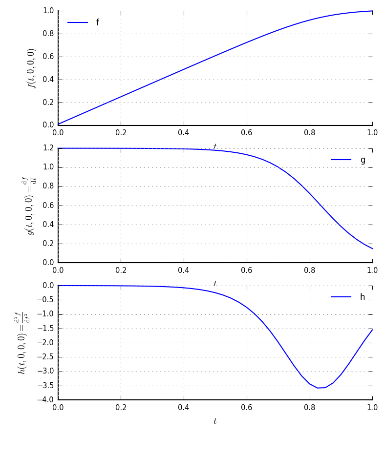</p>Reference increasing: right-to-left</div>
</a>

### 15 rmp &ndash; Ramp
<a href="f_rmp.go">
<div id="container"><p>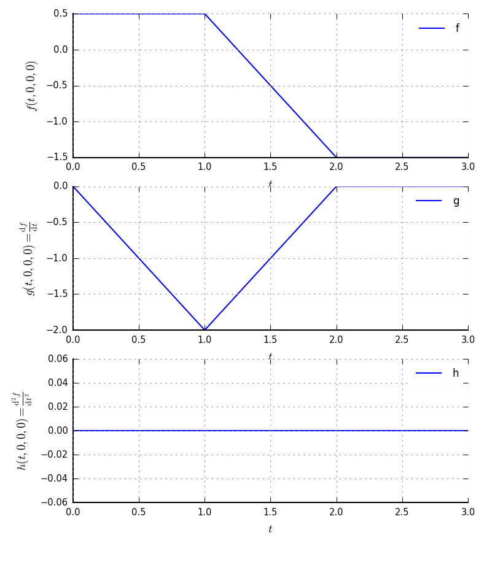</p>Ramp</div>
</a>

### 16 srmps &ndash; Smooth-ramp-smooth
<a href="f_srmps.go">
<div id="container"><p>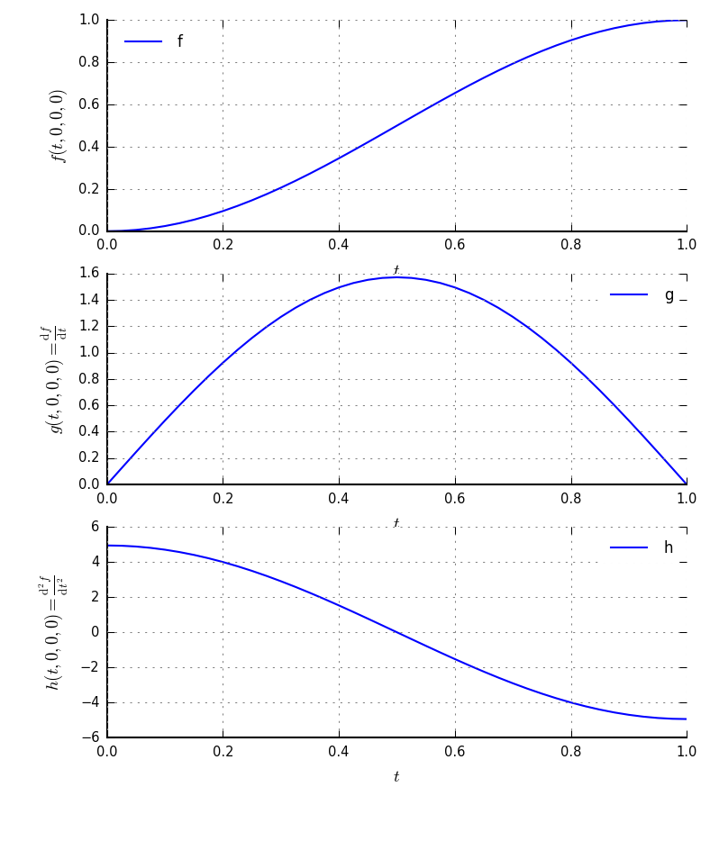</p>Smooth-ramp-smooth</div>
</a>
