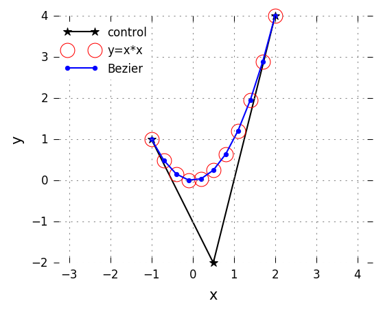
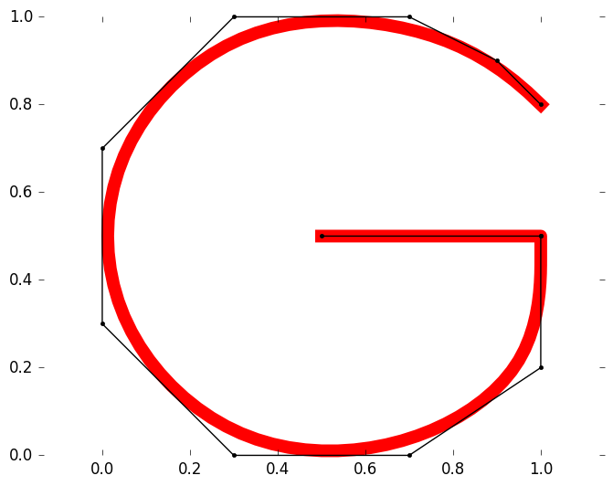
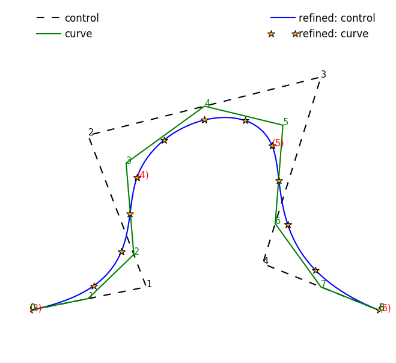
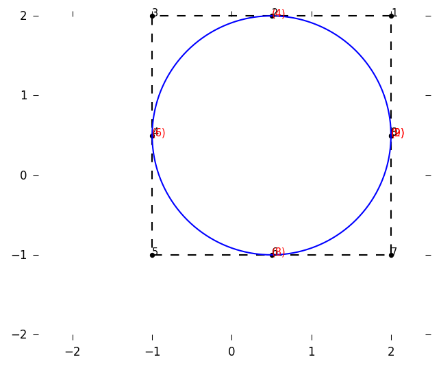

# Gosl. gm. Geometry algorithms and structures

 

More information is available in **[the documentation of this package](https://godoc.org/github.com/cpmech/gosl/gm).**

This package provides some functions to help with the solution of geometry problems. It also
includes some routines loosely related with geometry.

## Bezier curve

Source code: <a href="../examples/gm_bezier01.go">../examples/gm_bezier01.go</a>

## B-spline curve and control net

Source code: <a href="../examples/gm_bspline01.go">../examples/gm_bspline01.go</a>

## NURBS curve: quarter of Circle

Source code: <a href="../examples/gm_nurbs01.go">../examples/gm_nurbs01.go</a>

## NURBS curve: circle

Source code: <a href="../examples/gm_nurbs02.go">../examples/gm_nurbs02.go</a>

