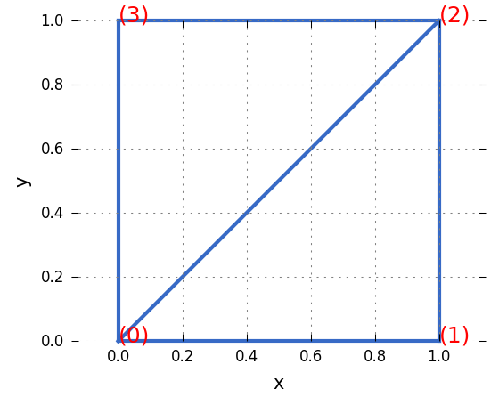

# Gosl. gm/tri. Mesh generation: triangles

More information is available in **[the documentation of this package](http://rawgit.com/cpmech/gosl/master/doc/xxgm-tri.html).**

The `tri` package has functions go generate meshes of triangular elements and Delaunay
triangulations. The package is a light wrapper to the very efficient `Triangle` code by Jonathan
Shewchuk and available at [the Triangle website](https://www.cs.cmu.edu/~quake/triangle.html).

Triangle's licence details are in the <a href="triangle_README.txt">triangle_README.txt</a> file.

In addition of being very fast, `Triangle` can generate meshes with great quality; i.e. it is a
**quality-mesh triangulator**.

Here, the Cartesian coordinates of points are stored in continuous 1D arrays (slices) such as:
```
X = { x0, x1, x2, ... Npoints }
Y = { y0, y1, y2, ... Npoints }
```

The topology is simply defined by two slices usually named `V` for vertices and `C` for cells
(triangles):
```
V = { { x0, y0 }, { x1, y1 }, { x2, y2 } ... Nvertices }
C = { { id0, id1, id2 }, { id0, id1, id2 } ... Ncellls }
```
where `V` is the list of vertices (there are Nvertices vertices) and `C` is the list of triangles
(there are Ncells triangles). The ids (e.g. id0, id1, id2) in `C` are the indices in `V`.


## Draw mesh

<div id="container">
<p></p>
</div>

For example, the set of triangles in the above figure are defined (and drawn) with:

```go
// vertices (points)
V := [][]float64{
    {0, 0}, {1, 0},
    {1, 1}, {0, 1},
}

// cells (triangles)
C := [][]int{
    {0, 1, 2},
    {2, 3, 0},
}

// plot
plt.Reset(true, &plt.A{WidthPt: 300})
tri.Draw(V, C, &plt.A{C: "#376ac6", Lw: 2, NoClip: true})
for i, v := range V {
    plt.Text(v[0], v[1], io.Sf("(%d)", i), &plt.A{C: "r", Fsz: 12, NoClip: true})
}
plt.Gll("x", "y", nil)
plt.Equal()
plt.HideAllBorders()
plt.Save("/tmp/gosl", "tri_draw01")
```

Source code: <a href="../../examples/tri_draw01.go">../../examples/tri_draw01.go</a>


## Delaunay triangulation

The Delaunay triangulation of a cloud of points in the `tri` package is easily computed with the
`Delaunay` command that takes as input the Cartesian coordinates.

For example:
```go
// fix seed
rnd.Init(1358)

// generate cloud of points
nx, ny := 6, 6
dx := 1.0 / float64(nx-1)
dy := 1.0 / float64(ny-1)
X := make([]float64, nx*ny)
Y := make([]float64, nx*ny)
for j := 0; j < ny; j++ {
    for i := 0; i < nx; i++ {
        n := i + j*nx
        X[n] = float64(i) * (dx * rnd.Float64(0.5, 1.0))
        Y[n] = float64(j) * (dy * rnd.Float64(0.5, 1.0))
    }
}

// generate
V, C, err := tri.Delaunay(X, Y, false)
if err != nil {
    io.Pf("%v", err)
    return
}

io.Pforan("V = %v\n", V)
io.Pf("C = %v\n", C)

// plot
plt.Reset(true, &plt.A{WidthPt: 500, Dpi: 150})
tri.Draw(V, C, &plt.A{C: "orange", Ls: "-", NoClip: true})
plt.Plot(X, Y, &plt.A{C: "k", Ls: "none", M: ".", NoClip: true})
plt.Gll("x", "y", nil)
plt.Equal()
plt.HideAllBorders()
plt.Save("/tmp/gosl", "tri_delaunay01")
```
will produce the following figure:

<div id="container">
<p></p>
</div>

Source code: <a href="../../examples/tri_delaunay01.go">../../examples/tri_delaunay01.go</a>
