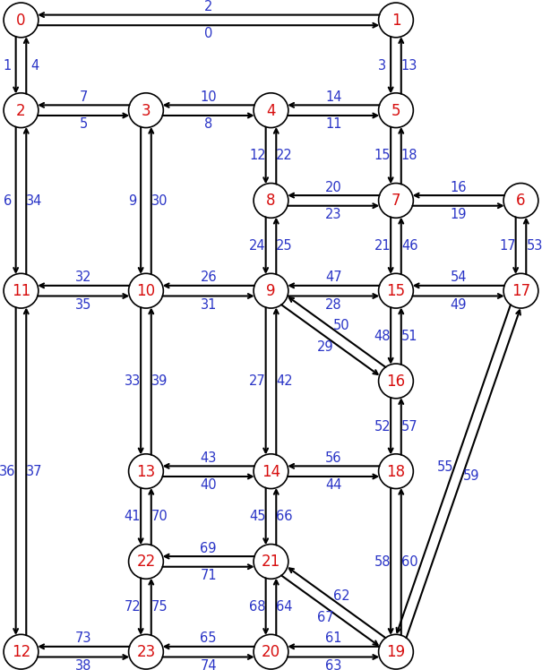

# Gosl. gm. Graph theory structures and algorithms

[](https://godoc.org/github.com/cpmech/gosl/graph) 

More information is available in **[the documentation of this package](https://godoc.org/github.com/cpmech/gosl/graph).**

This package implements algorithms for handling graphs and solving problems such as shortest path
finding. It also implements an algorithm to solve the assignment problem.


## Graph representation

In `graph`, directed graphs are mainly defined by edges. A weight can be assigned to each edge as
well. For example, the graph below:
```
          [10]
     0 ––––––––→ 3      numbers in parentheses
     |    (1)    ↑      indicate edge ids
  [5]|(0)        |
     |        (3)|[1]
     ↓    (2)    |      numbers in brackets
     1 ––––––––→ 2      indicate weights
          [3]
```
is defined with the following code:
```go
var G Graph
G.Init(
    // edge:  0       1       2       3
    [][]int{{0, 1}, {0, 3}, {1, 2}, {2, 3}},
    []float64{5, 10, 3, 1}, // edge/weights
    nil, nil, // optional: vertices and vertex/weights
)
```

Vertex coordinates can be specified as well. Furthermore, weights can be assigned to vertices. These
are useful when computing distances, for example.


## Floyd-Warshall algorithm to compute shortest paths

The `ShortestPaths` method of `Graph` computes the shortest paths using the Floyd-Warshall
algorithm. For example, the graph above has the following distances matrix:
```
       [10]
    0 ––––––→ 3            numbers in brackets
    |         ↑            indicate weights
[5] |         | [1]
    ↓         |
    1 ––––––→ 2
        [3]                ∞ means that there are no
                           connections from i to j
graph:  j= 0  1  2  3
           -----------  i=
           0  5  ∞ 10 |  0  ⇒  w(0→1)=5, w(0→3)=10
           ∞  0  3  ∞ |  1  ⇒  w(1→2)=3
           ∞  ∞  0  1 |  2  ⇒  w(2→3)=1
           ∞  ∞  ∞  0 |  3
```

After running the `ShortestPaths` command, paths from source (s) to destination (t) can be extracted
with the `Path` method.


### Example: Small graph

```go
//           [10]
//      0 ––––––––→ 3      numbers in parentheses
//      |    (1)    ↑      indicate edge ids
//   [5]|(0)        |
//      |        (3)|[1]
//      ↓    (2)    |      numbers in brackets
//      1 ––––––––→ 2      indicate weights
//           [3]

// initialise graph
var g graph.Graph
g.Init(
    // edge:  0       1       2       3
    [][]int{{0, 1}, {0, 3}, {1, 2}, {2, 3}},

    // weights:
    []float64{5, 10, 3, 1},

    // vertices (coordinates, for drawings):
    [][]float64{
        {0, 1}, // x,y vertex 0
        {0, 0}, // x,y vertex 1
        {1, 0}, // x,y vertex 2
        {1, 1}, // x,y vertex 3
    },

    // weights:
    nil,
)

// compute paths
g.ShortestPaths("FW")

// print shortest path from 0 to 2
io.Pf("dist from = %v\n", g.Path(0, 2))

// print shortest path from 0 to 3
io.Pf("dist from = %v\n", g.Path(0, 3))

// print distance matrix
io.Pf("dist =\n%v", g.StrDistMatrix())

// constants for plot
radius, width, gap := 0.05, 1e-8, 0.05

// plot
plt.Reset(true, &plt.A{WidthPt: 250, Dpi: 150, Prop: 1.0})
err := g.Draw(nil, nil, radius, width, gap, nil, nil, nil, nil)
if err != nil {
    io.Pf("%v", err)
    return
}
plt.Equal()
plt.AxisOff()
plt.Save("/tmp/gosl/graph", "shortestpath01")
```

Source code: <a href="../examples/graph_shortestpaths01.go">../examples/graph_shortestpaths01.go</a>

<div id="container">
<p></p>
</div>


### Example: Sioux Falls

```go
// load graph data from FLOW file
g := graph.ReadGraphTable("../graph/data/SiouxFalls.flow", false)

// compute paths
g.ShortestPaths("FW")

// print shortest path from 0 to 20
io.Pf("dist from = %v\n", g.Path(0, 20))
io.Pf("must be: [0, 2, 11, 12, 23, 20]\n")

// data for drawing: ids of vertices along columns in plot grid
columns := [][]int{
    {0, 2, 11, 12},
    {3, 10, 13, 22, 23},
    {4, 8, 9, 14, 21, 20},
    {1, 5, 7, 15, 16, 18, 19},
    {6, 17},
}

// data for drawing: y-coordinats of vertices in plot
Y := [][]float64{
    {7, 6, 4, 0},          // col0
    {6, 4, 2, 1, 0},       // col1
    {6, 5, 4, 2, 1, 0},    // col2
    {7, 6, 5, 4, 3, 2, 0}, // col3
    {5, 4},                // col4
}

// data for drawing: set vertices in graph structure
scalex := 1.8
scaley := 1.3
nv := 24
g.Verts = make([][]float64, nv)
for j, col := range columns {
    x := float64(j) * scalex
    for i, vid := range col {
        g.Verts[vid] = []float64{x, Y[j][i] * scaley}
    }
}

// data for drawing: set vertex labels
vlabels := make(map[int]string)
for i := 0; i < nv; i++ {
    vlabels[i] = io.Sf("%d", i)
}

// data for drawing: set edge labels
ne := 76
elabels := make(map[int]string)
for i := 0; i < ne; i++ {
    elabels[i] = io.Sf("%d", i)
}

// plot
plt.Reset(true, &plt.A{WidthPt: 500, Dpi: 150, Prop: 1.1})
err := g.Draw(vlabels, elabels, 0, 0, 0, nil, nil, nil, nil)
if err != nil {
    io.Pf("%v", err)
    return
}
plt.Equal()
plt.AxisOff()
plt.Save("/tmp/gosl/graph", "graph_siouxfalls01")
```

Source code: <a href="../examples/graph_siouxfalls01.go">../examples/graph_siouxfalls01.go</a>

<div id="container">
<p></p>
</div>


## Munkres (Hungarian algorithm): the assignment problem

The Munkres method, also known as the Hungarian algorithm, aims to solve the assignment problem;
i.e. problems such as the following example:

```
Minimise the cost of operation when assigning three employees (Fry, Leela, Bender) to three tasks,
where (the minimum cost is highlighted):

           $ | Clean  Sweep   Wash
      -------|--------------------
      Fry    |   [2]      3      3
      Leela  |     3    [2]      3
      Bender |     3      3    [2]
      minimum cost = 6
```

The code is based on [Bob Pilgrim' work](http://csclab.murraystate.edu/bob.pilgrim/445/munkres.html).

The method runs in O(n²), in the worst case; therefore is not efficient for large matrices.

The `Munkres` structure implements the solver.

### Examples

Solution of Euler's problem # 345 using the Hungarian algorithm.

```go
// problem matrix
C := [][]float64{
    {7, 53, 183, 439, 863, 497, 383, 563, 79, 973, 287, 63, 343, 169, 583},
    {627, 343, 773, 959, 943, 767, 473, 103, 699, 303, 957, 703, 583, 639, 913},
    {447, 283, 463, 29, 23, 487, 463, 993, 119, 883, 327, 493, 423, 159, 743},
    {217, 623, 3, 399, 853, 407, 103, 983, 89, 463, 290, 516, 212, 462, 350},
    {960, 376, 682, 962, 300, 780, 486, 502, 912, 800, 250, 346, 172, 812, 350},
    {870, 456, 192, 162, 593, 473, 915, 45, 989, 873, 823, 965, 425, 329, 803},
    {973, 965, 905, 919, 133, 673, 665, 235, 509, 613, 673, 815, 165, 992, 326},
    {322, 148, 972, 962, 286, 255, 941, 541, 265, 323, 925, 281, 601, 95, 973},
    {445, 721, 11, 525, 473, 65, 511, 164, 138, 672, 18, 428, 154, 448, 848},
    {414, 456, 310, 312, 798, 104, 566, 520, 302, 248, 694, 976, 430, 392, 198},
    {184, 829, 373, 181, 631, 101, 969, 613, 840, 740, 778, 458, 284, 760, 390},
    {821, 461, 843, 513, 17, 901, 711, 993, 293, 157, 274, 94, 192, 156, 574},
    {34, 124, 4, 878, 450, 476, 712, 914, 838, 669, 875, 299, 823, 329, 699},
    {815, 559, 813, 459, 522, 788, 168, 586, 966, 232, 308, 833, 251, 631, 107},
    {813, 883, 451, 509, 615, 77, 281, 613, 459, 205, 380, 274, 302, 35, 805},
}

// solver seeks to minimise cost, thus, multiply coefficients by -1
for i := 0; i < len(C); i++ {
    for j := 0; j < len(C[i]); j++ {
        C[i][j] *= -1
    }
}

// initialise solver
var mnk graph.Munkres
mnk.Init(len(C), len(C[0]))
mnk.SetCostMatrix(C)

// solve rpoblem
mnk.Run()

// results
io.Pf("links = %v\n", mnk.Links)
io.Pf("cost = %v  (optimal 13938)\n", -mnk.Cost)
```

Output:
```
links = [9 10 7 4 3 0 13 2 14 11 6 5 12 8 1]
cost = 13938  (optimal 13938)
```

Source code: <a href="../examples/graph_munkres01.go">../examples/graph_munkres01.go</a>
