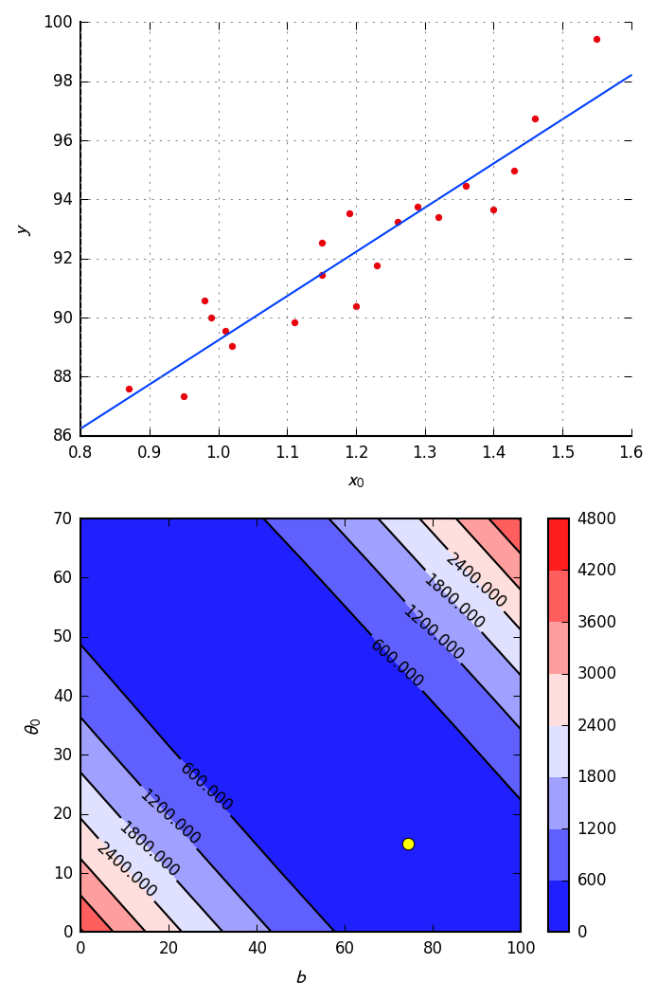
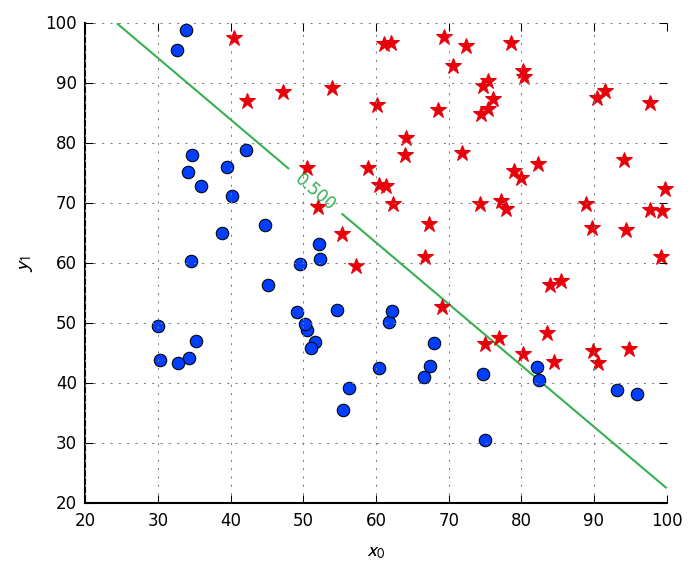
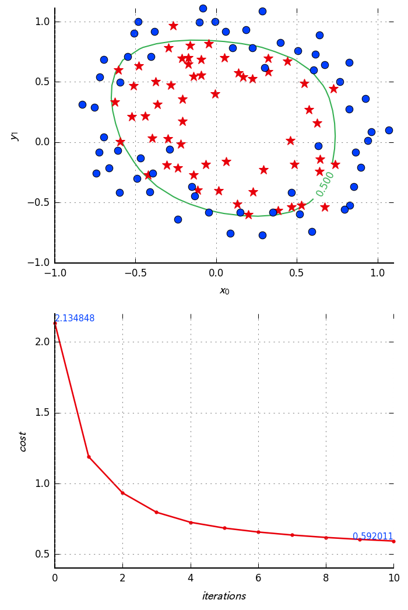

# Gosl. ml. Machine Learning

[](https://godoc.org/github.com/cpmech/gosl/ml) 

More information is available in **[the documentation of this package](https://godoc.org/github.com/cpmech/gosl/ml).**

Package `ml` implements functions to develop Machine Learning algorithms. A goal is to handle large
problems. Nonetheless, this package is on its early stages of development.

This package has been initiated with basis on the great teachings of Prof. Andrew Ng [1,2].

## White papers

1. [Machine Learning](https://github.com/cpmech/gosl/blob/master/doc/machlearn.pdf)

## TODO

1. Implement Support Vector Machines
2. Implement Artificial Neural Networks
3. Implement K-means clustering

## Linear and Logistic Regression

The `Regression` interface defines the functions that `LinReg` and `LogReg` must implement so they
can be trained by using `GraDescReg` Gradient-Descent or plotted using `PlotterReg`.

The `ParamsReg` holds the Theta and Bias parameters, not in a single vector as customarily in other
packages. The `ParamsReg` is an `Observable` (from package `utl`) structure so it will notify
changes to `Observers`.

The `Data` structure holds the `X` (nSamples versus nFeatures) matrix of data, raw or mapped
according to a mapping rule. The `Data` structure is also `Observable`.

The `Stat` structure reads `Data` and compute basic statistics. It is an `Observer` of `Data` and
thus will get notified of data changes.

A simple Linear Regression can be carried out using the following code (see more in the Examples
folder or the `t_???_test.go` test files)

```go
// data
XYraw := [][]float64{
    {0.99, 90.01},
    {1.02, 89.05},
    ...
    {1.43, 94.98},
    {0.95, 87.33},
}
data := ml.NewDataGivenRawXY(XYraw)

// parameters
params := ml.NewParamsReg(data.Nfeatures)

// model
model := ml.NewLinReg(data, params, "reg01")

// train using analytical solution
model.Train()

// ----------------------- plotting --------------------------

// clear plotting area
plt.Reset(true, &plt.A{WidthPt: 400, Dpi: 150, Prop: 1.5})

// plot data x-y
plt.Subplot(2, 1, 1)
pp := ml.NewPlotterReg(data, params, model, nil)
pp.DataY(0)

// plot model x-y
pp.ModelY(0, 0.8, 1.6)

// plot contour of cost function
plt.Subplot(2, 1, 2)
pp.ContourCost(-1, 0, 0, 100, 0, 70)

// save figure
plt.Save("/tmp/gosl", "ml_simple01")
```

### Output of some examples

Simple
<div id="container">
<p></p>
</div>

Prof A Ng's Test 1
<div id="container">
<p></p>
</div>

Prof A Ng's Test 2
<div id="container">
<p></p>
</div>

## References

[1] Ng A, CS229 Machine Learning, Stanford, https://see.stanford.edu/Course/CS229
[2] Ng A, Coursera https://www.coursera.org/learn/machine-learning
