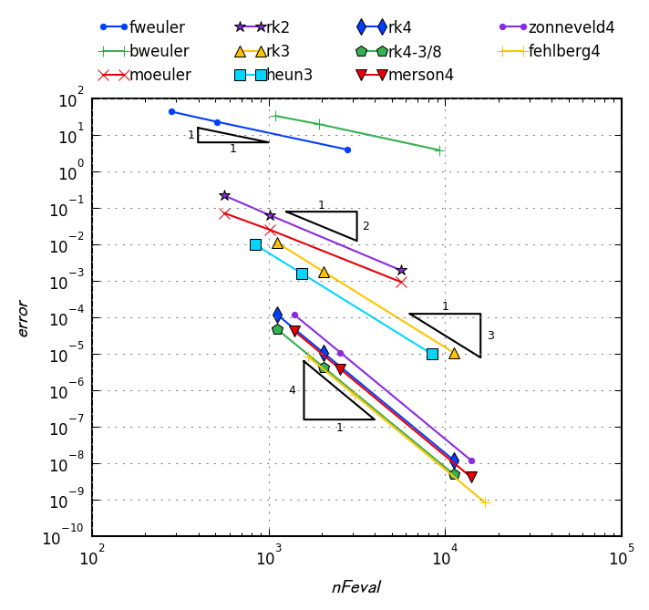
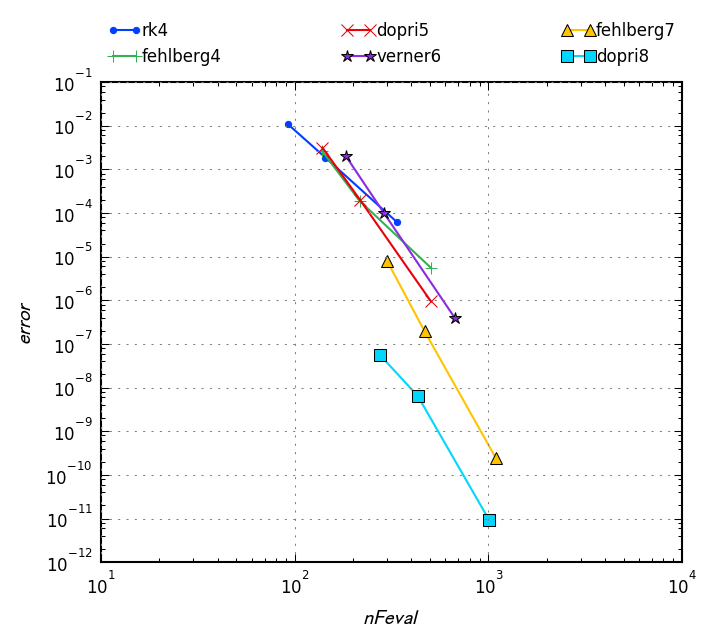

# Gosl. ode. Ordinary differential equations

Package `ode` implements solution techniques to ordinary differential equations, such as the
Runge-Kutta method. Methods that can handle stiff problems are also available.

## Examples

### Robertson's Equation

From Hairer-Wanner VII-p3 Eq.(1.4) [2].

Solution of Robertson's equation:

## Output of Tests

### Convergence of explicit Runge-Kutta methods

[source code](t_erk_test.go)

## References

[1] Hairer E, Norset SP, Wanner G. Solving O. Solving Ordinary Differential Equations I. Nonstiff
Problems, Springer. 1987

[2] Hairer E, Wanner G. Solving Ordinary Differential Equations II. Stiff and Differential-Algebraic
Problems, Second Revision Edition. Springer. 1996

## API

[Please see the documentation here](https://pkg.go.dev/github.com/cpmech/gosl/ode)
