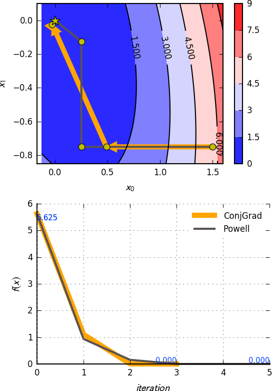
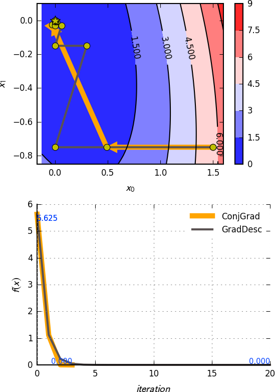
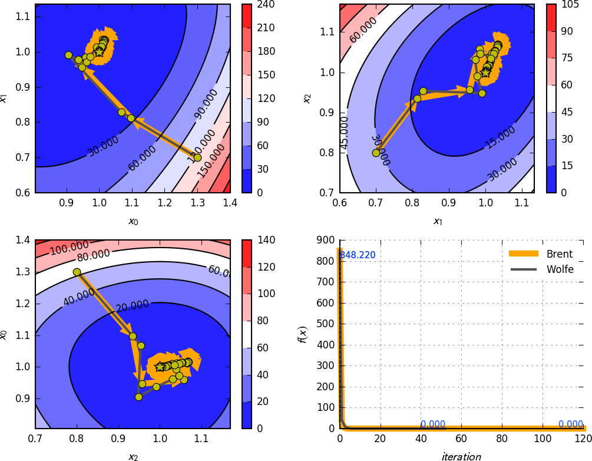
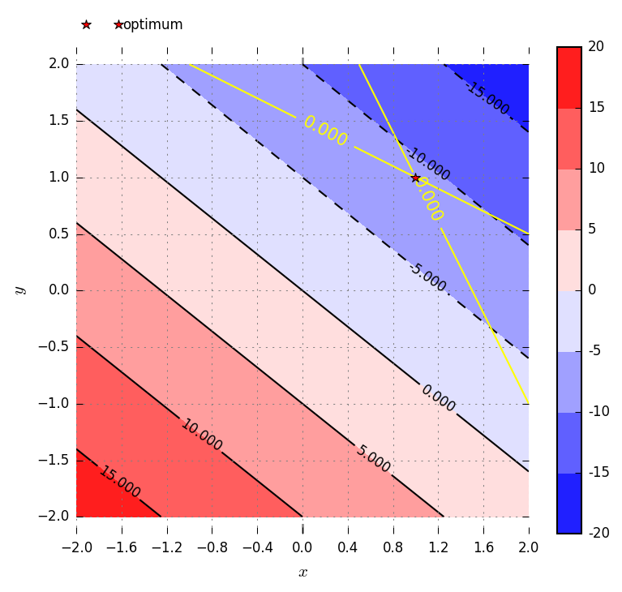
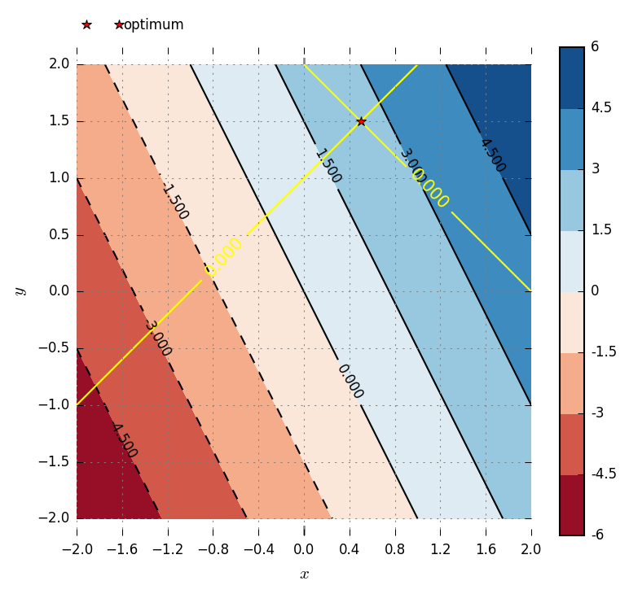

# Gosl. opt. Solvers for optimization problems

[](https://pkg.go.dev/github.com/cpmech/gosl/opt)

This package provides routines to solve optimization problems. The methods Conjugate Gradients
`ConjGrad`, Powell's method `Powell` and Gradient Descent `GradDesc` can be used to solve
unconstrained nonlinear problems. Linear programming problems can be solved with the Interior-Point
Method for linear problems `LinIpm`.

_Auxiliary structures_

- History -- holds history of numerical optimization
- Factory -- holds some pre-configured optimization problems
- Problem -- defines functions required for each optimization problem
- Convergence -- holds the objective and gradient functions and some control parameters to assess
  the convergence of the nonlinear solver. An instance of History is also recorded here.

_Nonlinear problems_

- ConjGrad -- conjugate gradients
- Powell -- Powell's method
- GradDesc -- gradient descent

These structures are instantiated with a given objective function and its gradient. They are all
instances of Convergence and thus use the control parameters from there. The method `Min` can be
called to solve the problem.

## Conjugate Gradients, Powell, Gradient Descent

### Comparison using Simple Quadratic Function

```go
	// objective function
	problem := opt.Factory.SimpleQuadratic2d()

	// initial point
	x0 := la.NewVectorSlice([]float64{1.5, -0.75})

	// ConjGrad
	xmin1 := x0.GetCopy()
	sol1 := opt.NewConjGrad(problem)
	sol1.UseHist = true
	t0 := time.Now()
	fmin1 := sol1.Min(xmin1, nil)
	dt := time.Now().Sub(t0)

	// stat
	io.Pf("ConjGrad: fmin     = %g  (fref = %g)\n", fmin1, problem.Fref)
	io.Pf("ConjGrad: xmin     = %.9f  (xref = %g)\n", xmin1, problem.Xref)
	io.Pf("ConjGrad: NumIter  = %d\n", sol1.NumIter)
	io.Pf("ConjGrad: NumFeval = %d\n", sol1.NumFeval)
	io.Pf("ConjGrad: NumGeval = %d\n", sol1.NumGeval)
	io.Pf("ConjGrad: ElapsedT = %v\n", dt)

	// Powell
	xmin2 := x0.GetCopy()
	sol2 := opt.NewPowell(problem)
	sol2.UseHist = true
	t0 = time.Now()
	fmin2 := sol2.Min(xmin2, nil)
	dt = time.Now().Sub(t0)

	// stat
	io.Pl()
	io.Pf("Powell: fmin     = %g  (fref = %g)\n", fmin2, problem.Fref)
	io.Pf("Powell: xmin     = %.9f  (xref = %g)\n", xmin2, problem.Xref)
	io.Pf("Powell: NumIter  = %d\n", sol2.NumIter)
	io.Pf("Powell: NumFeval = %d\n", sol2.NumFeval)
	io.Pf("Powell: NumGeval = %d\n", sol2.NumGeval)
	io.Pf("Powell: ElapsedT = %v\n", dt)

	// GradDesc
	xmin3 := x0.GetCopy()
	sol3 := opt.NewGradDesc(problem)
	sol3.UseHist = true
	sol3.Alpha = 0.2
	t0 = time.Now()
	fmin3 := sol3.Min(xmin3, nil)
	dt = time.Now().Sub(t0)

	// stat
	io.Pl()
	io.Pf("GradDesc: fmin     = %g  (fref = %g)\n", fmin3, problem.Fref)
	io.Pf("GradDesc: xmin     = %.9f  (xref = %g)\n", xmin3, problem.Xref)
	io.Pf("GradDesc: NumIter  = %d\n", sol3.NumIter)
	io.Pf("GradDesc: NumFeval = %d\n", sol3.NumFeval)
	io.Pf("GradDesc: NumGeval = %d\n", sol3.NumGeval)
	io.Pf("GradDesc: ElapsedT = %v\n", dt)
```





### Rosenbrock Function

```go
	// objective function: Rosenbrock
	N := 5 // 5D
	problem := opt.Factory.RosenbrockMulti(N)

	// initial point
	x0 := la.NewVectorSlice([]float64{1.3, 0.7, 0.8, 1.9, 1.2})

	// solve using Brent's method as Line Search
	xmin1 := x0.GetCopy()
	sol1 := opt.NewConjGrad(problem)
	sol1.UseBrent = true
	sol1.UseHist = true
	t0 := time.Now()
	fmin1 := sol1.Min(xmin1, nil)
	dt := time.Now().Sub(t0)

	// stat
	io.Pf("Brent: fmin     = %g  (fref = %g)\n", fmin1, problem.Fref)
	io.Pf("Brent: xmin     = %.9f\n", xmin1)
	io.Pf("Brent: NumIter  = %d\n", sol1.NumIter)
	io.Pf("Brent: NumFeval = %d\n", sol1.NumFeval)
	io.Pf("Brent: NumGeval = %d\n", sol1.NumGeval)
	io.Pf("Brent: ElapsedT = %v\n", dt)

	// solve using Wolfe's method as Line Search
	xmin2 := x0.GetCopy()
	sol2 := opt.NewConjGrad(problem)
	sol2.UseBrent = false
	sol2.UseHist = true
	t0 = time.Now()
	fmin2 := sol2.Min(xmin2, nil)
	dt = time.Now().Sub(t0)

	// stat
	io.Pl()
	io.Pf("Wolfe: fmin     = %g  (fref = %g)\n", fmin2, problem.Fref)
	io.Pf("Wolfe: xmin     = %.9f\n", xmin2)
	io.Pf("Wolfe: NumIter  = %d\n", sol2.NumIter)
	io.Pf("Wolfe: NumFeval = %d\n", sol2.NumFeval)
	io.Pf("Wolfe: NumGeval = %d\n", sol2.NumGeval)
	io.Pf("Wolfe: ElapsedT = %v\n", dt)
```



## Interior-point method for linear problems

```
LinIpm solves:

        min cᵀx   s.t.   Aᵀx = b, x ≥ 0
         x

or the dual problem:

        max bᵀλ   s.t.   Aᵀλ + s = c, s ≥ 0
         λ
```

Linear problems can be solved with the `LinIpm` structure. First, the problem definitions are
initialized with the `Init` command and by giving the matrix of constraint coefficients (A), the
right-hand side vector (b) of the constraints, and the vector defining the minimization problem (c).

The matrix `A` is given as compressed-column sparse for efficiency purposes.

### Example 1

Simple linear problem:

```
linear programming problem:

  min cᵀx   s.t.   Aᵀx = b, x ≥ 0
   x

specific problem:

     min   -4*x0 - 5*x1
   {x0,x1}

   s.t.  2*x0 +   x1 ≤ 3
           x0 + 2*x1 ≤ 3

         x0,x1 ≥ 0

standard form:

       min      -4*x0 - 5*x1
  {x0,x1,x2,x3}

  s.t.

   2*x0 +   x1 + x2     = 3
     x0 + 2*x1     + x3 = 3

   x0,x1,x2,x3 ≥ 0

as matrix:
                 / x0 \
  [-4  -5  0  0] | x1 | = cᵀ x
                 | x2 |
                 \ x3 /

   _            _   / x0 \
  |  2  1  1  0  |  | x1 | = Aᵀ x
  |_ 1  2  0  1 _|  | x2 |
                    \ x3 /

```

Go code:

```go
	// coefficients vector
	c := []float64{-4, -5, 0, 0}

	// constraints as a sparse matrix
	var T la.Triplet
	T.Init(2, 4, 6) // 2 by 4 matrix, with 6 non-zeros
	T.Put(0, 0, 2.0)
	T.Put(0, 1, 1.0)
	T.Put(0, 2, 1.0)
	T.Put(1, 0, 1.0)
	T.Put(1, 1, 2.0)
	T.Put(1, 3, 1.0)
	Am := T.ToMatrix(nil) // compressed-column matrix

	// right-hand side
	b := []float64{3, 3}

	// solve LP
	var ipm opt.LinIpm
	defer ipm.Free()
	ipm.Init(Am, b, c, nil)
	ipm.Solve(true)

	// print solution
	io.Pf("\n")
	io.Pf("x = %v\n", ipm.X)
	io.Pf("λ = %v\n", ipm.L)
	io.Pf("s = %v\n", ipm.S)

	// check solution
	A := Am.ToDense()
	bchk := la.NewVector(2)
	la.MatVecMul(bchk, 1, A, ipm.X)
	io.Pf("b(check) = %v\n", bchk)
```

Output:

```
A =
     2     1     1     0
     1     2     0     1

b =      3     3

c =     -4    -5     0     0

 it            f(x)           error
  0 -9.99000000e+00  1.71974522e-01
  1 -8.65656141e+00  3.63052829e-02
  2 -8.99639576e+00  3.78555516e-04
  3 -8.99996396e+00  3.78424585e-06
  4 -8.99999964e+00  3.78423235e-08
  5 -9.00000000e+00  3.78423337e-10

x = [0.9999999990004347 1.000000000078799 1.9203318816792844e-09 8.419670861842801e-10]
λ = [-1.0000000003319234 -1.9999999997280653]
s = [7.256799795925211e-10 1.218218347079067e-10 1.0000000006656913 2.000000000061833]
b(check) = [2.9999999980796686 2.9999999991580326]
```



### Example 2

Another linear problem:

```
linear programming problem:

  min cᵀx   s.t.   Aᵀx = b, x ≥ 0
   x

specific problem:

  min   2*x0 +   x1
  s.t.   -x0 +   x1 ≤ 1
          x0 +   x1 ≥ 2   →  -x0 - x1 ≤ -2
          x0 - 2*x1 ≤ 4
        x1 ≥ 0

standard (step 1) add slack
  s.t.   -x0 +   x1 + x2           = 1
         -x0 -   x1      + x3      = -2
          x0 - 2*x1           + x4 = 4

standard (step 2)
   replace x0 := x0_ - x5
   because it's unbounded

   min  2*x0_ +   x1                - 2*x5
   s.t.  -x0_ +   x1 + x2           +   x5 = 1
         -x0_ -   x1      + x3      +   x5 = -2
          x0_ - 2*x1           + x4 -   x5 = 4
        x0_,x1,x2,x3,x4,x5 ≥ 0
```

Go code:

```go
	// coefficients vector
	c := []float64{2, 1, 0, 0, 0, -2}

	// constraints as a sparse matrix
	var T la.Triplet
	T.Init(3, 6, 12) // 3 by 6 matrix, with 12 non-zeros
	T.Put(0, 0, -1)
	T.Put(0, 1, 1)
	T.Put(0, 2, 1)
	T.Put(0, 5, 1)
	T.Put(1, 0, -1)
	T.Put(1, 1, -1)
	T.Put(1, 3, 1)
	T.Put(1, 5, 1)
	T.Put(2, 0, 1)
	T.Put(2, 1, -2)
	T.Put(2, 4, 1)
	T.Put(2, 5, -1)
	Am := T.ToMatrix(nil) // compressed-column matrix

	// right-hand side
	b := []float64{1, -2, 4}

	// solve LP
	var ipm opt.LinIpm
	defer ipm.Free()
	ipm.Init(Am, b, c, nil)
	ipm.Solve(true)

	// print solution
	io.Pl()
	io.Pf("x = %v\n", ipm.X)
	io.Pf("λ = %v\n", ipm.L)
	io.Pf("s = %v\n", ipm.S)

	// check solution
	chk.Verbose = true
	tst := new(testing.T)
	A := Am.ToDense()
	bres := make([]float64, len(b))
	la.MatVecMul(bres, 1, A, ipm.X)
	chk.Array(tst, "A*x=b", 1e-8, bres, b)

	// fix and check x
	x := ipm.X[:2]
	x[0] -= ipm.X[5]
	chk.Array(tst, "x", 1e-8, x, []float64{0.5, 1.5})
```

Output:

```
A =
    -1     1     1     0     0     1
    -1    -1     0     1     0     1
     1    -2     0     0     1    -1

b =      1    -2     4

c =      2     1     0     0     0    -2

 it            f(x)           error
  0  4.82195674e+00  4.72141263e-01
  1  3.66300276e+00  4.21080232e-01
  2  2.67385434e+00  3.69702809e-02
  3  2.50182089e+00  5.20560741e-04
  4  2.50001821e+00  5.20845343e-06
  5  2.50000018e+00  5.20848030e-08
  6  2.50000000e+00  5.20848253e-10

x = [3.4562270104040635 1.4999999986259591 2.971515056222099e-09 2.2343305942772616e-10 6.499999995654445 2.9562270088065894]
λ = [-0.49999999992944033 -1.4999999999550573 4.316183389793475e-12]
s = [2.489351257414523e-10 1.207644468431149e-10 0.5000000000671894 1.5000000000928062 1.3343281402633547e-10 2.6562805299653977e-11]
x = [0.5000000015974742 1.4999999986259591]
b(check) = [0.999999997028485 -2.0000000002234333 -2.499999995654444]
```



## API

[Please see the documentation here](https://pkg.go.dev/github.com/cpmech/gosl/opt)
