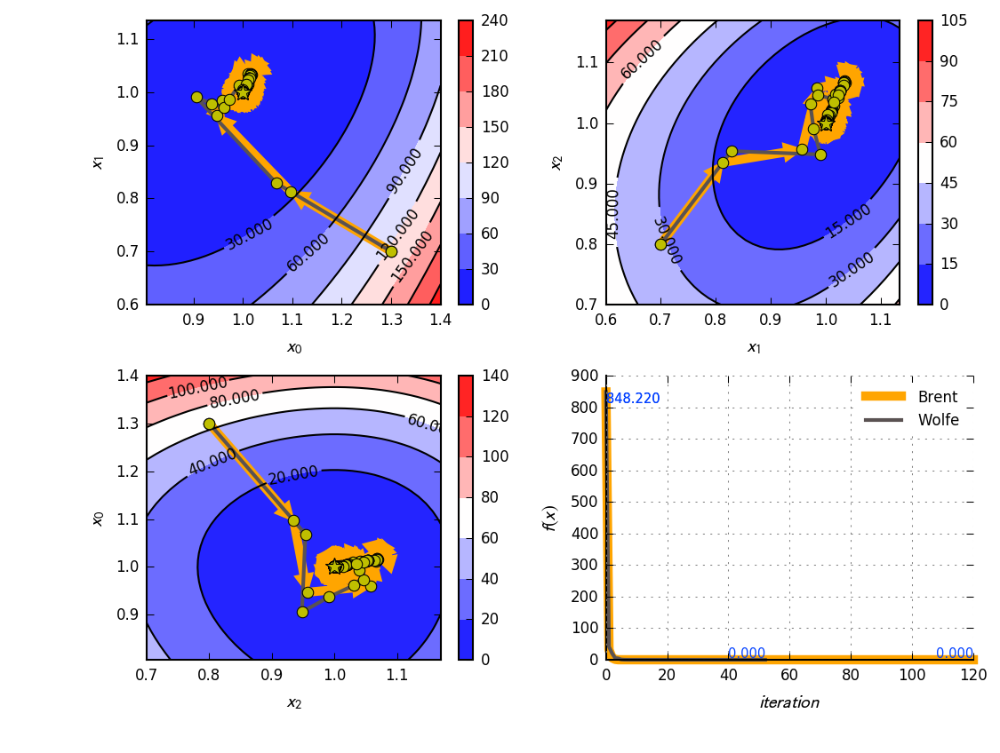

# Gosl. opt. Solvers for optimisation problems

This package provides routines to solve optimisation problems. The methods Conjugate Gradients
`ConjGrad`, Powell's method `Powell` and Gradient Descent `GradDesc` can be used to solve
unconstrained nonlinear problems. Linear programming problems can be solved with the Interior-Point
Method for linear problems `LinIpm`.

_Auxiliary structures_

- History -- holds history of numerical optimization
- Factory -- holds some pre-configured optimization problems
- Problem -- defines functions required for each optimization problem
- Convergence -- holds the objective and gradient functions and some control parameters to assess
  the convergence of the nonlinear solver. An instance of History is also recorded here.

_Nonlinear problems_

- ConjGrad -- conjugate gradients
- Powell -- Powell's method
- GradDesc -- gradient descent

These structures are instantiated with a given objective function and its gradient. They are all
instances of Convergence and thus use the control parameters from there. The method `Min` can be
called to solve the problem.

## Conjugate Gradients, Powell, Gradient Descent

### Comparison using Simple Quadratic Function

Source code: <a href="../examples/opt_comparison01.go">opt_comparison01.go</a>

<div id="container">
<p></p>
</div>

<div id="container">
<p></p>
</div>

### Rosenbrock Function

Source code: <a href="../examples/opt_conjgrad01.go" width="600">opt_conjgrad01.go</a>

<div id="container">
<p></p>
</div>

## Interior-point method for linear problems

```
LinIpm solves:

        min cᵀx   s.t.   Aᵀx = b, x ≥ 0
         x

or the dual problem:

        max bᵀλ   s.t.   Aᵀλ + s = c, s ≥ 0
         λ
```

Linear problems can be solved with the `LinIpm` structure. First, the problem definitions are
initialised with the `Init` command and by giving the matrix of constraint coefficients (A), the
right-hand side vector (b) of the constraints, and the vector defining the minimisation problem (c).

The matrix `A` is given as compressed-column sparse for efficiency purposes.

### Example 1

Simple linear problem:

```
linear programming problem:

  min cᵀx   s.t.   Aᵀx = b, x ≥ 0
   x

specific problem:

     min   -4*x0 - 5*x1
   {x0,x1}

   s.t.  2*x0 +   x1 ≤ 3
           x0 + 2*x1 ≤ 3

         x0,x1 ≥ 0

standard form:

       min      -4*x0 - 5*x1
  {x0,x1,x2,x3}

  s.t.

   2*x0 +   x1 + x2     = 3
     x0 + 2*x1     + x3 = 3

   x0,x1,x2,x3 ≥ 0

as matrix:
                 / x0 \
  [-4  -5  0  0] | x1 | = cᵀ x
                 | x2 |
                 \ x3 /

   _            _   / x0 \
  |  2  1  1  0  |  | x1 | = Aᵀ x
  |_ 1  2  0  1 _|  | x2 |
                    \ x3 /

```

Source code: <a href="../examples/opt_ipm01.go">../examples/opt_ipm01.go</a>

Output:

```
A =
     2     1     1     0
     1     2     0     1

b =      3     3

c =     -4    -5     0     0

 it            f(x)           error
  0 -9.99000000e+00  1.71974522e-01
  1 -8.65656141e+00  3.63052829e-02
  2 -8.99639576e+00  3.78555516e-04
  3 -8.99996396e+00  3.78424585e-06
  4 -8.99999964e+00  3.78423235e-08
  5 -9.00000000e+00  3.78423337e-10

x = [0.9999999990004347 1.000000000078799 1.9203318816792844e-09 8.419670861842801e-10]
λ = [-1.0000000003319234 -1.9999999997280653]
s = [7.256799795925211e-10 1.218218347079067e-10 1.0000000006656913 2.000000000061833]
b(check) = [2.9999999980796686 2.9999999991580326]
```

<div id="container">
<p></p>
</div>

### Example 2

Another linear problem:

```
linear programming problem:

  min cᵀx   s.t.   Aᵀx = b, x ≥ 0
   x

specific problem:

  min   2*x0 +   x1
  s.t.   -x0 +   x1 ≤ 1
          x0 +   x1 ≥ 2   →  -x0 - x1 ≤ -2
          x0 - 2*x1 ≤ 4
        x1 ≥ 0

standard (step 1) add slack
  s.t.   -x0 +   x1 + x2           = 1
         -x0 -   x1      + x3      = -2
          x0 - 2*x1           + x4 = 4

standard (step 2)
   replace x0 := x0_ - x5
   because it's unbounded

   min  2*x0_ +   x1                - 2*x5
   s.t.  -x0_ +   x1 + x2           +   x5 = 1
         -x0_ -   x1      + x3      +   x5 = -2
          x0_ - 2*x1           + x4 -   x5 = 4
        x0_,x1,x2,x3,x4,x5 ≥ 0
```

Source code: <a href="../examples/opt_ipm02.go">../examples/opt_ipm02.go</a>

Output:

```
A =
    -1     1     1     0     0     1
    -1    -1     0     1     0     1
     1    -2     0     0     1    -1

b =      1    -2     4

c =      2     1     0     0     0    -2

 it            f(x)           error
  0  4.82195674e+00  4.72141263e-01
  1  3.66300276e+00  4.21080232e-01
  2  2.67385434e+00  3.69702809e-02
  3  2.50182089e+00  5.20560741e-04
  4  2.50001821e+00  5.20845343e-06
  5  2.50000018e+00  5.20848030e-08
  6  2.50000000e+00  5.20848253e-10

x = [3.4562270104040635 1.4999999986259591 2.971515056222099e-09 2.2343305942772616e-10 6.499999995654445 2.9562270088065894]
λ = [-0.49999999992944033 -1.4999999999550573 4.316183389793475e-12]
s = [2.489351257414523e-10 1.207644468431149e-10 0.5000000000671894 1.5000000000928062 1.3343281402633547e-10 2.6562805299653977e-11]
x = [0.5000000015974742 1.4999999986259591]
b(check) = [0.999999997028485 -2.0000000002234333 -2.499999995654444]
```

<div id="container">
<p></p>
</div>


## API

**go doc**

```
package opt // import "gosl/opt"

Package opt implements routines for solving optimisation problems

VARIABLES

var Factory = FactoryType{}
    Factory holds Objective functions to be minimized


FUNCTIONS

func ReadLPfortran(fn string) (A *la.CCMatrix, b, c, l, u []float64)
    ReadLPfortran reads linear program from particular fortran file

        download LP files from here: http://users.clas.ufl.edu/hager/coap/format.html
        Output:
         A -- compressed-column sparse matrix where:
              Ap -- pointers to the beginning of storage of column (size n+1)
              Ai -- row indices for each non zero entry (input, nnz A)
              Ax -- non zero entries (input, nnz A)
         b -- right hand side (input, size m)
         c -- objective vector (minimize, size n)
         l -- lower bounds on variables (size n)
         u -- upper bounds on variables (size n)


TYPES

type ConjGrad struct {

	// merge properties
	Convergence // auxiliary object to check convergence

	// configuration
	UseBrent    bool // use Brent method insted of LineSearch (Wolfe conditions)
	UseFRmethod bool // use Fletcher-Reeves method instead of Polak-Ribiere
	CheckJfcn   bool // check Jacobian function at all points during minimization

	// Has unexported fields.
}
    ConjGrad implements the multidimensional minimization by the
    Fletcher-Reeves-Polak-Ribiere method.

        NOTE: Check Convergence to see how to set convergence parameters,
              max iteration number, or to enable and access history of iterations

        REFERENCES:
        [1] Press WH, Teukolsky SA, Vetterling WT, Fnannery BP (2007) Numerical Recipes:
            The Art of Scientific Computing. Third Edition. Cambridge University Press. 1235p.

func NewConjGrad(prob *Problem) (o *ConjGrad)
    NewConjGrad returns a new multidimensional optimizer using ConjGrad's method
    (no derivatives required)

func (o *ConjGrad) Min(x la.Vector, params utl.Params) (fmin float64)
    Min solves minimization problem

        Input:
          x -- [ndim] initial starting point (will be modified)
          params -- [may be nil] optional parameters. e.g. "alpha", "maxit". Example:
                       params := utl.NewParams(
                           &utl.P{N: "brent", V: 1},
                           &utl.P{N: "maxit", V: 1000},
                           &utl.P{N: "maxitls", V: 20},
                           &utl.P{N: "maxitzoom", V: 20},
                           &utl.P{N: "ftol", V: 1e-2},
                           &utl.P{N: "gtol", V: 1e-2},
                           &utl.P{N: "hist", V: 1},
                           &utl.P{N: "verb", V: 1},
                       )

        Output:
          fmin -- f(x@min) minimum f({x}) found
          x -- [modify input] position of minimum f({x})

type Convergence struct {

	// input
	Ffcn fun.Sv // objective function; scalar function of vector: y = f({x})
	Gfcn fun.Vv // gradient function: vector function of vector: g = dy/d{x} = deriv(f({x}), {x}) [may be nil]

	// configuration
	MaxIt   int     // max iterations
	Ftol    float64 // tolerance on f({x})
	Gtol    float64 // convergence criterion for the zero gradient test
	EpsF    float64 // small number to rectify the special case of converging to exactly zero function value
	UseHist bool    // save history
	Verbose bool    // show messages

	// statistics and History (e.g. for debugging)
	NumFeval int      // number of calls to Ffcn (function evaluations)
	NumGeval int      // number of calls to Gfcn (Jacobian evaluations)
	NumIter  int      // number of iterations from last call to Solve
	Hist     *History // history of optimization data (for debugging)

	// Has unexported fields.
}
    Convergence assists in checking the convergence of numerical optimizers
    Convergence can be accessed to set convergence parameters, max iteration
    number, or to enable and access history of iterations.

func (o *Convergence) AccessHistory() *History
    AccessHistory gets access to History

func (o *Convergence) Fconvergence(fprev, fmin float64) bool
    Fconvergence performs the check for f({x}) values

        Input:
          fprev -- a previous f({x}) value
          fmin -- current f({x}) value

        Output:
          returns true if f values are not changing any longer

func (o *Convergence) Gconvergence(fprev float64, x, u la.Vector) bool
    Gconvergence performs the check for df/dx|({x}) values

        Input:
          fprev -- a previous f({x}) value (for normalization purposes)
          x -- current {x} value
          u -- current direction; e.g. dfdx

        Output:
          returns true if dfdy values are not changing any longer

func (o *Convergence) InitConvergence(Ffcn fun.Sv, Gfcn fun.Vv)
    InitConvergence initialize convergence parameters

func (o *Convergence) InitHist(x0 la.Vector)
    InitHist initializes history

func (o *Convergence) SetConvParams(maxIt int, ftol, gtol float64)
    SetConvParams sets convergence parameters

func (o *Convergence) SetParams(params utl.Params)
    SetParams sets parameters

        Example:
                  o.SetParams(utl.NewParams(
                      &utl.P{N: "maxit", V: 1000},
                      &utl.P{N: "ftol", V: 1e-2},
                      &utl.P{N: "gtol", V: 1e-2},
                      &utl.P{N: "hist", V: 1},
                      &utl.P{N: "verb", V: 1},
                  ))

func (o *Convergence) SetUseHistory(useHist bool)
    SetUseHistory sets use history parameter

func (o *Convergence) SetVerbose(verbose bool)
    SetVerbose sets verbose mode

type FactoryType struct{}
    FactoryType defines a structure to implement a factory of Objective
    functions to be minimized

func (o FactoryType) Rosenbrock2d(a, b float64) (p *Problem)
    Rosenbrock2d returns the classical Rosenbrock2d function

        See https://en.wikipedia.org/wiki/Rosenbrock_function

        Input:
          a -- parameter a, a=0 ⇒ function is symmetric and minimum is at origin
          b -- parameter b

        NOTE: the commonly used values are a=1 and b=100

func (o FactoryType) RosenbrockMulti(N int) (p *Problem)
    RosenbrockMulti returns the multi-variate version of the Rosenbrock function

        See https://en.wikipedia.org/wiki/Rosenbrock_function
        See https://docs.scipy.org/doc/scipy-0.14.0/reference/tutorial/optimize.html#unconstrained-minimization-of-multivariate-scalar-functions-minimize

        Input:
          N -- dimension == ndim

func (o FactoryType) SimpleParaboloid() (p *Problem)
    SimpleParaboloid returns a simple optimization problem using a paraboloid as
    the objective function

func (o FactoryType) SimpleQuadratic2d() (p *Problem)
    SimpleQuadratic2d returns a simple problem with a quadratic function such
    that f(x) = xᵀ A x (2D)

func (o FactoryType) SimpleQuadratic3d() (p *Problem)
    SimpleQuadratic3d returns a simple problem with a quadratic function such
    that f(x) = xᵀ A x (3D)

type GradDesc struct {

	// merge properties
	Convergence // auxiliary object to check convergence

	// configuration
	Alpha float64 // rate to take descents

	// Has unexported fields.
}
    GradDesc implements a simple gradient-descent optimizer

        NOTE: Check Convergence to see how to set convergence parameters,
              max iteration number, or to enable and access history of iterations

func NewGradDesc(prob *Problem) (o *GradDesc)
    NewGradDesc returns a new multidimensional optimizer using GradDesc's method
    (no derivatives required)

func (o *GradDesc) Min(x la.Vector, params utl.Params) (fmin float64)
    Min solves minimization problem

        Input:
          x -- [ndim] initial starting point (will be modified)
          params -- [may be nil] optional parameters. e.g. "alpha", "maxit". Example:
                       params := utl.NewParams(
                           &utl.P{N: "alpha", V: 0.5},
                           &utl.P{N: "maxit", V: 1000},
                           &utl.P{N: "ftol", V: 1e-2},
                           &utl.P{N: "gtol", V: 1e-2},
                           &utl.P{N: "hist", V: 1},
                           &utl.P{N: "verb", V: 1},
                       )
        Output:
          fmin -- f(x@min) minimum f({x}) found
          x -- [modify input] position of minimum f({x})

type History struct {

	// data
	Ndim  int         // dimension of x-vector
	HistX []la.Vector // [it] history of x-values (position)
	HistU []la.Vector // [it] history of u-values (direction)
	HistF []float64   // [it] history of f-values
	HistI []float64   // [it] index of iteration

	// configuration
	NptsI   int       // number of points for contour
	NptsJ   int       // number of points for contour
	RangeXi []float64 // {ximin, ximax} [may be nil for default]
	RangeXj []float64 // {xjmin, xjmax} [may be nil for default]
	GapXi   float64   // expand {ximin, ximax}
	GapXj   float64   // expand {ximin, ximax}

	// Has unexported fields.
}
    History holds history of optmization using directiors; e.g. for Debugging

func NewHistory(nMaxIt int, f0 float64, x0 la.Vector, ffcn fun.Sv) (o *History)
    NewHistory returns new object

func (o *History) Append(fx float64, x, u la.Vector)
    Append appends new x and u vectors, and updates F and I arrays

func (o *History) Limits() (Xmin []float64, Xmax []float64)
    Limits computes range of X variables

type LinIpm struct {

	// problem
	A *la.CCMatrix // [Nl][nx]
	B la.Vector    // [Nl]
	C la.Vector    // [nx]

	// constants
	NmaxIt int     // max number of iterations
	Tol    float64 // tolerance ϵ for stopping iterations

	// dimensions
	Nx int // number of x
	Nl int // number of λ
	Ny int // number of y = nx + ns + nl = 2 * nx + nl

	// solution vector
	Y   la.Vector // y := [x, λ, s]
	X   la.Vector // subset of y
	L   la.Vector // subset of y
	S   la.Vector // subset of y
	Mdy la.Vector // -Δy
	Mdx la.Vector // subset of Mdy == -Δx
	Mdl la.Vector // subset of Mdy == -Δλ
	Mds la.Vector // subset of Mdy == -Δs

	// affine solution
	R  la.Vector   // residual
	Rx la.Vector   // subset of R
	Rl la.Vector   // subset of R
	Rs la.Vector   // subset of R
	J  *la.Triplet // [ny][ny] Jacobian matrix

	// linear solver
	Lis la.SparseSolver // linear solver
}
    LinIpm implements the interior-point methods for linear programming problems

        Solve:
                min cᵀx   s.t.   Aᵀx = b, x ≥ 0
                 x

        or the dual problem:

                max bᵀλ   s.t.   Aᵀλ + s = c, s ≥ 0
                 λ

func (o *LinIpm) Free()
    Free frees allocated memory

func (o *LinIpm) Init(A *la.CCMatrix, b, c la.Vector, prms utl.Params)
    Init initialises LinIpm

func (o *LinIpm) Solve(verbose bool)
    Solve solves linear programming problem

type LineSearch struct {

	// configuration
	MaxIt     int     // max iterations
	MaxItZoom int     // max iterations in zoom routine
	MaxAlpha  float64 // max 'a'
	MulAlpha  float64 // multiplier to increase 'a'; e.g. 1.5
	Coef1     float64 // "sufficient decrease" coefficient (c1); typically = 1e-4 (Fig 3.3, page 33 of [1])
	Coef2     float64 // "curvature condition" coefficient (c2); typically = 0.1 for CG methods and 0.9 for Newton or quasi-Newton methods (Fig 3.4, page 34 of [1])
	CoefQuad  float64 // coefficient for limiting 'a' in quadratic interpolation in zoom
	CoefCubic float64 // coefficient for limiting 'a' in cubic interpolation in zoom

	// statistics and History (for debugging)
	NumFeval    int // number of calls to Ffcn (function evaluations)
	NumJeval    int // number of calls to Jfcn (Jacobian evaluations)
	NumIter     int // number of iterations from last call to Find
	NumIterZoom int // number of iterations from last call to zoom

	Jfcn fun.Vv // vector function of vector: {J} = df/d{x} @ {x}

	// Has unexported fields.
}
    LineSearch finds the scalar 'a' that gives a substantial reduction of
    f({x}+a⋅{u})

        REFERENCES:
        [1] Nocedal, J. and Wright, S. (2006) Numerical Optimization.
            Springer Series in Operations Research. 2nd Edition. Springer. 664p

func NewLineSearch(ndim int, ffcn fun.Sv, Jfcn fun.Vv) (o *LineSearch)
    NewLineSearch returns a new LineSearch object

        ndim -- length(x)
        ffcn -- function y = f({x})
        Jfcn -- Jacobian {J} = df/d{x} @ {x}

func (o *LineSearch) F(a float64) float64
    F implements f(a) := f({xnew}(a,u)) where {xnew}(a,u) := {x} + a⋅{u}

func (o *LineSearch) G(a float64) float64
    G implements g(a) = df/da|({xnew}(a,u)) = df/d{xnew}⋅d{xnew}/da where {xnew}
    == {x} + a⋅{u}

func (o *LineSearch) Set(x, u la.Vector)
    Set sets x and u vectors as required by G(a) and H(a) functions

func (o *LineSearch) SetParams(params utl.Params)
    SetParams sets parameters

        Example:
                  o.SetParams(utl.NewParams(
                      &utl.P{N: "maxitls", V: 10},
                      &utl.P{N: "maxitzoom", V: 10},
                      &utl.P{N: "maxalpha", V: 100},
                      &utl.P{N: "mulalpha", V: 2},
                      &utl.P{N: "coef1", V: 1e-4},
                      &utl.P{N: "coef2", V: 0.4},
                      &utl.P{N: "coefquad", V: 0.1},
                      &utl.P{N: "coefcubic", V: 0.2},
                  ))

func (o *LineSearch) Wolfe(x, u la.Vector, useFold bool, fold float64) (a, f float64)
    Wolfe finds the scalar 'a' that gives a substantial reduction of
    f({x}+a⋅{u}) (Wolfe conditions)

        Input:
          x -- initial point
          u -- direction

        Output:
          a -- scale parameter
          f -- f @ a
          x -- x + a⋅u  [update input x]

        Reference: Algorithm 3.5, page 60 of [1]

type NonLinSolver interface {
	Min(x la.Vector, params utl.Params) (fmin float64) // computes minimum and updates x @ min
	SetConvParams(maxIt int, ftol, gtol float64)       // SetConvParams sets convergence parameters
	SetUseHistory(useHist bool)                        // SetUseHist sets use history parameter
	SetVerbose(verbose bool)                           // SetVerbose sets verbose mode
	AccessHistory() *History                           // get access to history
}
    NonLinSolver solves (unconstrained) nonlinear optimization problems

func GetNonLinSolver(kind string, prob *Problem) NonLinSolver
    GetNonLinSolver finds a non-linear-solver in database or panic

        kind -- e.g. conjgrad, powel, graddesc

type Powell struct {

	// merge properties
	Convergence // auxiliary object to check convergence

	// access
	Umat *la.Matrix // matrix whose columns contain the directions u

	// Has unexported fields.
}
    Powell implements the multidimensional minimization by Powell's method (no
    derivatives required)

        NOTE: Check Convergence to see how to set convergence parameters,
              max iteration number, or to enable and access history of iterations

        REFERENCES:
        [1] Press WH, Teukolsky SA, Vetterling WT, Fnannery BP (2007) Numerical Recipes:
            The Art of Scientific Computing. Third Edition. Cambridge University Press. 1235p.

func NewPowell(prob *Problem) (o *Powell)
    NewPowell returns a new multidimensional optimizer using Powell's method (no
    derivatives required)

func (o *Powell) Min(x la.Vector, params utl.Params) (fmin float64)
    Min solves minimization problem

        Input:
          x -- [ndim] initial starting point (will be modified)

          params -- [may be nil] optional parameters:

                  "reuse" > 0 -- use pre-computed matrix containing the directions as columns;
                                 otherwise, set Umat as a diagonal matrix

        Output:
          fmin -- f(x@min) minimum f({x}) found
          x -- [given as input] position of minimum f({x})

type Problem struct {
	Ndim int       // dimension of x == len(x)
	Ffcn fun.Sv    // objective function f({x})
	Gfcn fun.Vv    // gradient function df/d{x}|(x)
	Hfcn fun.Mv    // Hessian function d²f/d{x}d{x}|(x)
	Fref float64   // known solution fmin = f({x})
	Xref la.Vector // known solution {x} @ min
}
    Problem holds the functions defining an optimization problem

func NewQuadraticProblem(Amat [][]float64) (p *Problem)
    NewQuadraticProblem returns a quadratic optimization problem such that f(x)
    = xᵀ A x

```
