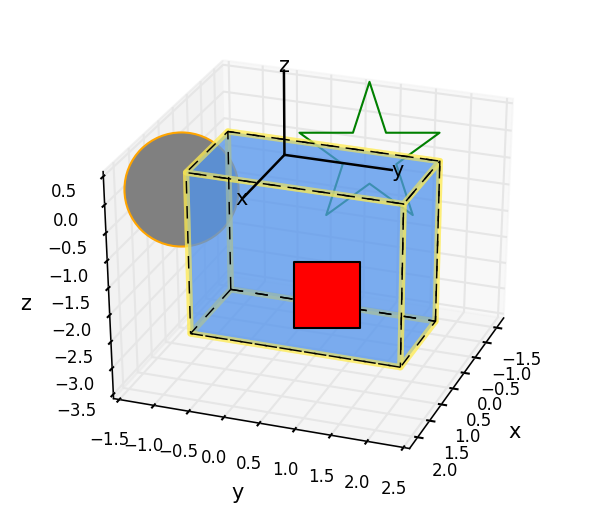
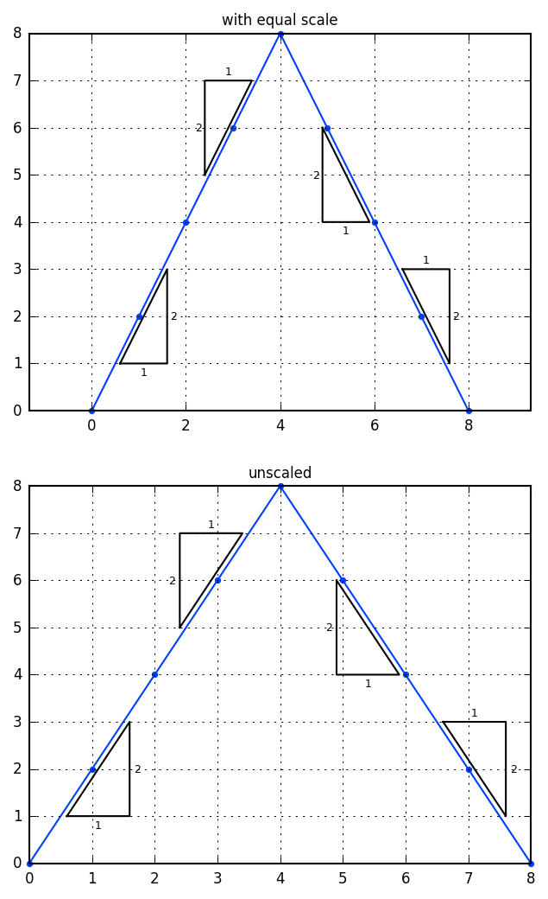
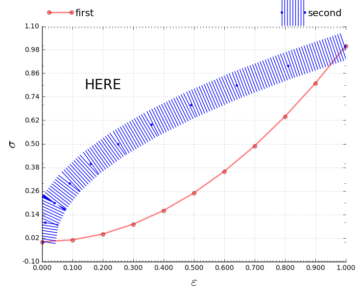
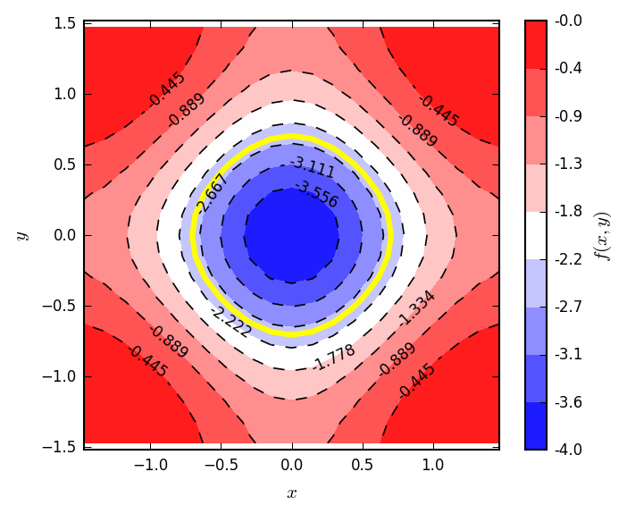
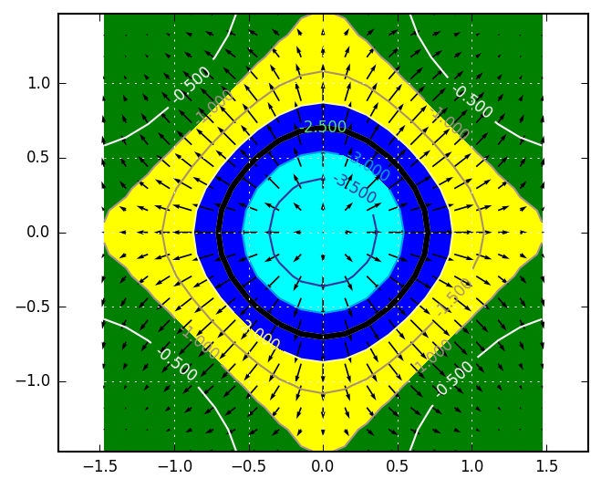
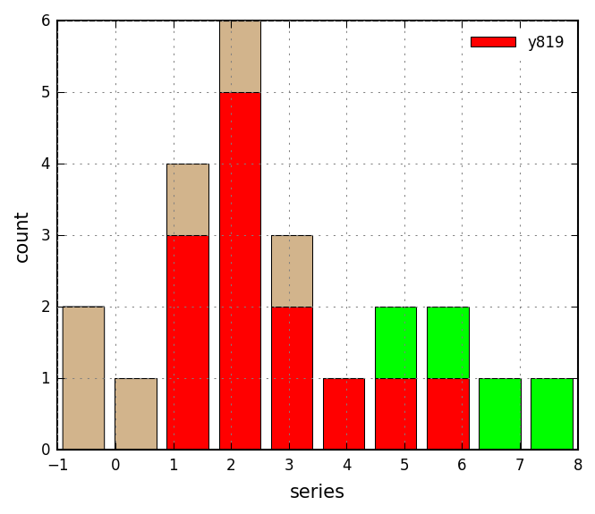
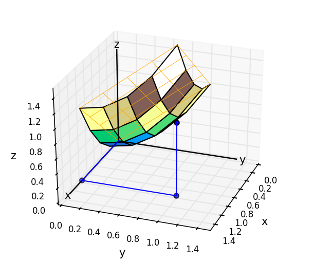
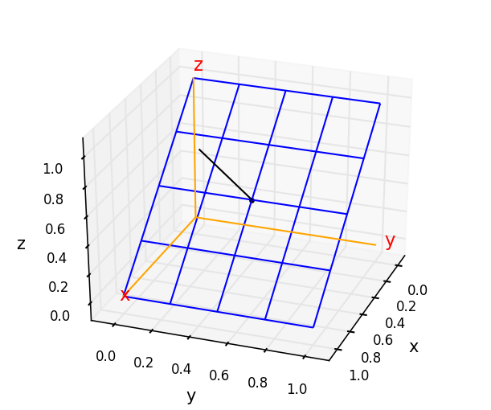
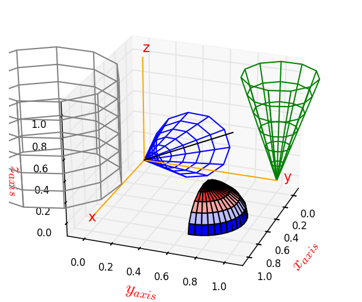
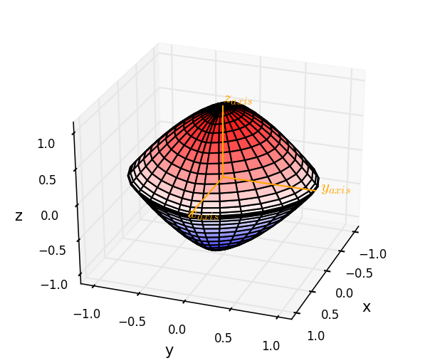

# Gosl. plt. Plotting and drawing (png and eps)

 

More information is available in **[the documentation of this package](https://pkg.go.dev/github.com/cpmech/gosl/plt).**

This package provides several functions to draw figures, plot results and annotate graphs. `plt` has
been largelly based on [matplotlib](https://matplotlib.org) and is, currently, a wrapper to
Python/pyplot by generating scripts to be run by an external `os` call.

Some basic functions are (similar to matplotlib ones to some extent):
1. `ReplaceAxes`, `Clf`
2. `Hist`, `Plot`, `Text`
3. `Show`, `Grid`
4. `Contour`, `Quiver`

The `plt` package has also some _higher level_ functions such as:
1. `Arrow`, `Circle`, `Polyline`
2. `AutoScale`, `AxisOff`, `AxisRange`
4. `Camera`, `Cross` (indicating the origin)
5.  `SetScientificX`, `SetTicksX`, `SetTicksY`, `SetXlog`, `SetYlog`
6. `Gll` (grid-labels-legend)

Functions to draw and handle 3D graphs are also available:
1. `Plot3dLine`, `Plot3dPoint`, `Plot3dPoints`
2. `Wireframe`, `Surface`, `Hemisphere`, `Superquadric`
3. `AxisRange3d`, `CylinderZ`, `ConeZ`

Nonetheless, interactive 3D graphs can also be developed with the `vtk` subpackage.

To initialise the figure, view and save a file (PNG or EPS), the following commands are available:
1. `Reset` initialises drawing space (optional)
2. `Show` show figure
3. `Save` saves the figure, after creating a directory.

All functions take a pointer to a structure holding optional arguments, the `A` structure that
belongs to the `plt` package, i.e. `plt.A`.

## Examples

### Drawing a polygon

Source code: <a href="../examples/plt_polygon01.go">../examples/plt_polygon01.go</a>

Polygon

### Plotting a contour

Source code: <a href="../examples/plt_contour01.go">../examples/plt_contour01.go</a>

Contour and vector field

### Plotting with zoom window

Source code: <a href="../examples/plt_zoomwindow01.go">../examples/plt_zoomwindow01.go</a>

### Drawing a box and 3D points

Source code: <a href="../examples/plt_boxandpoints.go">../examples/plt_boxandpoints.go</a>

### Waterfall graph

Source code: <a href="t_extra_test">t_extra_test</a>

### Drawing slope indicators

Source code: <a href="t_extra_test">t_extra_test</a>

## Output of Tests

Below, you will find some figures produced by the tests in <a href="t_plot01_test.go">t_plot01_test.go</a>.

**Test\_plot01**

**Test\_plot03**

**Test\_plot04**

**Test\_plot05**

**Test\_plot06**

**Test\_plot07**

**Test\_plot08**

**Test\_plot09**

