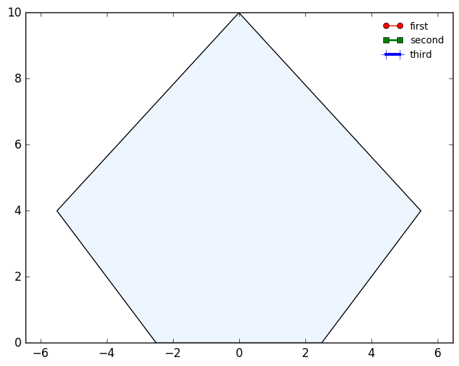

# Gosl. plt. Plotting and drawing (png and eps)

More information is available in [the documentation of this package](http://rawgit.com/cpmech/gosl/master/doc/xxplt.html).

This package provides several functions to draw figures, plot results and annotate graphs. `plt` has
been largelly based on [matplotlib](https://matplotlib.org) and is, currently, a sort of wrapper to
Python/pyplot in the sense that it generates python scripts to be run by an external `os` call.

A future implementation will add an option to draw directly to the web browser, after generating
JavaScript codes. We also plan for a [QT](https://www.qt.io) version.

Many pyplot functions are _wrapped_. For instance:
1. `Axes`, `Clf`
2. `Hist`, `Plot`, `Text`
3. `Show`, `Grid`
4. `Contour`, `Quiver`

The `plt` package is in fact somewhat **more convenient** than the analogue pyplot because it comes
with a number of _higher level_ functions such as:
1. `Arrow`, `Circle`, `DrawPolyline`
2. `AutoScale`, `AxisOff`, `AxisRange`
3. `AxisXmin`, `AxisXmax`, `AxisYmin`, `AxisYmax`
4. `Camera`, `Cross` (indicating the origin)
5.  `SetScientific`, `SetTicksX`, `SetTicksY`, `SetXlog`, `SetYlog`
6. `Gll` (grid-labels-legend)

Functions to draw and handle 3D graphs are also available:
1. `Plot3dLine`, `Plot3dPoints`
2. `Wireframe`, `Surface`
3. `AxisRange3d` 
Nonetheless fancier graphs are better developed with the `vtk` subpackage.

To view and save figures, the following commands are available:
1. `SetForEps` prepares figure for generating an eps file, e.g. by giving the proportion and size
2. `SetForPng` prepares figure for generating a png file, e.g. by giving the proportion, size and resolution
3. `Save` and `SaveD` that saves the figure and save after creating a directory, respectively.

Most functions take an extra argument that is passed to python for further customisation.

In fact, you can do everything here (in Go) as you would do in python, because, if needed, you can
write python scripts of even load a python file to be run when showing or saving figures. The
following commands allow this:
1. `PyCmds` run python commands
2. `PyFile` load and run a python file

## Examples

### Drawing a polygon
```
// points
P := [][]float64{
    {-2.5, 0.0},
    {-5.5, 4.0},
    {0.0, 10.0},
    {5.5, 4.0},
    {2.5, 0.0},
}

// style
var sd plt.Sty
sd.Init()
sd.Closed = true

// draw
plt.DrawPolyline(P, &sd, "")
plt.AutoScale(P)
plt.Equal()
plt.DrawLegend([]plt.Fmt{
    plt.Fmt{C: "red", M: "o", Ls: "-", Lw: 1, Ms: -1, L: "first", Me: -1},
    plt.Fmt{C: "green", M: "s", Ls: "-", Lw: 2, Ms: 0, L: "second", Me: -1},
    plt.Fmt{C: "blue", M: "+", Ls: "-", Lw: 3, Ms: 10, L: "third", Me: -1},
}, 10, "best", false, "")

// save figure
plt.SaveD("/tmp/gosl", "draw01.png")
```

<div id="container">
<p></p>
Polygon
</div>

### Plotting a contour
```
// scalar field
fcn := func(x, y float64) float64 {
    return -math.Pow(math.Pow(math.Cos(x), 2.0)+math.Pow(math.Cos(y), 2.0), 2.0)
}

// gradient. u=dfdx, v=dfdy
grad := func(x, y float64) (u, v float64) {
    m := math.Pow(math.Cos(x), 2.0) + math.Pow(math.Cos(y), 2.0)
    u = 4.0 * math.Cos(x) * math.Sin(x) * m
    v = 4.0 * math.Cos(y) * math.Sin(y) * m
    return
}

// grid size
xmin, xmax, N := -math.Pi/2.0+0.1, math.Pi/2.0-0.1, 21

// mesh grid
X, Y := utl.MeshGrid2D(xmin, xmax, xmin, xmax, N, N)

// compute f(x,y) and components of gradient
F := utl.DblsAlloc(N, N)
U := utl.DblsAlloc(N, N)
V := utl.DblsAlloc(N, N)
for i := 0; i < N; i++ {
    for j := 0; j < N; j++ {
        F[i][j] = fcn(X[i][j], Y[i][j])
        U[i][j], V[i][j] = grad(X[i][j], Y[i][j])
    }
}

// plot
plt.SetForPng(0.75, 600, 150)
plt.Contour(X, Y, F, "levels=20, cmapidx=4")
plt.Quiver(X, Y, U, V, "color='red'")
plt.Gll("x", "y", "")
plt.Equal()
plt.SaveD("/tmp/gosl", "plt_contour01.png")
```

<div id="container">
<p></p>
Contour and vector field
</div>
