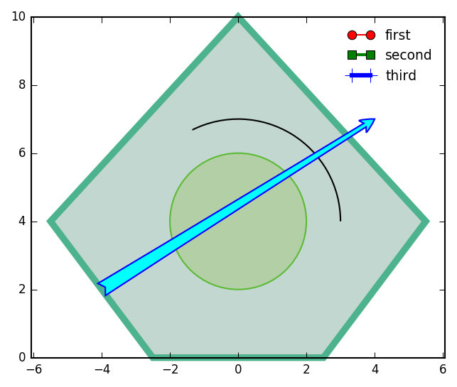
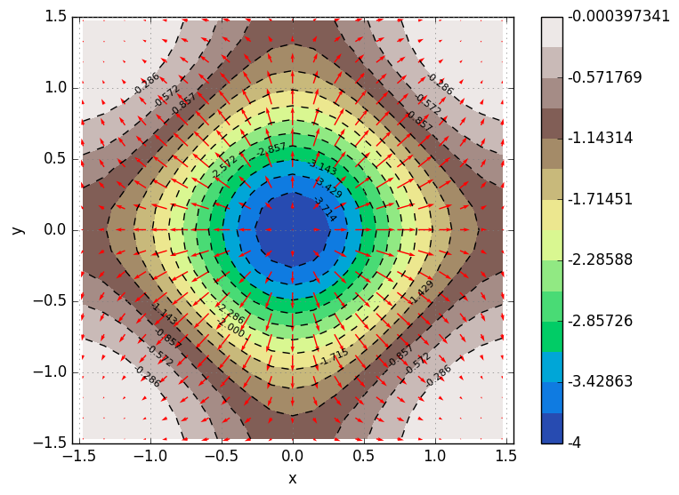
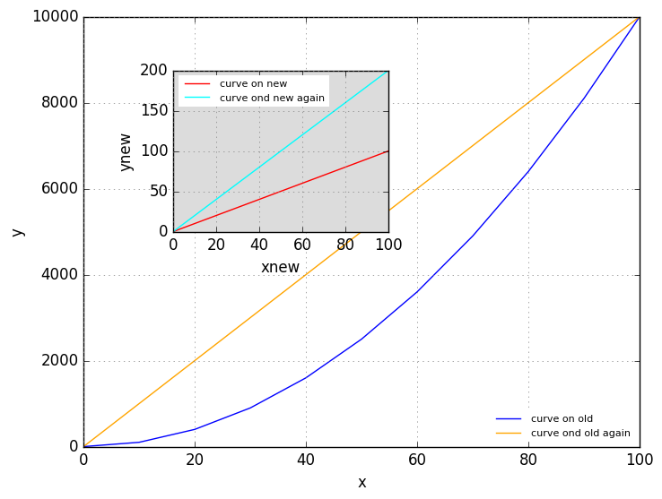

# Gosl. plt. Plotting and drawing (png and eps)

More information is available in **[the documentation of this package](http://rawgit.com/cpmech/gosl/master/doc/xxplt.html).**

This package provides several functions to draw figures, plot results and annotate graphs. `plt` has
been largelly based on [matplotlib](https://matplotlib.org) and is, currently, a sort of wrapper to
Python/pyplot in the sense that it generates python scripts to be run by an external `os` call.

A future implementation will add an option to draw directly to the web browser, after generating
JavaScript codes. We also plan for a [QT](https://www.qt.io) version.

Some basic functions are (some are very similar to matplotlib ones):
1. `ReplaceAxes`, `Clf`
2. `Hist`, `Plot`, `Text`
3. `Show`, `Grid`
4. `Contour`, `Quiver`

The `plt` package is in fact somewhat **more convenient** than the analogue pyplot because it comes
with a number of _higher level_ functions such as:
1. `Arrow`, `Circle`, `Polyline`
2. `AutoScale`, `AxisOff`, `AxisRange`
4. `Camera`, `Cross` (indicating the origin)
5.  `SetScientificX`, `SetTicksX`, `SetTicksY`, `SetXlog`, `SetYlog`
6. `Gll` (grid-labels-legend)

Functions to draw and handle 3D graphs are also available:
1. `Plot3dLine`, `Plot3dPoint`, `Plot3dPoints`
2. `Wireframe`, `Surface`, `Hemisphere`, `Superquadric`
3. `AxisRange3d`, `CylinderZ`, `ConeZ`
Nonetheless, fancier graphs can also be developed with the `vtk` subpackage.

To initialise the figure, view and save figures, the following commands are available:
1. `Reset` initialises drawing space (optional)
2. `Show` show figure
3. `Save` saves the figure, after creating a directory.

All functions take a pointer to a structure holding optional arguments, the `A` structure that
belongs to the `plt` package, i.e. `plt.A`.


## Examples


### Drawing a polygon

```go
// point coordinates
P := [][]float64{
    {-2.5, 0.0},
    {-5.5, 4.0},
    {0.0, 10.0},
    {5.5, 4.0},
    {2.5, 0.0},
}

// formatting/styling data
// Fc: face color, Ec: edge color, Lw: linewidth
stPlines := &plt.A{Fc: "#c1d7cf", Ec: "#4db38e", Lw: 4.5, Closed: true, NoClip: true}
stCircles := &plt.A{Fc: "#b2cfa5", Ec: "#5dba35", Z: 1}
stArrows := &plt.A{Fc: "cyan", Ec: "blue", Z: 2, Scale: 50, Style: "fancy"}

// clear drawing area, with defaults
setDefault := true
plt.Reset(setDefault, nil)

// draw polyline
plt.Polyline(P, stPlines)

// draw circle
plt.Circle(0, 4, 2.0, stCircles)

// draw arrow
plt.Arrow(-4, 2, 4, 7, stArrows)

// draw arc
plt.Arc(0, 4, 3, 0, 90, nil)

// autoscale axes
plt.AutoScale(P)

// enforce same scales
plt.Equal()

// draw a _posteriori_ legend
plt.LegendX([]*plt.A{
    &plt.A{C: "red", M: "o", Ls: "-", Lw: 1, Ms: -1, L: "first", Me: -1},
    &plt.A{C: "green", M: "s", Ls: "-", Lw: 2, Ms: 0, L: "second", Me: -1},
    &plt.A{C: "blue", M: "+", Ls: "-", Lw: 3, Ms: 10, L: "third", Me: -1},
}, nil)

// save figure (default is PNG)
err := plt.Save("/tmp/gosl", "plt_polygon01")
if err != nil {
    io.Pf("error: %v\n", err)
}
```

Source code: <a href="../examples/plt_polygon01.go">../examples/plt_polygon01.go</a>

<div id="container">
<p></p>
Polygon
</div>


### Plotting a contour
```go
// grid size
xmin, xmax, N := -math.Pi/2.0+0.1, math.Pi/2.0-0.1, 21

// mesh grid, scalar and vector field
X, Y, F, U, V := utl.MeshGrid2dFG(xmin, xmax, xmin, xmax, N, N, func(x, y float64) (f, u, v float64) {

    // scalar field
    m := math.Pow(math.Cos(x), 2.0) + math.Pow(math.Cos(y), 2.0)
    f = -math.Pow(m, 2.0)

    // gradient. u=dfdx, v=dfdy
    u = 4.0 * math.Cos(x) * math.Sin(x) * m
    v = 4.0 * math.Cos(y) * math.Sin(y) * m
    return
})

// plot
plt.Reset(false, nil)
plt.ContourF(X, Y, F, &plt.A{CmapIdx: 4, Nlevels: 15})
plt.Quiver(X, Y, U, V, &plt.A{C: "r"})
plt.Gll("x", "y", nil)
plt.Equal()
plt.Save("/tmp/gosl", "plt_contour01")
```

Source code: <a href="../examples/plt_contour01.go">../examples/plt_contour01.go</a>

<div id="container">
<p></p>
Contour and vector field
</div>


### Plotting with zoom window

```go
// data
x := utl.LinSpace(0.0, 100.0, 11)
y1 := make([]float64, len(x))
y2 := make([]float64, len(x))
y3 := make([]float64, len(x))
y4 := make([]float64, len(x))
for i := 0; i < len(x); i++ {
    y1[i] = x[i] * x[i]
    y2[i] = x[i]
    y3[i] = x[i] * 100
    y4[i] = x[i] * 2
}

// clear figure
Reset(false, nil)

// plot curve on main figure
Plot(x, y1, &A{L: "curve on old"})

// plot curve on zoom window
old, new := ZoomWindow(0.25, 0.5, 0.3, 0.3, nil)
Plot(x, y2, &A{C: "r", L: "curve on new"})

// activate main figure
Sca(old)
Plot(x, y3, &A{C: "orange", L: "curve ond old again"})
Gll("x", "y", &A{LegLoc: "lower right"})

// activate zoom window
Sca(new)
Plot(x, y4, &A{C: "cyan", L: "curve ond new again"})
Gll("xnew", "ynew", nil)

err := Save("/tmp/gosl", "t_plot10")
if err != nil {
    tst.Errorf("%v", err)
}
```

Source code: <a href="../examples/plt_zoomwindow01.go">../examples/plt_zoomwindow01.go</a>

<div id="container">
<p></p>
</div>
