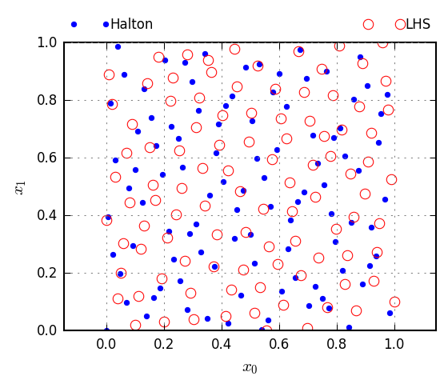

# Gosl. rnd. Random numbers and probability distributions

The `rnd` package assists on computations involving stochastic processes. The package has many
functions to generate pseudo-random numbers, probability distributions, and sampling techniques such
as the Latin hypercube algorithm.

## Pseudo random numbers

In this package, some standard Go functions from package `rand` are wrapped for convenience. Most
random generation functions have an equivalent function wrapping the Mersenne Twister code from
Mutsuo Saito and Makoto Matsumoto.

Some useful functions are:

1. `Init` initialise the system with a seed
2. `Int`, `Ints`, `Float64`, `Float64s` to generate integers and floats
3. Shuffle and GetUnique functions to shuffle slices and filter slices with unique values,
   respectively.

## Probability distributions

The probability distributions in the `rnd` package are initialised with the help of the `VarData`
structure that contains the following main fields:

```go
// input
D DistType // type of distribution
M float64  // mean
S float64  // standard deviation

// input: Frechet
L float64 // location
C float64 // scale
A float64 // shape

// input: uniform
Min float64 // min value
Max float64 // max value
```

The currently available distributions are:

1. `NormalKind` Normal distribution
2. `LognormalKind` Lognormal distribution
3. `GumbelKind` Type I Extreme Value distribution
4. `FrechetKind` Type II Extreme Value distribution
5. `UniformKind` Uniform distribution

## Sampling algorithms: Halton and Latin Hypercube methods

The `HaltonPoints` function is a simple way to generate combinations of point coordinates in a
hypercube.

The `LatinIHS` function implements the Latin improved distributed hypercube sampling method. The
results are the indices of points. The point coordinates can be computed with the `HypercubeCoords`
function.

## Examples

### Generate 100,000 integers and draw Histogram

Source code: <a href="../examples/rnd_ints01.go">../examples/rnd_ints01.go</a>

Output:

```
time elapsed = 3.506121ms
  [0,1) |  10085 ############################################################
  [1,2) |   9874 ###########################################################
  [2,3) |  10078 ############################################################
  [3,4) |   9998 ############################################################
  [4,5) |   9937 ###########################################################
  [5,6) |  10003 ############################################################
  [6,7) |  10119 #############################################################
  [7,8) |   9795 ###########################################################
  [8,9) |  10026 ############################################################
 [9,10) |  10085 ############################################################
  count = 100000
time elapsed = 3.259988ms
  [0,1) |  10077 ############################################################
  [1,2) |  10017 ############################################################
  [2,3) |   9910 ###########################################################
  [3,4) |  10092 ############################################################
  [4,5) |   9853 ###########################################################
  [5,6) |   9976 ############################################################
  [6,7) |  10096 #############################################################
  [7,8) |  10058 ############################################################
  [8,9) |   9905 ###########################################################
 [9,10) |  10016 ############################################################
  count = 100000
```

### Generate samples based on the Lognormal distribution

Source code: <a href="../examples/rnd_lognormalDistribution.go">../examples/rnd_lognormalDistribution.go</a>

<div id="container">
<p></p>
</div>

### Example: sampling algorithms

Source code: <a href="../examples/rnd_haltonAndLatin01.go">../examples/rnd_haltonAndLatin01.go</a>

<div id="container">
<p></p>
</div>

## API

**go doc**

```
package rnd // import "gosl/rnd"

Package rnd implements random numbers generators (wrapping the standard
functions or the Mersenne Twister library). It also implements probability
distribution functions.

VARIABLES

var (
	// Primes1000 contains 1000 prime numbers
	Primes1000 = []int{
		2, 3, 5, 7, 11, 13, 17, 19, 23, 29,
		31, 37, 41, 43, 47, 53, 59, 61, 67, 71,
    ... ... ... ...
		7727, 7741, 7753, 7757, 7759, 7789, 7793, 7817, 7823, 7829,
		7841, 7853, 7867, 7873, 7877, 7879, 7883, 7901, 7907, 7919,
	}
)

FUNCTIONS

func BuildTextHist(xmin, xmax float64, nstations int, values []float64, numfmt string, barlen int) string
    BuildTextHist builds a text histogram

        Input:
         xmin      -- station xmin
         xmax      -- station xmax
         nstations -- number of stations
         values    -- values to be counted
         numfmt    -- number format
         barlen    -- max length of bar

func FlipCoin(p float64) bool
    FlipCoin generates a Bernoulli variable; throw a coin with probability p

func Float64(low, high float64) float64
    Float64 generates a pseudo random real number between low and high; i.e. in
    [low, right)

        Input:
         low  -- lower limit (closed)
         high -- upper limit (open)
        Output:
         random float64

func Float64s(values []float64, low, high float64)
    Float64s generates pseudo random real numbers between low and high; i.e. in
    [low, right)

        Input:
         low  -- lower limit (closed)
         high -- upper limit (open)
        Output:
         values -- slice to be filled with len(values) numbers

func HaltonPoints(dim, n int) (x [][]float64)
    HaltonPoints generates randomly spaced points

        x -- [dim][n] points

func HypercubeCoords(sample [][]int, xmin, xmax []float64) (X [][]float64)
    HypercubeCoords computes the coordinates in the hypercube

        Input:
          sample -- the hypercube sampling indices; e.g. from LatinIHS [ndim][npoints]
          xmin -- min limit of coordinates [ndim]
          xmax -- max limit of coordinates [ndim]
        Output:
          X -- coordinates [ndim][npoints]

func Init(seed int)
    Init initialises random numbers generators

        Input:
         seed -- seed value; use seed <= 0 to use current time

func Int(low, high int) int
    Int generates pseudo random integer between low and high.

        Input:
         low  -- lower limit
         high -- upper limit
        Output:
         random integer

func IntGetGroups(groups [][]int, pool []int)
    IntGetGroups randomly selects indices from pool separating them in groups

        Input:
          pool -- all ints.
        Output:
          groups -- [ngroups][size_of_group] pre-allocated slices

func IntGetShuffled(values []int) (shuffled []int)
    IntGetShuffled returns a shufled slice of integers

func IntGetUnique(values []int, n int) (selected []int)
    IntGetUnique randomly selects n items in a list avoiding duplicates

        Note: using the 'reservoir sampling' method; see Wikipedia:
              https://en.wikipedia.org/wiki/Reservoir_sampling

func IntGetUniqueN(start, endp1, n int) (selected []int)
    IntGetUniqueN randomly selects n items from start to endp1-1 avoiding
    duplicates

        Note: using the 'reservoir sampling' method; see Wikipedia:
              https://en.wikipedia.org/wiki/Reservoir_sampling

func IntShuffle(values []int)
    IntShuffle shuffles a slice of integers

func Ints(values []int, low, high int)
    Ints generates pseudo random integers between low and high.

        Input:
         low    -- lower limit
         high   -- upper limit
        Output:
         values -- slice to be filled with len(values) numbers

func LatinIHS(dim, n, d int) (x [][]int)
    LatinIHS implements the improved distributed hypercube sampling algorithm.
    Note: code developed by John Burkardt (GNU LGPL license) -- see source code
    for further information.

        Input:
         dim -- spatial dimension
         n   -- number of points to be generated
         d   -- duplication factor ≥ 1 (~ 5 is reasonable)
        Output:
         x   -- [dim][n] points

func Lognormal(μ, σ float64) float64
    Lognormal returns a random number belonging to a lognormal distribution

func MTfloat64(low, high float64) float64
    MTfloat64 generates pseudo random real numbers between low and high; i.e. in
    [low, right) using the Mersenne Twister method.

        Input:
         low  -- lower limit (closed)
         high -- upper limit (open)
        Output:
         random float64

func MTfloat64s(values []float64, low, high float64)
    MTfloat64s generates pseudo random real numbers between low and high; i.e.
    in [low, right) using the Mersenne Twister method.

        Input:
         low  -- lower limit (closed)
         high -- upper limit (open)
        Output:
         values -- slice to be filled with len(values) numbers

func MTinit(seed int)
    MTinit initialises random numbers generators (Mersenne Twister code)

        Input:
         seed -- seed value; use seed <= 0 to use current time

func MTint(low, high int) int
    MTint generates pseudo random integer between low and high using the
    Mersenne Twister method.

        Input:
         low  -- lower limit
         high -- upper limit
        Output:
         random integer

func MTintShuffle(v []int)
    MTintShuffle shuffles a slice of integers using Mersenne Twister algorithm.

func MTints(values []int, low, high int)
    MTints generates pseudo random integers between low and high using the
    Mersenne Twister method.

        Input:
         low    -- lower limit
         high   -- upper limit
        Output:
         values -- slice to be filled with len(values) numbers

func Normal(μ, σ float64) float64
    Normal returns a random number belonging to a normal distribution

func Shuffle(values []float64)
    Shuffle shuffles a slice of float point numbers

func StatAve(x []float64) (xave float64)
    StatAve computes the average of x values

        Input:
         x -- sample
        Output:
         xave -- average

func StatAveDev(x []float64, std bool) (xave, xdev float64)
    StatAveDev computes the average of x and the average deviation or standard
    deviation (σ)

        Input:
         x   -- sample
         std -- compute standard deviation (σ) instead of average deviation (adev)
        Output:
         xdev -- average deviation; if std==true, computes standard deviation (σ) instead

func StatBasic(x []float64, std bool) (xmin, xave, xmax, xdev float64)
    StatBasic performs some basic statistics

        Input:
         x   -- sample
         std -- compute standard deviation (σ) instead of average deviation (adev)
        Output:
         xmin -- minimum value
         xave -- mean average (first moment)
         xmax -- maximum value
         xdev -- average deviation; if std==true, computes standard deviation (σ) instead

func StatDev(x []float64, std bool) (xdev float64)
    StatDev computes the average deviation or standard deviation (σ)

        Input:
         x   -- sample
         std -- compute standard deviation (σ) instead of average deviation (adev)
        Output:
         xdev -- average deviation; if std==true, computes standard deviation (σ) instead

func StatDevFirst(x []float64, xave float64, std bool) (xdev float64)
    StatDevFirst computes the average deviation or standard deviation (σ) for
    given value of average/mean/first moment

        Input:
         x    -- sample
         xave -- bar(x) == average/mean/first moment
         std  -- compute standard deviation (σ) instead of average deviation (adev)
        Output:
         xdev -- average deviation; if std==true, computes standard deviation (σ) instead

func StatDur(durs []time.Duration) (min, ave, max, sum time.Duration)
    StatDur generates stat about duration

func StatMoments(x []float64) (sum, mean, adev, sdev, vari, skew, kurt float64)
    StatMoments computes the 4th moments of a data set

        Input:
         x -- sample
        Output:
         sum  -- sum of values
         mean -- mean average (first moment)
         adev -- average deviation
         sdev -- standrad deviation
         vari -- variance (second moment)
         skew -- skewness (third moment)
         kurt -- kurtosis (fourth moment)
        Based on:
           Press WH, Teukolsky SA, Vetterling WT and Flannery BP (2007)
             Numerical Recipes in C++ 2007 (3rd Edition), page 725.

func StatTable(x [][]float64, std, withZ bool) (y, z [][]float64)
    StatTable computes the min, ave, max, and dev of values organised in a table

        Input:
         x     -- sample
         std   -- compute standard deviation (σ) instead of average deviation (adev)
         withZ -- computes z-matrix as well
        Convention of indices:
         0=min  1=ave  2=max  3=dev
        Output:                        min          ave          max          dev
                                        ↓            ↓            ↓            ↓
         x00 x01 x02 x03 x04 x05 → y00=min(x0?) y10=ave(x0?) y20=max(x0?) y30=dev(x0?)
         x10 x11 x12 x13 x14 x15 → y01=min(x1?) y11=ave(x1?) y21=max(x1?) y31=dev(x1?)
         x20 x21 x22 x23 x24 x25 → y02=min(x2?) y12=ave(x2?) y22=max(x2?) y32=dev(x2?)
                                        ↓            ↓            ↓            ↓
                             min → z00=min(y0?) z01=min(y1?) z02=min(y2?) z03=min(y3?)
                             ave → z10=ave(y0?) z11=ave(y1?) z12=ave(y2?) z13=ave(y3?)
                             max → z20=max(y0?) z21=max(y1?) z22=max(y2?) z23=max(y3?)
                             dev → z30=dev(y0?) z31=dev(y1?) z32=dev(y2?) z33=dev(y3?)
                                        =            =            =            =
                             min → z00=min(min) z01=min(ave) z02=min(max) z03=min(dev)
                             ave → z10=ave(min) z11=ave(ave) z12=ave(max) z13=ave(dev)
                             max → z20=max(min) z21=max(ave) z22=max(max) z23=max(dev)
                             dev → z30=dev(min) z31=dev(ave) z32=dev(max) z33=dev(dev)

func StdInvPhi(x float64) float64
    StdInvPhi implements Φ⁻¹(x), the inverse standard cumulative distribution
    function

func StdPhi(x float64) float64
    StdPhi implements Φ(x), the standard cumulative distribution function

func Stdphi(x float64) float64
    Stdphi implements φ(x), the standard probability density function

func TextHist(labels []string, counts []int, barlen int) string
    TextHist prints a text histogram

        Input:
         labels -- labels
         counts -- frequencies

func Uniform(min, max float64) float64
    Uniform returns a random number belonging to a uniform distribution

func UnitVectors(n int) (U [][]float64)
    UnitVectors generates random unit vectors in 3D


TYPES

type DistFrechet struct {
	L float64 // location. default = 0
	C float64 // scale. default = 1
	A float64 // shape
}
    DistFrechet implements the Frechet / Type II Extreme Value Distribution
    (largest value)

func (o DistFrechet) Cdf(x float64) float64
    Cdf computes the cumulative probability function @ x

func (o *DistFrechet) Init(p *Variable)
    Init initialises Frechet distribution

func (o DistFrechet) Mean() float64
    Mean returns the expected value

func (o *DistFrechet) Name() string
    Name returns the name of this probability distribution

func (o DistFrechet) Pdf(x float64) float64
    Pdf computes the probability density function @ x

func (o DistFrechet) Variance() float64
    Variance returns the variance

type DistGumbel struct {
	U float64 // location: characteristic largest value
	B float64 // scale: measure of dispersion of the largest value
}
    DistGumbel implements the Gumbel / Type I Extreme Value Distribution
    (largest value)

func (o DistGumbel) Cdf(x float64) float64
    Cdf computes the cumulative probability function @ x

func (o *DistGumbel) Init(p *Variable)
    Init initialises Gumbel distribution

func (o *DistGumbel) Name() string
    Name returns the name of this probability distribution

func (o DistGumbel) Pdf(x float64) float64
    Pdf computes the probability density function @ x

type DistLogNormal struct {

	// input
	N float64 // mean of log(x)
	Z float64 // standard deviation of log(x)

	// auxiliary
	A float64 // 1 / (z sqrt(2 π))
	B float64 // -1 / (2 z²)
}
    DistLogNormal implements the lognormal distribution

func (o *DistLogNormal) CalcDerived()
    CalcDerived computes derived/auxiliary quantities

func (o DistLogNormal) Cdf(x float64) float64
    Cdf computes the cumulative probability function @ x

func (o *DistLogNormal) Init(p *Variable)
    Init initialises lognormal distribution

func (o *DistLogNormal) Name() string
    Name returns the name of this probability distribution

func (o DistLogNormal) Pdf(x float64) float64
    Pdf computes the probability density function @ x

type DistNormal struct {

	// input
	Mu  float64 // μ: mean
	Sig float64 // σ: std deviation

	// Has unexported fields.
}
    DistNormal implements the normal distribution

func (o *DistNormal) CalcDerived()
    CalcDerived compute derived/auxiliary quantities

func (o DistNormal) Cdf(x float64) float64
    Cdf computes the cumulative probability function @ x

func (o *DistNormal) Init(p *Variable)
    Init initialises normal distribution

func (o *DistNormal) Name() string
    Name returns the name of this probability distribution

func (o DistNormal) Pdf(x float64) float64
    Pdf computes the probability density function @ x

type DistUniform struct {

	// input
	A float64 // min value
	B float64 // max value
}
    DistUniform implements the normal distribution

func (o DistUniform) Cdf(x float64) float64
    Cdf computes the cumulative probability function @ x

func (o *DistUniform) Init(p *Variable)
    Init initialises uniform distribution

func (o *DistUniform) Name() string
    Name returns the name of this probability distribution

func (o DistUniform) Pdf(x float64) float64
    Pdf computes the probability density function @ x

type Distribution interface {
	Name() string
	Init(prms *Variable)
	Pdf(x float64) float64
	Cdf(x float64) float64
}
    Distribution defines a probability distribution

func GetDistrib(dtype string) (d Distribution)
    GetDistrib returns a distribution from factory

type Histogram struct {
	Stations []float64 // stations
	Counts   []int     // counts
}
    Histogram holds data for computing/plotting histograms

        bin[i] corresponds to station[i] <= x < station[i+1]

             [ bin[0] )[ bin[1] )[ bin[2] )[ bin[3] )[ bin[4] )
          ---|---------|---------|---------|---------|---------|---  x
           s[0]      s[1]      s[2]      s[3]      s[4]      s[5]

func (o *Histogram) Count(vals []float64, clear bool)
    Count counts how many items fall within each bin

func (o Histogram) DensityArea(nsamples int) (area float64)
    DensityArea computes the area of the density diagram

        nsamples -- number of samples used when generating pseudo-random numbers

func (o Histogram) FindBin(x float64) int
    FindBin finds where x falls in returns -1 if x is outside the range

func (o Histogram) GenLabels(numfmt string) (labels []string)
    GenLabels generate nice labels identifying bins

type IntHistogram struct {
	Stations []int // stations
	Counts   []int // counts
}
    IntHistogram holds data for computing/plotting histograms with integers

        bin[i] corresponds to station[i] <= x < station[i+1]

             [ bin[0] )[ bin[1] )[ bin[2] )[ bin[3] )[ bin[4] )
          ---|---------|---------|---------|---------|---------|---  x
           s[0]      s[1]      s[2]      s[3]      s[4]      s[5]

func (o *IntHistogram) Count(vals []int, clear bool)
    Count counts how many items fall within each bin

func (o IntHistogram) FindBin(x int) int
    FindBin finds where x falls in returns -1 if x is outside the range

func (o IntHistogram) GenLabels(numfmt string) (labels []string)
    GenLabels generate nice labels identifying bins

type Variable struct {

	// input: required by many distributions
	D string  // [required] type of distribution
	M float64 // [optional] mean
	S float64 // [optional] standard deviation

	// input: Frechet
	L float64 // [Frechet] location
	C float64 // [Frechet] scale
	A float64 // [Frechet] shape

	// input: limits
	Min float64 // [optional] min value
	Max float64 // [optional] max value

	// optional
	Key string // [optional] auxiliary indentifier
	Prm *utl.P // [optional] parameter connected to this random variable

	// derived
	Normal bool         // [derived] is normal distribution
	Distr  Distribution // [derived] pointer to distribution
}
    Variable holds all data defining a single random variable including
    information about a probability distribution that bests represents this
    variable

        Some distributions:
           "N" : Normal
           "L" : Lognormal
           "G" : Gumbel (Type I Extreme Value)
           "F" : Frechet (Type II Extreme Value)
           "U" : Uniform

func (o *Variable) SetDistribution(dtype string)
    SetDistribution sets the implementation of Distribution in VarData

func (o *Variable) Transform(x float64) (y float64, invalid bool)
    Transform transform x into standard normal space

type Variables []*Variable
    Variables implements a set of random variables

func (o *Variables) Init()
    Init initialises distributions in Variables

func (o Variables) Transform(x []float64) (y []float64, invalid bool)
    Transform transforms all variables

```
