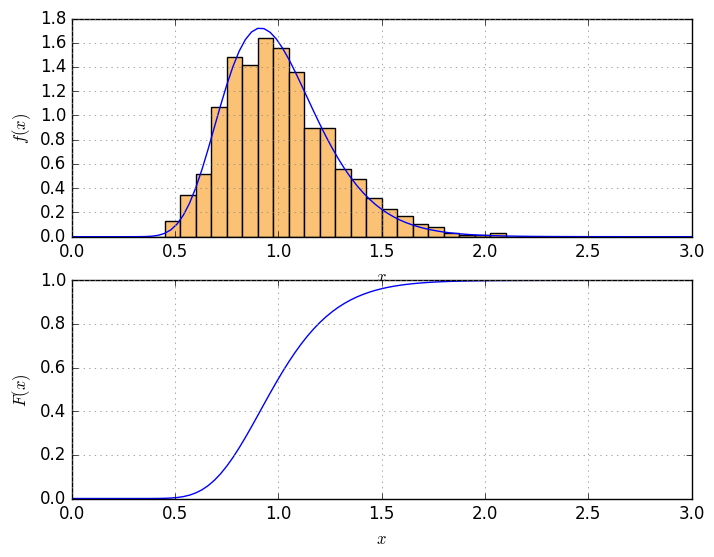

# Gosl. rnd. Random numbers and probability distributions

[](https://pkg.go.dev/github.com/cpmech/gosl/rnd)

The `rnd` package assists on computations involving stochastic processes. The package has many
functions to generate pseudo-random numbers, probability distributions, and sampling techniques such
as the Latin hypercube algorithm.

## Pseudo random numbers

In this package, some standard Go functions from package `rand` are wrapped for convenience. Most
random generation functions have an equivalent function wrapping the Mersenne Twister code from
Mutsuo Saito and Makoto Matsumoto.

Some useful functions are:

1. `Init` initialise the system with a seed
2. `Int`, `Ints`, `Float64`, `Float64s` to generate integers and floats
3. Shuffle and GetUnique functions to shuffle slices and filter slices with unique values,
   respectively.

## Probability distributions

The probability distributions in the `rnd` package are initialised with the help of the `VarData`
structure that contains the following main fields:

```go
// input
D DistType // type of distribution
M float64  // mean
S float64  // standard deviation

// input: Frechet
L float64 // location
C float64 // scale
A float64 // shape

// input: uniform
Min float64 // min value
Max float64 // max value
```

The currently available distributions are:

1. `NormalKind` Normal distribution
2. `LognormalKind` Lognormal distribution
3. `GumbelKind` Type I Extreme Value distribution
4. `FrechetKind` Type II Extreme Value distribution
5. `UniformKind` Uniform distribution

## Sampling algorithms: Halton and Latin Hypercube methods

The `HaltonPoints` function is a simple way to generate combinations of point coordinates in a
hypercube.

The `LatinIHS` function implements the Latin improved distributed hypercube sampling method. The
results are the indices of points. The point coordinates can be computed with the `HypercubeCoords`
function.

## Examples

### Generate 100,000 integers and draw Histogram

Go code:

```go
	// initialise seed with fixed number; use 0 to use current time
	rnd.Init(1234)

	// allocate slice for integers
	nsamples := 100000
	nints := 10
	vals := make([]int, nsamples)

	// using the rnd.Int function
	t0 := time.Now()
	for i := 0; i < nsamples; i++ {
		vals[i] = rnd.Int(0, nints-1)
	}
	io.Pf("time elapsed = %v\n", time.Now().Sub(t0))

	// text histogram
	hist := rnd.IntHistogram{Stations: utl.IntRange(nints + 1)}
	hist.Count(vals, true)
	io.Pf(rnd.TextHist(hist.GenLabels("%d"), hist.Counts, 60))

	// using the rnd.Ints function
	t0 = time.Now()
	rnd.Ints(vals, 0, nints-1)
	io.Pf("time elapsed = %v\n", time.Now().Sub(t0))

	// text histogram
	hist.Count(vals, true)
	io.Pf(rnd.TextHist(hist.GenLabels("%d"), hist.Counts, 60))
```

Output:

```
time elapsed = 3.506121ms
  [0,1) |  10085 ############################################################
  [1,2) |   9874 ###########################################################
  [2,3) |  10078 ############################################################
  [3,4) |   9998 ############################################################
  [4,5) |   9937 ###########################################################
  [5,6) |  10003 ############################################################
  [6,7) |  10119 #############################################################
  [7,8) |   9795 ###########################################################
  [8,9) |  10026 ############################################################
 [9,10) |  10085 ############################################################
  count = 100000
time elapsed = 3.259988ms
  [0,1) |  10077 ############################################################
  [1,2) |  10017 ############################################################
  [2,3) |   9910 ###########################################################
  [3,4) |  10092 ############################################################
  [4,5) |   9853 ###########################################################
  [5,6) |   9976 ############################################################
  [6,7) |  10096 #############################################################
  [7,8) |  10058 ############################################################
  [8,9) |   9905 ###########################################################
 [9,10) |  10016 ############################################################
  count = 100000
```

### Generate samples based on the Lognormal distribution

Go code:

```go
	// initialise generator
	rnd.Init(1234)

	// parameters
	μ := 1.0
	σ := 0.25

	// generate samples
	nsamples := 1000
	X := make([]float64, nsamples)
	for i := 0; i < nsamples; i++ {
		X[i] = rnd.Lognormal(μ, σ)
	}

	// constants
	nstations := 41        // number of bins + 1
	xmin, xmax := 0.0, 3.0 // limits for histogram

	// build histogram: count number of samples within each bin
	var hist rnd.Histogram
	hist.Stations = utl.LinSpace(xmin, xmax, nstations)
	hist.Count(X, true)

	// compute area of density diagram
	area := hist.DensityArea(nsamples)
	io.Pf("area = %v\n", area)

	// lognormal distribution
	var dist rnd.DistLogNormal
	dist.Init(&rnd.Variable{M: μ, S: σ})
  
	// compute lognormal points
	n := 101
	x := utl.LinSpace(0, 3, n)
	y := make([]float64, n)
	Y := make([]float64, n)
	for i := 0; i < n; i++ {
		y[i] = dist.Pdf(x[i])
		Y[i] = dist.Cdf(x[i])
	}
```



### Example: sampling algorithms

```go
	// initialise generator
	rnd.Init(1234)

	// Halton points
	ndim := 2
	npts := 100
	Xhps := rnd.HaltonPoints(ndim, npts)

	// Latin Hypercube
	dupfactor := 5
	lhs := rnd.LatinIHS(ndim, npts, dupfactor)
	xmin := []float64{0, 0}
	xmax := []float64{1, 1}
	Xlhs := rnd.HypercubeCoords(lhs, xmin, xmax)
```


## API

[Please see the documentation here](https://pkg.go.dev/github.com/cpmech/gosl/rnd)
