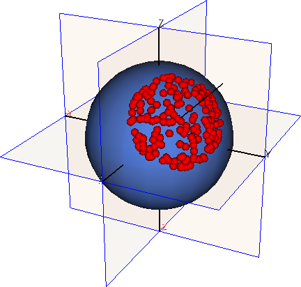

# Gosl. vtk. 3D Visualisation with the VTK tool kit

More information is available in **[the documentation of this package](http://rawgit.com/cpmech/gosl/master/doc/xxvtk.html).**

The `vtk` package presents routines to use the [Visualisation Toolkit](http://www.vtk.org) directly
from Go. Some few structures are defined, including:
1. `Scene` to hold all scene elements
2. `Arrow`, `Sphere` `Spheres` to draw arrows and spheres
3. `IsoSurf` to draw iso-surfaces

## Examples

### Drawing spheres

The `Sphere` structure draws one sphere whereas the `Spheres` structure draws many spheres at once.
A data file with the spheres coordinates and radii is considered.

```go
// create a new VTK Scene
scn := vtk.NewScene()
scn.HydroLine = true
scn.FullAxes = true
scn.AxesLen = 1.5

// sphere
sphere := &vtk.Sphere{
    Cen:   []float64{0, 0, 0},
    R:     1.0,
    Color: []float64{85.0 / 255.0, 128.0 / 255.0, 225.0 / 255.0, 1},
}
sphere.AddTo(scn)

// spheres
sset := vtk.NewSpheresFromFile("data/points.dat")
sset.AddTo(scn)

// start interactive mode
scn.SavePng = true
scn.Fnk = "/tmp/gosl/vtk_spheres01"
scn.Run()
```

Source code: <a href="../examples/vtk_spheres01.go">../examples/vtk_spheres01.go</a>

<div id="container">
<p></p>
</div>


### Drawing an isosurface

```go
// create a new VTK Scene
scn := vtk.NewScene()
scn.Reverse = true // start viewing the negative side of the x-y-z Cartesian system

// parameters
M := 1.0  // slope of line in p-q graph
pt := 0.0 // tensile p
a0 := 0.8 // size of surface

// limits and divisions for grid generation
pqth := []float64{pt, a0, 0, M * a0, 0, 360}
ndiv := []int{21, 21, 41}

// cone symbolising the Drucker-Prager criterion
cone := vtk.NewIsoSurf(func(x []float64) (f, vx, vy, vz float64) {
    p, q := calc_p(x), calc_q(x)
    f = q - M*p
    return
})
cone.Limits = pqth
cone.Ndiv = ndiv
cone.OctRotate = true
cone.GridShowPts = false
cone.Color = []float64{0, 1, 1, 1}
cone.CmapNclrs = 0 // use this to use specified color
cone.AddTo(scn)    // remember to add to Scene

// ellipsoid symbolising the Cam-clay yield surface
ellipsoid := vtk.NewIsoSurf(func(x []float64) (f, vx, vy, vz float64) {
    p, q := calc_p(x), calc_q(x)
    f = q*q + M*M*(p-pt)*(p-a0)
    return
})
ellipsoid.Limits = pqth
cone.Ndiv = ndiv
ellipsoid.OctRotate = true
ellipsoid.Color = []float64{1, 1, 0, 0.5}
ellipsoid.CmapNclrs = 0 // use this to use specified color
ellipsoid.AddTo(scn)    // remember to add to Scene

// illustrate use of Arrow
arr := vtk.NewArrow() // X0 is equal to origin
arr.V = []float64{-1, -1, -1}
arr.AddTo(scn)

// illustrate use of Sphere
sph := vtk.NewSphere()
sph.Cen = []float64{-a0, -a0, -a0}
sph.R = 0.05
sph.AddTo(scn)

// start interactive mode
scn.SavePng = true
scn.Fnk = "/tmp/vtk_isosurf01"
scn.Run()
```

Source code: <a href="../examples/vtk_isosurf01.go">../examples/vtk_isosurf01.go</a>

<div id="container">
<p></p>
</div>
